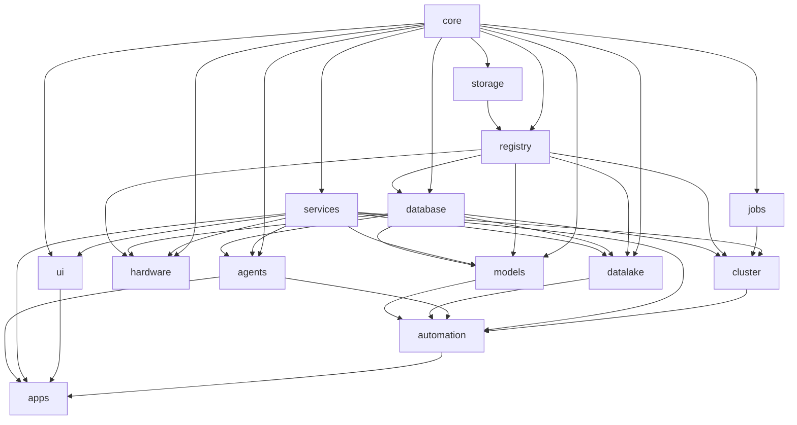

[](https://pypi.org/project/mindtrace/)
[](https://github.com/mindtrace/mindtrace/blob/main/LICENSE)
[](https://pepy.tech/projects/mindtrace)

# Mindtrace

Mindtrace is a modular Python framework for building ML and AI infrastructure: typed microservices, artifact registries, object storage, database abstractions, job orchestration, distributed workers, hardware integrations, agents, and more.

[Docs](https://mindtrace.github.io/mindtrace/) · [Samples](samples/) · [Contributing](CONTRIBUTING.md)

## Features

- **Modular infrastructure framework** with installable subpackages
- **Typed microservices** with auto-generated clients and MCP support
- **Artifact and object storage** through Registry and Storage layers
- **Database abstractions** for MongoDB, Redis, and Registry-backed persistence
- **Job queues and distributed execution** through Jobs and Cluster
- **LLM agents** with tools, memory, callbacks, and MCP toolsets
- **Hardware integration** for cameras, scanners, PLCs, and sensors
- **Composable architecture** where modules build naturally on top of one another

## Installation

```bash
pip install mindtrace
# or
uv add mindtrace
```

Or install only what you need:

```bash
pip install mindtrace-services   # Typed microservices
pip install mindtrace-registry   # Versioned artifact storage
pip install mindtrace-storage    # Object storage backends
pip install mindtrace-database   # ODM layer for MongoDB / Redis / Registry
pip install mindtrace-jobs       # Typed job queues
pip install mindtrace-cluster    # Distributed workers and routing
pip install mindtrace-agents     # LLM agents with tools and memory
pip install mindtrace-hardware   # Cameras, scanners, PLCs, sensors
```

## Quick Tour

The Mindtrace ecosystem is designed so that you can start small and compose modules as your system grows.

### Core

`mindtrace-core` gives you the shared building blocks used across the rest of the framework: configuration, logging, base classes, observables, and typed task schemas.

```python
from mindtrace.core import Mindtrace


class MyProcessor(Mindtrace):
    def run(self):
        self.logger.info(f"Temp dir: {self.config.MINDTRACE_DIR_PATHS.TEMP_DIR}")


with MyProcessor() as processor:
    processor.run()
```

### Services

`mindtrace-services` lets you define typed endpoints once and get a service plus a generated client.

```python
from pydantic import BaseModel

from mindtrace.core import TaskSchema
from mindtrace.services import Service


class EchoInput(BaseModel):
    message: str


class EchoOutput(BaseModel):
    echoed: str


echo_schema = TaskSchema(
    name="echo",
    input_schema=EchoInput,
    output_schema=EchoOutput,
)


class EchoService(Service):
    def __init__(self, **kwargs):
        super().__init__(**kwargs)
        self.add_endpoint("echo", self.echo, schema=echo_schema)

    def echo(self, payload: EchoInput) -> EchoOutput:
        return EchoOutput(echoed=payload.message)


cm = EchoService.launch(host="localhost", port=8080, wait_for_launch=True)
print(cm.echo(message="Hello, world!").echoed)
cm.shutdown()
```

While the service is running, you can inspect the generated API docs at:

- `http://localhost:8080/docs`

### Registry

`mindtrace-registry` is the versioned artifact layer and supports local, S3-compatible, and GCS-backed registries.

```python
import numpy as np

from mindtrace.registry import Registry


registry = Registry()  # Defaults to the local registry at ~/.cache/mindtrace/registry
embeddings = np.random.rand(100, 768).astype(np.float32)
registry.save("data:embeddings", embeddings)
loaded = registry.load("data:embeddings")
print(loaded.shape)
```

```python
from mindtrace.registry import Registry, S3RegistryBackend


registry = Registry(
    backend=S3RegistryBackend(
        endpoint="localhost:9000",
        access_key="minioadmin",
        secret_key="minioadmin",
        bucket="mindtrace-registry",
        secure=False,
    )
)
```

### Database

`mindtrace-database` provides a unified ODM layer over MongoDB, Redis, and Registry-backed storage.

```python
from pydantic import Field

from mindtrace.database import BackendType, UnifiedMindtraceDocument, UnifiedMindtraceODM


class User(UnifiedMindtraceDocument):
    name: str = Field(description="User name")
    email: str = Field(description="Email")

    class Meta:
        collection_name = "users"
        global_key_prefix = "myapp"
        indexed_fields = ["email"]
        unique_fields = ["email"]


db = UnifiedMindtraceODM(
    unified_model_cls=User,
    mongo_db_uri="mongodb://localhost:27017",
    mongo_db_name="myapp",
    redis_url="redis://localhost:6379",
    preferred_backend=BackendType.MONGO,
)
```

### Jobs

`mindtrace-jobs` gives you typed job schemas plus local, Redis, and RabbitMQ backends.

```python
from pydantic import BaseModel

from mindtrace.jobs import Consumer, JobSchema, LocalClient, Orchestrator


class EchoInput(BaseModel):
    message: str


echo_schema = JobSchema(name="echo_job", input_schema=EchoInput)
orchestrator = Orchestrator(LocalClient())
orchestrator.register(echo_schema)


class EchoConsumer(Consumer):
    def run(self, job_dict: dict) -> dict:
        return {"echoed": job_dict["payload"]["message"]}
```

### Cluster

`mindtrace-cluster` builds on jobs and services to route work across worker services and nodes.

```python
from mindtrace.cluster import ClusterManager, Node


cluster = ClusterManager.launch(host="localhost", port=8002, wait_for_launch=True)
node = Node.launch(host="localhost", port=8003, cluster_url=str(cluster.url), wait_for_launch=True)
print(cluster.status())
print(node.status())
```

### Hardware

`mindtrace-hardware` provides interfaces and service tooling for cameras, scanners, PLCs, and sensors.

```python
import asyncio

from mindtrace.hardware import CameraManager


async def main():
    async with CameraManager() as manager:
        cameras = manager.discover()
        print(cameras)


asyncio.run(main())
```

### Agents

`mindtrace-agents` provides agents with tools, memory, callbacks, and MCP toolsets.

```python
from mindtrace.agents import MindtraceAgent, OpenAIChatModel, OpenAIProvider


provider = OpenAIProvider()
model = OpenAIChatModel("gpt-4o-mini", provider=provider)
agent = MindtraceAgent(model=model, name="assistant")

result = agent.run_sync("What is 2 + 2?")
print(result)
```

## Modules

| Module | Description |
|--------|-------------|
| [`core`](mindtrace/core) | Foundational abstractions, config, logging, observables, and typed schemas |
| [`services`](mindtrace/services) | Typed microservice framework with generated clients and MCP support |
| [`registry`](mindtrace/registry) | Versioned artifact storage for models, datasets, configs, and more |
| [`storage`](mindtrace/storage) | Object storage backends for GCS and S3-compatible services |
| [`database`](mindtrace/database) | Unified ODM layer for MongoDB, Redis, and Registry-backed persistence |
| [`jobs`](mindtrace/jobs) | Typed job schemas and queue backends |
| [`cluster`](mindtrace/cluster) | Service-based distributed workers, routing, and DLQ handling |
| [`agents`](mindtrace/agents) | LLM agents with tools, memory, streaming, callbacks, and MCP integration |
| [`hardware`](mindtrace/hardware) | Cameras, stereo cameras, 3D scanners, PLCs, sensors, and hardware services |
| [`datalake`](mindtrace/datalake) | Query and manage datasets, models, labels, and datums |
| [`models`](mindtrace/models) | Model definitions, inference workflows, and related utilities |
| [`automation`](mindtrace/automation) | Pipeline orchestration and workflow integrations |
| [`ui`](mindtrace/ui) | UI components and visualisation tools |
| [`apps`](mindtrace/apps) | End-user applications and demos |

## Module Dependencies



## Choose the Right Module

If you are not sure where to start:

- **Need config, logging, base utilities, or typed schemas?** → [`core`](mindtrace/core)
- **Need a deployable API or MCP-capable service?** → [`services`](mindtrace/services)
- **Need versioned artifact storage?** → [`registry`](mindtrace/registry)
- **Need object storage access?** → [`storage`](mindtrace/storage)
- **Need a document/database abstraction?** → [`database`](mindtrace/database)
- **Need queue-backed background jobs?** → [`jobs`](mindtrace/jobs)
- **Need distributed workers across machines?** → [`cluster`](mindtrace/cluster)
- **Need LLM agents with tools and memory?** → [`agents`](mindtrace/agents)
- **Need industrial hardware/device integration?** → [`hardware`](mindtrace/hardware)
- **Need data/model/label management?** → [`datalake`](mindtrace/datalake)

Many real systems combine several modules. Common combinations include:

- `core` + `services`
- `registry` + `storage`
- `database` + `services`
- `jobs` + `cluster`
- `agents` + `services`
- `hardware` + `services`

## Architecture

Mindtrace is intentionally layered so higher-level modules build on lower-level ones rather than duplicating shared concerns.

| Layer | Modules |
|-------|---------|
| **Foundation** | `core` |
| **Core infrastructure** | `services`, `registry`, `storage`, `database`, `jobs` |
| **Higher-level systems** | `cluster`, `agents`, `hardware`, `datalake`, `models` |
| **Orchestration and apps** | `automation`, `ui`, `apps` |

You do not need to adopt every module at once. Most projects start with just one or two and grow from there.

## Documentation

- [Full Documentation](https://mindtrace.github.io/mindtrace/)
- [Samples](samples/)
- [Contributing](CONTRIBUTING.md)
