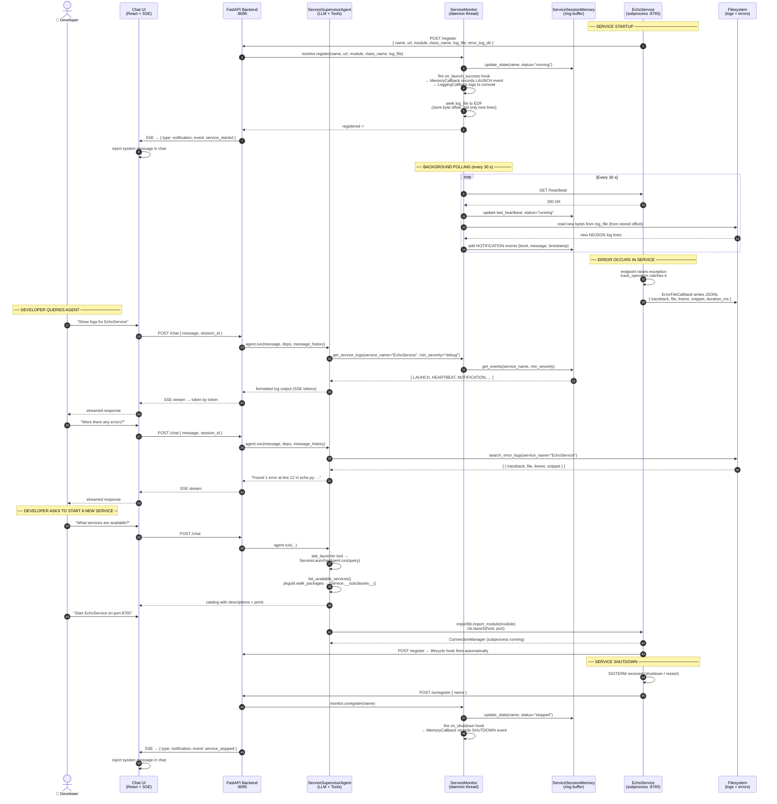

## Mindtrace — How It Actually Works

```mermaid
sequenceDiagram
    autonumber

    actor Dev as 👤 Developer
    participant UI as Chat UI<br/>(React + SSE)
    participant BE as FastAPI Backend<br/>:8095
    participant Agent as ServiceSupervisorAgent<br/>(LLM + Tools)
    participant Monitor as ServiceMonitor<br/>(daemon thread)
    participant Memory as ServiceSessionMemory<br/>(ring buffer)
    participant Svc as EchoService<br/>(subprocess :8765)
    participant FS as Filesystem<br/>(logs + errors)

    Note over Svc: ── SERVICE STARTUP ──────────────────────

    Svc->>BE: POST /register<br/>{ name, url, module, class_name, log_file, error_log_dir }
    BE->>Monitor: monitor.register(name, url, module, class_name, log_file)
    Monitor->>Memory: update_state(name, status="running")
    Monitor->>Monitor: fire on_launch_success hook<br/>→ MemoryCallback records LAUNCH event<br/>→ LoggingCallback logs to console
    Monitor->>Monitor: seek log_file to EOF<br/>(store byte offset, tail only new lines)
    Monitor-->>BE: registered ✓
    BE->>UI: SSE → { type: notification, event: service_started }
    UI->>UI: inject system message in chat

    Note over Monitor: ── BACKGROUND POLLING (every 30 s) ──────

    loop Every 30 s
        Monitor->>Svc: GET /heartbeat
        Svc-->>Monitor: 200 OK
        Monitor->>Memory: update last_heartbeat, status="running"
        Monitor->>FS: read new bytes from log_file (from stored offset)
        FS-->>Monitor: new NDJSON log lines
        Monitor->>Memory: add NOTIFICATION events (level, message, timestamp)
    end

    Note over Svc: ── ERROR OCCURS IN SERVICE ──────────────

    Svc->>Svc: endpoint raises exception<br/>track_operation catches it
    Svc->>FS: ErrorFileCallback writes JSONL<br/>{ traceback, file, lineno, snippet, duration_ms }

    Note over Dev: ── DEVELOPER QUERIES AGENT ──────────────

    Dev->>UI: "Show logs for EchoService"
    UI->>BE: POST /chat { message, session_id }
    BE->>Agent: agent.run(message, deps, message_history)
    Agent->>Monitor: get_service_logs(service_name="EchoService", min_severity="debug")
    Monitor->>Memory: get_events(service_name, min_severity)
    Memory-->>Agent: [ LAUNCH, HEARTBEAT, NOTIFICATION, ... ]
    Agent-->>BE: formatted log output (SSE tokens)
    BE-->>UI: SSE stream → token by token
    UI-->>Dev: streamed response

    Dev->>UI: "Were there any errors?"
    UI->>BE: POST /chat { message, session_id }
    BE->>Agent: agent.run(message, deps, message_history)
    Agent->>FS: search_error_logs(service_name="EchoService")
    FS-->>Agent: [ { traceback, file, lineno, snippet } ]
    Agent-->>BE: "Found 1 error at line 12 in echo.py: ..."
    BE-->>UI: SSE stream
    UI-->>Dev: streamed response

    Note over Dev: ── DEVELOPER ASKS TO START A NEW SERVICE ─

    Dev->>UI: "What services are available?"
    UI->>BE: POST /chat
    BE->>Agent: agent.run(...)
    Agent->>Agent: ask_launcher tool →<br/>ServiceLauncherAgent.run(query)
    Agent->>Agent: list_available_services()<br/>pkgutil.walk_packages → Service.__subclasses__()
    Agent-->>UI: catalog with descriptions + ports
    Dev->>UI: "Start EchoService on port 8765"
    Agent->>Svc: importlib.import_module(module)<br/>cls.launch(host, port)
    Svc-->>Agent: ConnectionManager (subprocess running)
    Svc->>BE: POST /register  ← lifecycle hook fires automatically

    Note over Svc: ── SERVICE SHUTDOWN ─────────────────────

    Svc->>Svc: SIGTERM received (shutdown / restart)
    Svc->>BE: POST /unregister { name }
    BE->>Monitor: monitor.unregister(name)
    Monitor->>Memory: update_state(name, status="stopped")
    Monitor->>Monitor: fire on_shutdown hook<br/>→ MemoryCallback records SHUTDOWN event
    BE->>UI: SSE → { type: notification, event: service_stopped }
    UI->>UI: inject system message in chat
```
