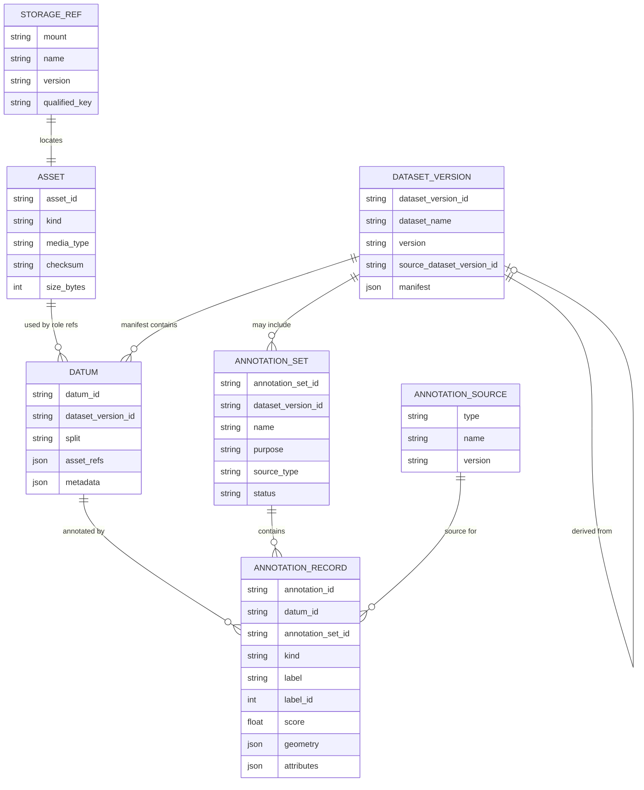
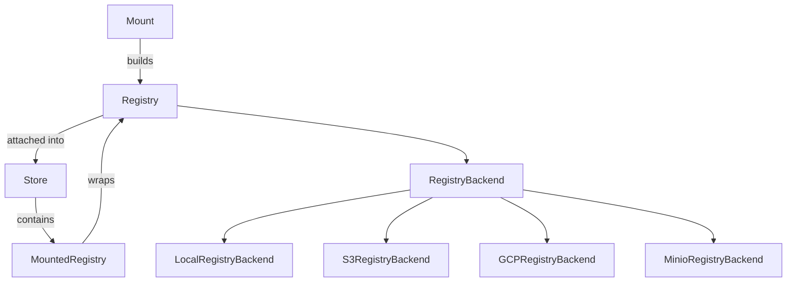
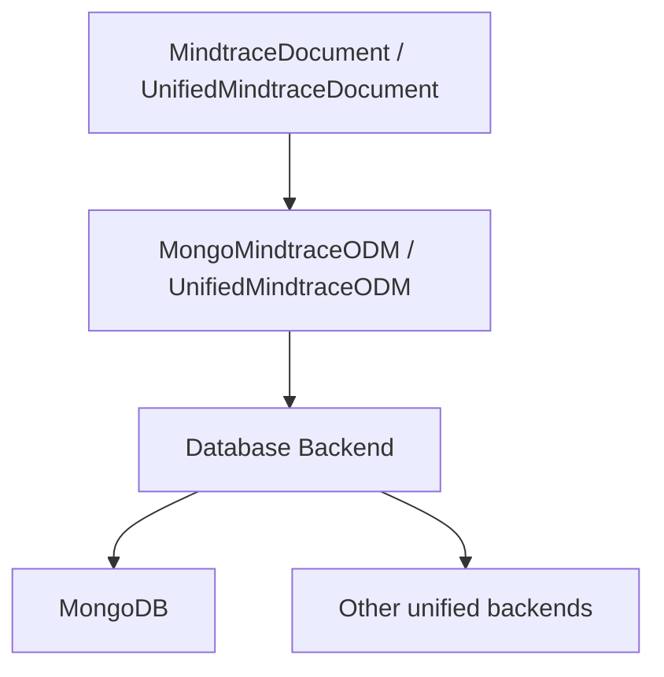
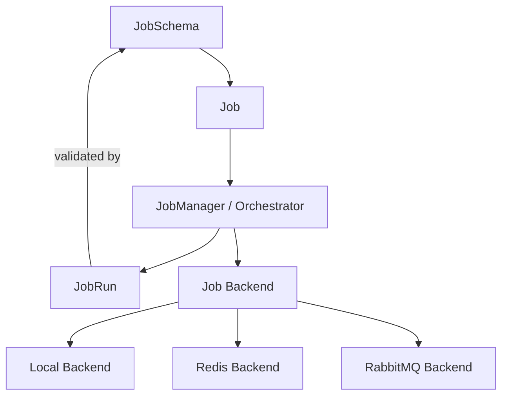
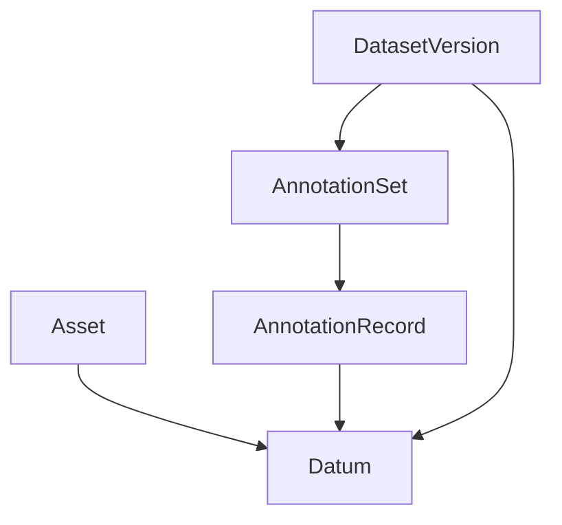
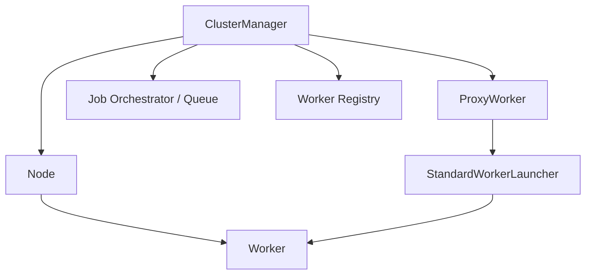
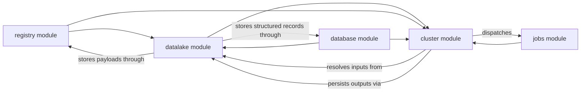

# Datalake V3 Proposal

## Summary

This document proposes **Datalake Version 3 (V3)** for Mindtrace.

V3 is intended as the next architectural step after:

- **V1**: the original `mtrix` Datalake, which focused primarily on dataset packaging, synchronization, and loading
- **V2**: the current `mindtrace.datalake` module, which introduced a simpler and more data-centric persistence model

The purpose of this document is to describe what V3 should be, why it is needed, how it relates to the earlier versions, and what architectural shape makes sense as Mindtrace grows.

At a high level, V3 is trying to accomplish the following:

- provide a clearer and more scalable long-term data architecture for Mindtrace
- move beyond dataset-package management toward a more general canonical persistence layer
- support richer storage topologies and more explicit data ownership boundaries
- support structured, queryable, and reusable data across multiple applications and workflows
- fit cleanly with adjacent modules such as `jobs` and `cluster`
- preserve the useful ideas from earlier iterations without carrying forward their structural limitations

In short, this document lays out a vision for V3 as the long-term data foundation for Mindtrace: scalable, modular, storage-aware, and designed to support rich data workflows across the platform.

---
## Table of Contents

- [Objectives](#objectives)
  - [Goals](#goals)
  - [Non-goals](#non-goals)
- [Version History](#version-history)
  - [V1: The `mtrix` Datalake](#v1-the-mtrix-datalake)
  - [V2: The current `mindtrace.datalake` module](#v2-the-current-mindtracedatalake-module)
  - [V3: Expanding the current Datalake to match our data needs](#v3-expanding-the-current-datalake-to-match-our-data-needs)
- [Module Structure](#module-structure)
  - [The `registry` module](#the-registry-module)
  - [The `database` module](#the-database-module)
  - [The `jobs` module](#the-jobs-module)
  - [The `datalake` module](#the-datalake-module)
  - [The `cluster` module](#the-cluster-module)
  - [How everything works together](#how-everything-works-together)
- [V3 Design](#v3-design)
  - [Strongest parts of the proposed V3 design](#strongest-parts-of-the-proposed-v3-design)
  - [Design risks and ambiguities to resolve in V3](#design-risks-and-ambiguities-to-resolve-in-v3)
  - [Canonical V3 entities](#canonical-v3-entities)
  - [Canonical semantic rule](#canonical-semantic-rule)
  - [Proposed minimal V3 API](#proposed-minimal-v3-api)
- [Appendix](#appendix)
  - [Integration notes](#integration-notes)
  - [Open questions](#open-questions)
  - [Recommended V3 implementation stance](#recommended-v3-implementation-stance)

---

## Objectives

### Goals

- Define a canonical data model for Datalake in Mindtrace.
- Support remote payload storage across multiple backends via `Store` / `Registry`.
- Support structured metadata and annotation persistence in a database.
- Preserve immutable dataset-version semantics.
- Support query-generated dataset views.
- Support both Mindtrace-native datasets and HuggingFace dataset interoperability.
- Keep the initial V3 API small enough to implement without building the entire future platform at once.

### Non-goals

- Full enterprise data catalog in the initial V3 implementation.
- Full lineage graph and lifecycle management in the initial V3 implementation.
- Arbitrary Python-callable query execution over RPC.
- Fully automatic reference-counted garbage collection across all stored objects in the initial V3 implementation.
- Replacing every existing application-level workflow with Datalake on day one.

---

## Version History

This proposal is easier to understand if the Datalake is viewed as three iterations:

- **V1**: the `mtrix` Datalake
- **V2**: the current `mindtrace.datalake` module
- **V3**: expanding the current Datalake to match the broader data model and storage needs described in this proposal

### V1: The `mtrix` Datalake

The previous `mtrix` package included a `datalake` module that is useful to study because it solved a real set of problems well, but it also reveals why a new Datalake iteration is necessary.

#### What V1 was

The `mtrix` Datalake was primarily a dataset lifecycle and synchronization system.

At a high level it combined:

- a thin top-level `Datalake` facade
- a `ServiceRegistry` for dependency wiring
- service classes for discovery, provisioning, synchronization, loading, and manifest handling
- manifest-driven dataset versioning
- local filesystem dataset layouts
- Hugging Face as a registry / discovery plane
- GCP as blob storage
- Arrow / Hugging Face dataset cache building for loading

In other words, V1 was less a generalized canonical datalake and more a dataset packaging, synchronization, and loading framework.

#### What V1 did

V1 supported a concrete end-to-end workflow:

1. **Create a dataset locally** from a source directory.
2. **Validate it** by attempting to build cache through a Hugging Face `GeneratorBasedBuilder`.
3. **Store it locally** under a conventional directory structure with manifest files, split subdirectories, data files, masks, annotation JSON, and item metadata JSON.
4. **Publish it remotely** by splitting responsibilities across:
   - Hugging Face for dataset repository / manifest / README style coordination
   - GCP for actual data and annotation file blobs
5. **Fetch it back locally** by downloading a manifest first and then lazily filling in missing files.
6. **Load it** by materializing a Hugging Face dataset through a builder and Arrow cache.
7. **Update it incrementally** by comparing against previous versions and copying / merging changed files and annotations.

This gave `mtrix` a practical dataset distribution pipeline with local-first and offline-aware behavior.

#### Strengths of V1

##### 1. Good service decomposition

The split into:

- discovery
- provisioning
- synchronization
- loading
- manifest management

was clean and maintainable. The top-level `Datalake` class remained fairly thin while operational complexity lived in focused service classes.

##### 2. Strong dataset-version packaging model

The manifest-driven dataset-version model was well suited to shipping and loading versioned datasets. It gave a clear package boundary for:

- dataset name
- semantic version
- data type
- split structure
- output definitions
- annotation files
- item metadata files

##### 3. Thoughtful local/offline workflow

The explicit `offline_mode` was operationally useful and reflected real needs. The system was clearly designed around:

- local availability
- remote synchronization when needed
- explicit failure when offline constraints prevented an operation

##### 4. Practical incremental update support

The previous design did support version-to-version update flows, including:

- comparing previous and current versions
- uploading only newly introduced files in some cases
- merging annotation content
- applying removals

That is a meaningful capability and should not be dismissed.

##### 5. Strong Hugging Face integration

If the main consumer abstraction is a Hugging Face dataset, the old design was coherent. The builder/cache flow was aligned with a real consumer story.

#### Limitations of V1

The limitations of V1 are structural rather than cosmetic.

##### 1. It is dataset-package centric, not canonical-data centric

V1 treats the world primarily as:

- dataset names
- dataset versions
- manifests
- split directories
- files inside those directories

That is enough for dataset shipping, but not enough for a reusable canonical data layer.

It does not make the following concepts first-class:

- assets
- storage references independent of local layout
- datums as reusable units of membership
- annotation sets
- atomic annotation records
- multiple storage locations for the same payload

##### 2. Annotations are file-based, not first-class records

Annotations in V1 are largely handled as JSON files per split and per dataset version. They can be merged and copied, but they are not modeled as queryable, canonical records.

That creates several limitations:

- weak support for live annotation CRUD
- poor provenance at the per-annotation level
- difficulty representing multiple overlapping annotation layers
- difficulty querying across annotations independently of dataset package boundaries
- difficulty reusing annotation data outside a specific packaged dataset version

##### 3. Local filesystem layout is doing too much work

V1 is heavily coupled to a particular on-disk representation:

- root dataset directories
- `manifest_v*.json`
- `splits/<split>/...`
- images / meshes / point clouds directories
- masks directories
- annotation and item metadata JSON files

This is practical for one packaging format, but too rigid for a general platform.

##### 4. Remote storage topology is fixed and overly opinionated

V1 effectively assumes:

- Hugging Face for registry / discovery / repository concerns
- GCP for blob storage

That hardcodes vendor roles into the design.

##### 5. No generalized storage namespace or mount abstraction

There is no equivalent of a multi-mount `Store` or unified storage facade.

##### 6. Reuse and composability are limited

Because the main unit is a packaged dataset version, it is difficult to treat:

- an image asset
- a derived artifact
- a label snapshot
- a shared annotation layer

as reusable canonical pieces that can participate in multiple datasets or workflows.

### V2: The current `mindtrace.datalake` module

The current `mindtrace.datalake` module in the Mindtrace repo is already a significant shift away from the original `mtrix` dataset-package model. It is not yet the V3 design proposed in this document, but it does represent a meaningful V2 step.

#### What V2 is

The current V2 module is a lightweight asynchronous datalake centered on a single `Datalake` class and a single `Datum` model.

At a high level, V2 provides:

- MongoDB-backed persistence of `Datum` records
- optional external payload storage through `Registry`
- automatic lazy loading of registry-backed payloads
- derivation tracking through `derived_from`
- querying over datums and derivation chains
- a unified API for storing data either directly in MongoDB or indirectly via registry references

The core mental model in V2 is:

- a `Datum` is the fundamental stored object
- each datum may either hold inline `data` or a `registry_uri` + `registry_key`
- each datum may be derived from another datum
- queries can traverse derivation relationships to build row-shaped result sets

This is a much simpler design than V1 and a much more data-centric design than the old package-based approach.

#### What V2 does

Operationally, the current V2 module supports:

1. **Add datum**
   - store payload directly in MongoDB for smaller values
   - or store payload in a registry and keep only a reference in MongoDB
2. **Get datum**
   - load a datum record from MongoDB
   - if it is registry-backed, transparently load the payload from the referenced registry
3. **Track derivation**
   - maintain parent/child relationships using `derived_from`
4. **Query derived data**
   - support base queries and chained derived queries
   - support strategies like `latest`, `earliest`, `random`, `quickest`, and `missing`
5. **Run aggregation-based query execution**
   - use Mongo aggregation for more efficient chained lookups than the older legacy query path

#### Strengths of V2

##### 1. It is much simpler than V1

The V2 module is dramatically simpler than the old `mtrix` Datalake.

It strips away:

- dataset package layout assumptions
- split-directory orchestration
- Hugging Face repository coupling
- GCP-specific remote role assumptions
- manifest-first lifecycle complexity

and instead focuses on a smaller core:

- datum records
- registry-backed payload indirection
- derivation-aware querying

##### 2. It introduces a canonical persisted record

The `Datum` model is the first real step toward a reusable canonical persistence layer.

Unlike V1, the current module is not primarily organized around dataset package files. It has a real persisted record type with fields for:

- payload or payload reference
- metadata
- derivation relationship
- timestamps

##### 3. It separates heavy payloads from metadata when needed

The `add_datum(...)` path allows a datum to be stored either:

- directly in MongoDB
- or externally in a registry with a MongoDB reference

##### 4. It supports derivation as a first-class relationship

`derived_from` is simple, but powerful. It allows V2 to represent:

- processing pipelines
- generated labels
- transformations
- parent/child data relationships

##### 5. It provides a practical query layer

The aggregation-based `query_data(...)` is a meaningful improvement over purely application-side chained lookups.

#### Limitations of V2

##### 1. `Datum` is doing too much

The current `Datum` model is carrying several concerns at once:

- payload container
- payload reference
- metadata bag
- derivation node
- query unit

This is a reasonable simplification for V2, but it does not scale cleanly into a richer datalake model.

##### 2. There is no first-class annotation model

Annotations are not modeled as first-class structured records. They can exist only as arbitrary `data` or `metadata` attached to generic datums.

That means V2 lacks:

- atomic annotation records
- annotation-set grouping
- explicit source/provenance model for labels
- strong geometry typing
- clear distinction between labels and arbitrary data payloads

##### 3. There is no explicit asset/storage model

V2 can store payloads in a registry, but it does not yet have an explicit model for:

- asset identity
- storage references as first-class objects
- multiple physical locations for the same logical payload
- mount-aware storage semantics

##### 4. Registry usage is still too primitive

The current module uses `registry_uri` directly and lazily creates `Registry(LocalRegistryBackend(...))` instances.

##### 5. Query model is powerful but not yet a canonical data model

The current aggregation query API is useful, but it is still oriented around:

- ad hoc row construction
- derivation traversal
- generic datum matching

rather than around the higher-level V3 entities that should become canonical.

##### 6. Dataset concepts are not yet explicit enough

Compared to V1, V2 swings strongly away from packaged datasets — which is good. But it does not yet replace them with sufficiently explicit canonical dataset entities.

### V3: Expanding the current Datalake to match our data needs

At a high level, V3 builds on V2 rather than replacing it blindly.

V3 exists because:

- V1 was too package-centric
- V2 is a strong simplification, but still too generic in the wrong places
- the next iteration needs to preserve V2's simplicity while adding explicit structure for assets, annotations, datasets, and storage

Concretely, V3 must add:

#### 1. Generalized storage via `Store` / mounts

V3 needs mount-aware storage semantics and a unified storage facade rather than a raw `registry_uri` field on a generic datum.

#### 2. Explicit payload identity

V3 needs `StorageRef` and `Asset` so payload-bearing objects can be identified and managed independently of the generic datum record.

#### 3. First-class annotation schema

V3 needs:

- `AnnotationSource`
- `AnnotationRecord`
- `AnnotationSet`

so labels become canonical structured data rather than arbitrary embedded payloads.

#### 4. Reusable dataset membership model

V3 keeps `Datum`, but narrows its role to dataset membership and composition rather than using it as the one object that represents every kind of stored thing.

#### 5. Immutable dataset versions over canonical entities

V3 reintroduces dataset-version semantics in a cleaner way than V1 by making dataset versions immutable views over canonical datums, assets, and annotation sets.

#### Summary of the version history

- **V1** solved dataset packaging, synchronization, and HF-oriented loading.
- **V2** introduced a much cleaner canonical datum record plus registry-backed payload indirection and derivation-aware querying.
- **V3** is the next architectural step: expanding V2 into a fuller datalake with explicit assets, annotations, dataset versions, and mount-aware storage.

---

## V3 Design

### Strongest parts of the proposed V3 design

### 1. Split payload storage from metadata storage

This is the strongest architectural decision in the proposed V3 design.

- Payloads such as images, masks, artifacts, and exports belong in Registry / Store-backed object storage.
- Structured metadata, manifests, and annotations belong in a database / ODM layer.

This enables:

- large-scale remote storage on NAS / MinIO / GCP
- lightweight queryability over metadata and labels
- app-independent asset reuse
- clean separation between storage concerns and annotation/query concerns

### 2. `Datum` as the unit of dataset membership

The idea that a dataset is composed of datums is strong and should be central to V3.

A datum can point to one or more stored payloads while also carrying:

- structured metadata
- split membership
- links to annotation sets

This supports reusable assets, derived datasets, and query-generated views without forcing deep copies.

### 3. Immutable `Dataset` with mutable `DatasetBuilder`

This is a very good modeling choice for V3.

- `Dataset` should represent an immutable view / version.
- `DatasetBuilder` should represent a mutable changeset used to construct a new dataset version.

This makes versioning more natural and prevents accidental mutation of registered datasets.

### 4. View semantics by default

Returning dataset views from the Datalake without copying payloads is the right default behavior.

This keeps registration and querying cheap, and aligns with the idea that datasets are reference-based compositions over stored datums and assets.

### 5. Query-generated datasets

Generating datasets from metadata / annotation filters is a powerful capability and should remain a first-class feature.

### 6. Mindtrace-native datasets plus HuggingFace interoperability

Supporting a native Mindtrace data model while providing conversion to / from HuggingFace datasets is a strong long-term direction.

---

### Design risks and ambiguities to resolve in V3

### 1. Canonical annotations are mixed with task/job output classes

A key design risk is blurring together:

- task-level result containers (`ImageDetectionAnnotation`, `SemanticSegmentationAnnotation`, etc.)
- atomic persisted annotation records (one bbox, one mask, one classification label)

For Datalake persistence and querying, the canonical model should be based on atomic annotation records, not nested job-output-shaped objects.

### 2. `Datum.metadata` and `Datum.annotations` are too loosely defined

`metadata` should be descriptive/filterable metadata.

`annotations` should be canonical structured annotation records or references to annotation sets.

If that boundary remains fuzzy, metadata risks becoming a catch-all JSON blob.

### 3. `Datum.data` is too unconstrained

A flexible `data: dict[str, Archivable | str]` style field is too vague as a canonical schema.

The model needs a more explicit representation of payload-bearing assets and their roles.

### 4. Reference counting is mentioned but not clearly modeled

One possible direction is for dataset deletion to decrement reference counts and garbage-collect payloads.

That may be desirable long-term, but it is not yet sufficiently specified to be part of the initial V3 contract.

### 5. `Dataset` is trying to be too many things at once

At the API/schema level, we should separate:

- dataset version record
- dataset view object / Python runtime wrapper
- archive/export forms

A Python class can still provide a nice user-facing abstraction, but the canonical service model should be more explicit.

### 6. Query API as arbitrary Python `Callable`

This is a nice SDK shorthand, but not a service contract.

The Datalake API should expose structured declarative filters, while Python helpers can compile lambdas / helper expressions into that representation later.

### 7. Version semantics need separation

The V3 design must avoid conflating:

- dataset version
- payload object version
- annotation revision / snapshot version

These must remain distinct.

---

### Canonical V3 entities

<details>
<summary>Expand the canonical V3 entity model and relationships</summary>

The following entities define the proposed canonical V3 model.



Relationship summary:

- `StorageRef` describes where a payload lives physically.
- `Asset` is the logical record for a payload-bearing object and points to a `StorageRef`.
- `Datum` is the unit of dataset membership and references one or more `Asset`s by role.
- `AnnotationSet` groups related annotations, often by source or purpose.
- `AnnotationRecord` is an atomic label attached to a `Datum` and belonging to an `AnnotationSet`.
- `AnnotationSource` captures where an annotation came from.
- `DatasetVersion` is an immutable dataset view over datums, annotation sets, and provenance from earlier versions.

### 1. `StorageRef`

A reference to a stored payload object.

```python
StorageRef:
    mount: str
    name: str
    version: str | None = "latest"
    qualified_key: str | None = None
```

Notes:

- `mount` maps naturally to a `Store` mount such as `temp`, `nas`, or `gcp`.
- `name` is the unqualified object key within that mount.
- `version` refers to the storage-layer version, not the dataset version.

### 2. `Asset`

A canonical record for a payload-bearing object.

```python
Asset:
    asset_id: str
    kind: Literal["image", "mask", "artifact", "embedding", "document", "other"]
    media_type: str
    storage_ref: StorageRef
    checksum: str | None = None
    size_bytes: int | None = None
    metadata: dict[str, Any] = {}
    created_at: datetime
    created_by: str | None = None
```

Notes:

- An asset is the catalog record for a payload in backing storage.
- This cleanly separates payload storage from dataset membership and annotation meaning.

### 3. `AnnotationSource`

Describes where an annotation came from.

```python
AnnotationSource:
    type: Literal["human", "machine", "derived"]
    name: str
    version: str | None = None
    metadata: dict[str, Any] = {}
```

Examples:

- `{"type": "human", "name": "review-ui"}`
- `{"type": "machine", "name": "yolo", "version": "1.2.0"}`
- `{"type": "derived", "name": "bbox-to-mask"}`

### 4. `AnnotationRecord`

One atomic annotation.

```python
AnnotationRecord:
    annotation_id: str
    datum_id: str
    annotation_set_id: str
    kind: Literal[
        "classification",
        "bbox",
        "rotated_bbox",
        "polygon",
        "polyline",
        "ellipse",
        "keypoint",
        "mask",
        "instance_mask",
    ]
    label: str
    label_id: int | None = None
    score: float | None = None
    source: AnnotationSource
    geometry: dict[str, Any]
    attributes: dict[str, Any] = {}
    created_at: datetime
    updated_at: datetime
```

Example geometry payloads:

```json
{ "type": "bbox", "x": 10, "y": 20, "width": 30, "height": 40 }
```

```json
{
  "type": "rotated_bbox",
  "cx": 10,
  "cy": 20,
  "width": 30,
  "height": 40,
  "angle_deg": 15
}
```

```json
{
  "type": "mask",
  "encoding": "rle_row_major_v1",
  "counts": [12, 4, 91],
  "size": [1080, 1920],
  "bbox": { "x": 10, "y": 20, "width": 30, "height": 40 }
}
```

Notes:

- Atomic records are easier to query, edit, and export.
- Job outputs should map into these records rather than become the canonical storage format.

### 5. `AnnotationSet`

A grouping and provenance boundary for annotation records.

```python
AnnotationSet:
    annotation_set_id: str
    dataset_version_id: str | None = None
    name: str
    purpose: Literal["ground_truth", "prediction", "review", "snapshot", "other"]
    source_type: Literal["human", "machine", "mixed"]
    status: Literal["draft", "active", "archived"]
    metadata: dict[str, Any] = {}
    created_at: datetime
    created_by: str | None = None
```

Notes:

- This allows multiple annotation layers over the same underlying datum.
- Useful distinctions include human truth vs machine predictions vs reviewed snapshots.

### 6. `Datum`

The unit of dataset membership.

```python
Datum:
    datum_id: str
    dataset_version_id: str
    split: Literal["train", "val", "test"] | None = None
    asset_refs: dict[str, str]  # role -> asset_id
    metadata: dict[str, Any] = {}
    annotation_set_ids: list[str] = []
    created_at: datetime
```

Notes:

- `asset_refs` can map roles like `image`, `thumbnail`, `aux_mask`, or `roi_crop` to asset IDs.
- Datums should link to annotation sets instead of embedding all annotation payloads directly.

### 7. `DatasetVersion`

An immutable dataset record.

```python
DatasetVersion:
    dataset_version_id: str
    dataset_name: str
    version: str
    description: str | None = None
    manifest: list[str]  # datum_ids
    source_dataset_version_id: str | None = None
    metadata: dict[str, Any] = {}
    created_at: datetime
    created_by: str | None = None
```

Notes:

- This preserves the immutable dataset concept from the sketches.
- A runtime `Dataset` object can wrap this record and provide a Pythonic interface.

### 8. `DatasetBuilder`

`DatasetBuilder` should remain part of the SDK / Python workflow surface rather than become a primary persisted schema.

It represents staged mutations used to produce a new `DatasetVersion`.

---

</details>

### Canonical semantic rule

One of the most important semantic rules for V3 should be:

> Dataset versions are immutable views over datum membership; assets and annotations are persisted separately and referenced by those views.

This keeps the V3 data model normalized, extensible, and operationally practical.

---

### Proposed minimal V3 API

The API should be split into four slices:

- storage
- assets
- datasets
- annotations

### A. Storage / mounts API

#### `GET /api/v1/datalake/health`

Basic service health.

#### `GET /api/v1/datalake/mounts`

List configured mounts and default mount information.

Example response:

```json
{
  "default_mount": "nas",
  "mounts": [
    {
      "name": "temp",
      "read_only": false,
      "backend": "file:///tmp/mindtrace-store-abc123",
      "version_objects": false,
      "mutable": true
    },
    {
      "name": "nas",
      "read_only": false,
      "backend": "s3://minio/datalake",
      "version_objects": true,
      "mutable": true
    },
    {
      "name": "gcp",
      "read_only": false,
      "backend": "gs://my-bucket/datalake",
      "version_objects": true,
      "mutable": true
    }
  ]
}
```

#### `POST /api/v1/datalake/objects/put`

Persist a raw payload into the configured Store / Registry layer.

Example request:

```json
{
  "mount": "nas",
  "name": "project:p1:image:img1",
  "version": "latest",
  "content_base64": "...",
  "content_type": "image/jpeg",
  "metadata": {
    "filename": "foo.jpg",
    "project_id": "p1"
  },
  "on_conflict": "overwrite"
}
```

#### `POST /api/v1/datalake/objects/get`

Retrieve a raw payload.

#### `POST /api/v1/datalake/objects/head`

Inspect a storage object without returning the payload.

#### `POST /api/v1/datalake/objects/copy`

Copy an object between mounts.

This is especially important for NAS -> GCP promotion workflows.

### B. Assets API

#### `POST /api/v1/datalake/assets`

Register an asset record for a stored payload.

Example request:

```json
{
  "kind": "image",
  "media_type": "image/jpeg",
  "storage_ref": {
    "mount": "nas",
    "name": "project:p1:image:img1",
    "version": "latest"
  },
  "checksum": "sha256:...",
  "size_bytes": 12345,
  "metadata": {
    "filename": "foo.jpg",
    "project_id": "p1"
  }
}
```

#### `GET /api/v1/datalake/assets/{asset_id}`

Fetch asset metadata.

#### `GET /api/v1/datalake/assets`

List/filter assets by kind, project, metadata, or pagination.

#### `DELETE /api/v1/datalake/assets/{asset_id}`

Delete an asset record. Underlying payload deletion policy may remain conservative in the initial V3 implementation.

### C. Datasets API

#### `POST /api/v1/datalake/datasets`

Create/register a new immutable dataset version.

This should accept:

- dataset name
- version
- manifest / datum membership
- optionally a builder-derived payload

#### `GET /api/v1/datalake/datasets`

List datasets.

#### `GET /api/v1/datalake/datasets/{dataset_name}/versions`

List versions for a dataset.

#### `GET /api/v1/datalake/datasets/{dataset_name}/versions/{version}`

Fetch dataset version metadata.

#### `POST /api/v1/datalake/datasets/{dataset_name}/versions/{version}/view`

Return a paginated dataset view descriptor.

#### `POST /api/v1/datalake/datasets/query`

Create a derived dataset view using structured filters.

Example request:

```json
{
  "dataset": "all",
  "split": "train",
  "filters": [
    { "field": "metadata.label", "op": "eq", "value": "undercut" },
    { "field": "metadata.severity", "op": "gt", "value": 3.0 }
  ]
}
```

This preserves the spirit of `from_query(...)` while replacing a Python `Callable` with a proper service contract.

### D. Datum API

#### `POST /api/v1/datalake/datums`

Create one or more datums.

#### `GET /api/v1/datalake/datums/{datum_id}`

Fetch datum metadata.

#### `GET /api/v1/datalake/datums`

Filter datums by dataset version, split, or metadata.

#### `PATCH /api/v1/datalake/datums/{datum_id}`

Update mutable datum metadata before finalization if allowed.

### E. Annotation API

#### `POST /api/v1/datalake/annotation-sets`

Create a new annotation set.

#### `GET /api/v1/datalake/annotation-sets/{annotation_set_id}`

Fetch annotation set metadata.

#### `GET /api/v1/datalake/annotation-sets`

List/filter annotation sets.

#### `POST /api/v1/datalake/annotations`

Create one or more annotation records.

Example request:

```json
{
  "annotation_set_id": "aset-1",
  "annotations": [
    {
      "datum_id": "datum-1",
      "kind": "bbox",
      "label": "crack",
      "score": 0.92,
      "source": {
        "type": "machine",
        "name": "yolo",
        "version": "1.0.0"
      },
      "geometry": {
        "type": "bbox",
        "x": 1,
        "y": 2,
        "width": 3,
        "height": 4
      },
      "attributes": {
        "severity": "high"
      }
    }
  ]
}
```

#### `GET /api/v1/datalake/annotations`

Filter annotation records by datum, set, kind, label, or source.

#### `PATCH /api/v1/datalake/annotations/{annotation_id}`

Update an annotation record.

#### `DELETE /api/v1/datalake/annotations/{annotation_id}`

Delete an annotation record.

---

## Appendix

### Integration notes

This proposal is intentionally framed as a public Mindtrace design rather than an application-specific integration plan.

A consumer of the Datalake module should be able to:

- store payloads through the storage / asset APIs
- reference canonical Datalake asset IDs from higher-level application records
- use the annotation APIs for live label CRUD when appropriate
- generate dataset exports from canonical assets and annotation records
- promote objects across mounts through storage copy endpoints

This keeps Datalake positioned as the canonical persistence and access layer while allowing downstream applications to remain thin clients over that data model.

---

## Module Structure

This section describes how the major Mindtrace modules should relate to one another in the broader V3 architecture.

### The `registry` module

#### Main role / responsibility

The `registry` module is responsible for versioned object persistence and multi-backend storage access.

Its job is to provide:

- a version-aware object persistence abstraction
- support for multiple storage backends
- multi-mount composition through `Store`
- materialization and serialization of Python objects

The `registry` module is the storage substrate that V3 should build on, rather than reimplement.

#### Major classes

- `Registry`
- `Store`
- `Mount`
- `MountedRegistry`



### The `database` module

#### Main role / responsibility

The `database` module is responsible for structured persistence, querying, indexing, and model-backed storage for Mindtrace records.

Its job is to provide:

- document-oriented persistence for structured application data
- ODM-style model integration
- backend abstraction across supported database/storage engines
- indexing, uniqueness, and query support for higher-level modules

For the Datalake specifically, the `database` module is the structured persistence substrate for canonical metadata and queryable entities.

#### Major classes

- `MindtraceDocument` / `UnifiedMindtraceDocument`
- `MongoMindtraceODM`
- `UnifiedMindtraceODM`
- backend and model configuration types



In the V3 architecture, the `database` module should be the place where canonical Datalake records live as structured, queryable entities, while the `registry` module stores larger payloads and versioned objects externally.

### The `jobs` module

#### Main role / responsibility

The `jobs` module is responsible for executable work definitions and run lifecycle management.

Its job is to provide:

- job definitions and schemas
- queueing and execution state
- retries and failure handling
- worker-facing input/output contracts

The `jobs` module should remain usable without a hard dependency on the Datalake.

#### Major classes

- `Job`
- `JobManager`
- `JobRun`
- `JobSchema`



### The `datalake` module

#### Main role / responsibility

The `datalake` module is responsible for canonical persisted data models and data-facing query semantics.

Its job is to provide:

- canonical records for assets, annotations, datums, and dataset versions
- persistent metadata and provenance
- queryable structured data
- a clean boundary between canonical state and export/materialization forms
- an integration layer that relies on both `registry` for payload persistence and `database` for structured records

#### Major classes

- `Asset`
- `Datum`
- `AnnotationSet`
- `DatasetVersion`



### The `cluster` module

#### Main role / responsibility

The `cluster` module is responsible for distributed job orchestration, worker lifecycle management, and execution routing across nodes and workers.

Based on the current module and README, its job is to provide:

- a central orchestrator for submitting and tracking jobs
- worker registration and worker-type registration
- node-managed worker launching
- routing jobs either directly to endpoints or through workers
- support for worker execution environments such as Git-based and Docker-based runs
- integration with the registry for worker distribution and launch metadata

The current cluster module already acts as the practical bridge between execution and infrastructure. In a fuller V3 architecture, it should remain the main integration point between `jobs`, `registry`, and `datalake`.

#### Major classes

- `ClusterManager`
- `Node`
- `Worker`
- `ProxyWorker` / `StandardWorkerLauncher`



The actual current module also includes built-in worker implementations and execution helpers such as:

- `EchoWorker`
- `RunScriptWorker`
- Git and Docker execution environments

So the current Cluster module is not just a scheduler in the abstract. It is already a concrete execution system with:

- orchestration through `ClusterManager`
- node-based worker launching
- worker status tracking
- worker-type registration
- queue/orchestrator integration
- registry-backed worker distribution

### How everything works together

At a high level, the intended relationship is:

- **`registry`** provides storage and object persistence primitives
- **`database`** provides structured record persistence and query support
- **`datalake`** provides canonical persisted data entities and data semantics
- **`jobs`** provides executable task definitions and run lifecycle semantics
- **`cluster`** integrates jobs and data in a distributed execution environment



The intended dependency direction should be:

- `registry` is a lower-level storage substrate
- `database` is a lower-level structured persistence substrate
- `datalake` builds on both `registry` and `database`
- `jobs` remains largely independent of `datalake`
- `cluster` is the primary integration layer between execution and persisted data

This keeps the architecture modular while still allowing tight practical interoperability.

## V3 Design

### Strongest parts of the proposed V3 design

### 1. Split payload storage from metadata storage

This is the strongest architectural decision in the proposed V3 design.

- Payloads such as images, masks, artifacts, and exports belong in Registry / Store-backed object storage.
- Structured metadata, manifests, and annotations belong in a database / ODM layer.

This enables:

- large-scale remote storage on NAS / MinIO / GCP
- lightweight queryability over metadata and labels
- app-independent asset reuse
- clean separation between storage concerns and annotation/query concerns

### 2. `Datum` as the unit of dataset membership

The idea that a dataset is composed of datums is strong and should be central to V3.

A datum can point to one or more stored payloads while also carrying:

- structured metadata
- split membership
- links to annotation sets

This supports reusable assets, derived datasets, and query-generated views without forcing deep copies.

### 3. Immutable `Dataset` with mutable `DatasetBuilder`

This is a very good modeling choice for V3.

- `Dataset` should represent an immutable view / version.
- `DatasetBuilder` should represent a mutable changeset used to construct a new dataset version.

This makes versioning more natural and prevents accidental mutation of registered datasets.

### 4. View semantics by default

Returning dataset views from the Datalake without copying payloads is the right default behavior.

This keeps registration and querying cheap, and aligns with the idea that datasets are reference-based compositions over stored datums and assets.

### 5. Query-generated datasets

Generating datasets from metadata / annotation filters is a powerful capability and should remain a first-class feature.

### 6. Mindtrace-native datasets plus HuggingFace interoperability

Supporting a native Mindtrace data model while providing conversion to / from HuggingFace datasets is a strong long-term direction.

---

### Design risks and ambiguities to resolve in V3

### 1. Canonical annotations are mixed with task/job output classes

A key design risk is blurring together:

- task-level result containers (`ImageDetectionAnnotation`, `SemanticSegmentationAnnotation`, etc.)
- atomic persisted annotation records (one bbox, one mask, one classification label)

For Datalake persistence and querying, the canonical model should be based on atomic annotation records, not nested job-output-shaped objects.

### 2. `Datum.metadata` and `Datum.annotations` are too loosely defined

`metadata` should be descriptive/filterable metadata.

`annotations` should be canonical structured annotation records or references to annotation sets.

If that boundary remains fuzzy, metadata risks becoming a catch-all JSON blob.

### 3. `Datum.data` is too unconstrained

A flexible `data: dict[str, Archivable | str]` style field is too vague as a canonical schema.

The model needs a more explicit representation of payload-bearing assets and their roles.

### 4. Reference counting is mentioned but not clearly modeled

One possible direction is for dataset deletion to decrement reference counts and garbage-collect payloads.

That may be desirable long-term, but it is not yet sufficiently specified to be part of the initial V3 contract.

### 5. `Dataset` is trying to be too many things at once

At the API/schema level, we should separate:

- dataset version record
- dataset view object / Python runtime wrapper
- archive/export forms

A Python class can still provide a nice user-facing abstraction, but the canonical service model should be more explicit.

### 6. Query API as arbitrary Python `Callable`

This is a nice SDK shorthand, but not a service contract.

The Datalake API should expose structured declarative filters, while Python helpers can compile lambdas / helper expressions into that representation later.

### 7. Version semantics need separation

The V3 design must avoid conflating:

- dataset version
- payload object version
- annotation revision / snapshot version

These must remain distinct.

---

### Canonical V3 entities

<details>
<summary>Expand the canonical V3 entity model and relationships</summary>

The following entities define the proposed canonical V3 model.


Relationship summary:

- `StorageRef` describes where a payload lives physically.
- `Asset` is the logical record for a payload-bearing object and points to a `StorageRef`.
- `Datum` is the unit of dataset membership and references one or more `Asset`s by role.
- `AnnotationSet` groups related annotations, often by source or purpose.
- `AnnotationRecord` is an atomic label attached to a `Datum` and belonging to an `AnnotationSet`.
- `AnnotationSource` captures where an annotation came from.
- `DatasetVersion` is an immutable dataset view over datums, annotation sets, and provenance from earlier versions.

### 1. `StorageRef`

A reference to a stored payload object.

```python
StorageRef:
    mount: str
    name: str
    version: str | None = "latest"
    qualified_key: str | None = None
```

Notes:

- `mount` maps naturally to a `Store` mount such as `temp`, `nas`, or `gcp`.
- `name` is the unqualified object key within that mount.
- `version` refers to the storage-layer version, not the dataset version.

### 2. `Asset`

A canonical record for a payload-bearing object.

```python
Asset:
    asset_id: str
    kind: Literal["image", "mask", "artifact", "embedding", "document", "other"]
    media_type: str
    storage_ref: StorageRef
    checksum: str | None = None
    size_bytes: int | None = None
    metadata: dict[str, Any] = {}
    created_at: datetime
    created_by: str | None = None
```

Notes:

- An asset is the catalog record for a payload in backing storage.
- This cleanly separates payload storage from dataset membership and annotation meaning.

### 3. `AnnotationSource`

Describes where an annotation came from.

```python
AnnotationSource:
    type: Literal["human", "machine", "derived"]
    name: str
    version: str | None = None
    metadata: dict[str, Any] = {}
```

Examples:

- `{"type": "human", "name": "review-ui"}`
- `{"type": "machine", "name": "yolo", "version": "1.2.0"}`
- `{"type": "derived", "name": "bbox-to-mask"}`

### 4. `AnnotationRecord`

One atomic annotation.

```python
AnnotationRecord:
    annotation_id: str
    datum_id: str
    annotation_set_id: str
    kind: Literal[
        "classification",
        "bbox",
        "rotated_bbox",
        "polygon",
        "polyline",
        "ellipse",
        "keypoint",
        "mask",
        "instance_mask",
    ]
    label: str
    label_id: int | None = None
    score: float | None = None
    source: AnnotationSource
    geometry: dict[str, Any]
    attributes: dict[str, Any] = {}
    created_at: datetime
    updated_at: datetime
```

Example geometry payloads:

```json
{ "type": "bbox", "x": 10, "y": 20, "width": 30, "height": 40 }
```

```json
{
  "type": "rotated_bbox",
  "cx": 10,
  "cy": 20,
  "width": 30,
  "height": 40,
  "angle_deg": 15
}
```

```json
{
  "type": "mask",
  "encoding": "rle_row_major_v1",
  "counts": [12, 4, 91],
  "size": [1080, 1920],
  "bbox": { "x": 10, "y": 20, "width": 30, "height": 40 }
}
```

Notes:

- Atomic records are easier to query, edit, and export.
- Job outputs should map into these records rather than become the canonical storage format.

### 5. `AnnotationSet`

A grouping and provenance boundary for annotation records.

```python
AnnotationSet:
    annotation_set_id: str
    dataset_version_id: str | None = None
    name: str
    purpose: Literal["ground_truth", "prediction", "review", "snapshot", "other"]
    source_type: Literal["human", "machine", "mixed"]
    status: Literal["draft", "active", "archived"]
    metadata: dict[str, Any] = {}
    created_at: datetime
    created_by: str | None = None
```

Notes:

- This allows multiple annotation layers over the same underlying datum.
- Useful distinctions include human truth vs machine predictions vs reviewed snapshots.

### 6. `Datum`

The unit of dataset membership.

```python
Datum:
    datum_id: str
    dataset_version_id: str
    split: Literal["train", "val", "test"] | None = None
    asset_refs: dict[str, str]  # role -> asset_id
    metadata: dict[str, Any] = {}
    annotation_set_ids: list[str] = []
    created_at: datetime
```

Notes:

- `asset_refs` can map roles like `image`, `thumbnail`, `aux_mask`, or `roi_crop` to asset IDs.
- Datums should link to annotation sets instead of embedding all annotation payloads directly.

### 7. `DatasetVersion`

An immutable dataset record.

```python
DatasetVersion:
    dataset_version_id: str
    dataset_name: str
    version: str
    description: str | None = None
    manifest: list[str]  # datum_ids
    source_dataset_version_id: str | None = None
    metadata: dict[str, Any] = {}
    created_at: datetime
    created_by: str | None = None
```

Notes:

- This preserves the immutable dataset concept from the sketches.
- A runtime `Dataset` object can wrap this record and provide a Pythonic interface.

### 8. `DatasetBuilder`

`DatasetBuilder` should remain part of the SDK / Python workflow surface rather than become a primary persisted schema.

It represents staged mutations used to produce a new `DatasetVersion`.

---

</details>

### Canonical semantic rule

One of the most important semantic rules for V3 should be:

> Dataset versions are immutable views over datum membership; assets and annotations are persisted separately and referenced by those views.

This keeps the V3 data model normalized, extensible, and operationally practical.

---

### Proposed minimal V3 API

The API should be split into four slices:

- storage
- assets
- datasets
- annotations

### A. Storage / mounts API

#### `GET /api/v1/datalake/health`

Basic service health.

#### `GET /api/v1/datalake/mounts`

List configured mounts and default mount information.

Example response:

```json
{
  "default_mount": "nas",
  "mounts": [
    {
      "name": "temp",
      "read_only": false,
      "backend": "file:///tmp/mindtrace-store-abc123",
      "version_objects": false,
      "mutable": true
    },
    {
      "name": "nas",
      "read_only": false,
      "backend": "s3://minio/datalake",
      "version_objects": true,
      "mutable": true
    },
    {
      "name": "gcp",
      "read_only": false,
      "backend": "gs://my-bucket/datalake",
      "version_objects": true,
      "mutable": true
    }
  ]
}
```

#### `POST /api/v1/datalake/objects/put`

Persist a raw payload into the configured Store / Registry layer.

Example request:

```json
{
  "mount": "nas",
  "name": "project:p1:image:img1",
  "version": "latest",
  "content_base64": "...",
  "content_type": "image/jpeg",
  "metadata": {
    "filename": "foo.jpg",
    "project_id": "p1"
  },
  "on_conflict": "overwrite"
}
```

#### `POST /api/v1/datalake/objects/get`

Retrieve a raw payload.

#### `POST /api/v1/datalake/objects/head`

Inspect a storage object without returning the payload.

#### `POST /api/v1/datalake/objects/copy`

Copy an object between mounts.

This is especially important for NAS -> GCP promotion workflows.

### B. Assets API

#### `POST /api/v1/datalake/assets`

Register an asset record for a stored payload.

Example request:

```json
{
  "kind": "image",
  "media_type": "image/jpeg",
  "storage_ref": {
    "mount": "nas",
    "name": "project:p1:image:img1",
    "version": "latest"
  },
  "checksum": "sha256:...",
  "size_bytes": 12345,
  "metadata": {
    "filename": "foo.jpg",
    "project_id": "p1"
  }
}
```

#### `GET /api/v1/datalake/assets/{asset_id}`

Fetch asset metadata.

#### `GET /api/v1/datalake/assets`

List/filter assets by kind, project, metadata, or pagination.

#### `DELETE /api/v1/datalake/assets/{asset_id}`

Delete an asset record. Underlying payload deletion policy may remain conservative in the initial V3 implementation.

### C. Datasets API

#### `POST /api/v1/datalake/datasets`

Create/register a new immutable dataset version.

This should accept:

- dataset name
- version
- manifest / datum membership
- optionally a builder-derived payload

#### `GET /api/v1/datalake/datasets`

List datasets.

#### `GET /api/v1/datalake/datasets/{dataset_name}/versions`

List versions for a dataset.

#### `GET /api/v1/datalake/datasets/{dataset_name}/versions/{version}`

Fetch dataset version metadata.

#### `POST /api/v1/datalake/datasets/{dataset_name}/versions/{version}/view`

Return a paginated dataset view descriptor.

#### `POST /api/v1/datalake/datasets/query`

Create a derived dataset view using structured filters.

Example request:

```json
{
  "dataset": "all",
  "split": "train",
  "filters": [
    { "field": "metadata.label", "op": "eq", "value": "undercut" },
    { "field": "metadata.severity", "op": "gt", "value": 3.0 }
  ]
}
```

This preserves the spirit of `from_query(...)` while replacing a Python `Callable` with a proper service contract.

### D. Datum API

#### `POST /api/v1/datalake/datums`

Create one or more datums.

#### `GET /api/v1/datalake/datums/{datum_id}`

Fetch datum metadata.

#### `GET /api/v1/datalake/datums`

Filter datums by dataset version, split, or metadata.

#### `PATCH /api/v1/datalake/datums/{datum_id}`

Update mutable datum metadata before finalization if allowed.

### E. Annotation API

#### `POST /api/v1/datalake/annotation-sets`

Create a new annotation set.

#### `GET /api/v1/datalake/annotation-sets/{annotation_set_id}`

Fetch annotation set metadata.

#### `GET /api/v1/datalake/annotation-sets`

List/filter annotation sets.

#### `POST /api/v1/datalake/annotations`

Create one or more annotation records.

Example request:

```json
{
  "annotation_set_id": "aset-1",
  "annotations": [
    {
      "datum_id": "datum-1",
      "kind": "bbox",
      "label": "crack",
      "score": 0.92,
      "source": {
        "type": "machine",
        "name": "yolo",
        "version": "1.0.0"
      },
      "geometry": {
        "type": "bbox",
        "x": 1,
        "y": 2,
        "width": 3,
        "height": 4
      },
      "attributes": {
        "severity": "high"
      }
    }
  ]
}
```

#### `GET /api/v1/datalake/annotations`

Filter annotation records by datum, set, kind, label, or source.

#### `PATCH /api/v1/datalake/annotations/{annotation_id}`

Update an annotation record.

#### `DELETE /api/v1/datalake/annotations/{annotation_id}`

Delete an annotation record.

---

## Appendix

### Integration notes

This proposal is intentionally framed as a public Mindtrace design rather than an application-specific integration plan.

A consumer of the Datalake module should be able to:

- store payloads through the storage / asset APIs
- reference canonical Datalake asset IDs from higher-level application records
- use the annotation APIs for live label CRUD when appropriate
- generate dataset exports from canonical assets and annotation records
- promote objects across mounts through storage copy endpoints

This keeps Datalake positioned as the canonical persistence and access layer while allowing downstream applications to remain thin clients over that data model.

---

## Module Structure

### How `datalake`, `jobs`, and `cluster` should work together

The V3 Datalake should be designed in a way that allows clean interoperability with the `jobs` and `cluster` modules without collapsing those modules into each other.

The intended relationship is:

- **`datalake`** owns canonical persisted data models and storage semantics
- **`jobs`** owns execution semantics, job schemas, queueing, retries, and run lifecycle
- **`cluster`** owns distributed orchestration and acts as the integration layer between execution and persisted data

### Separation of responsibilities

#### `datalake`

The Datalake module should own:

- canonical data entities such as `Asset`, `StorageRef`, `Datum`, `AnnotationSet`, `AnnotationRecord`, and `DatasetVersion`
- storage and retrieval semantics
- metadata persistence and query semantics
- provenance fields on canonical entities
- mount-aware and registry/store-aware payload access

The Datalake should **not** need to know how jobs are queued, retried, scheduled, or assigned to workers.

#### `jobs`

The Jobs module should own:

- job definitions
- job input and output schemas
- job run lifecycle
- retries, failure handling, and queue state
- logs and execution metadata

The Jobs module should be able to stand alone without a hard dependency on the Datalake module.

That means Jobs should not require canonical Datalake entity internals in order to function.

#### `cluster`

The Cluster module should act as the layer that binds computation to data.

It should be responsible for:

- resolving Datalake references into worker-usable job inputs
- dispatching jobs to workers
- collecting outputs from workers
- persisting outputs back into Datalake using explicit persistence adapters
- making placement and locality decisions where data location matters

### Why Jobs and Datalake should not share identical schemas

A key design principle for V3 is that **job/task I/O schemas are not the same thing as canonical persisted Datalake schemas**.

For example:

- a detection job may emit a `DetectionJobOutput`
- but the Datalake should persist those results as one `AnnotationSet` plus many atomic `AnnotationRecord`s

That means:

- job output schemas may be optimized for execution and worker ergonomics
- Datalake schemas should be optimized for long-term storage, queryability, provenance, and interoperability

The two should map cleanly to each other, but they should not be forced to be identical.

### Recommended integration model

The cleanest model is:

1. **Jobs defines executable task schemas**
2. **Datalake defines canonical persisted schemas**
3. **Cluster registers explicit adapters between them**

In practice, this means:

- job inputs should mostly use references such as `datum_id`, `asset_id`, `dataset_version_id`, or `annotation_set_id`
- job outputs should be task-oriented structures
- Cluster should resolve inputs from Datalake before execution and persist outputs into Datalake after execution

### Runtime schema registration

The Jobs module does not need one permanent, static schema equivalent for every Datalake entity.

Instead, a good design is for Jobs to support runtime-registered schemas, while Cluster or higher-level integrations register domain-specific task types.

This allows:

- Jobs to remain generic and reusable
- Datalake to remain the owner of canonical persisted data structures
- Cluster to install the task types, input resolvers, and output persistence adapters required for a specific deployment

### Canonical outputs vs run artifacts

V3 should distinguish between:

#### Canonical outputs

These are outputs that should become first-class Datalake entities, such as:

- `AnnotationSet` / `AnnotationRecord`
- derived `Asset`s
- new `Datum`s
- `DatasetVersion`s

#### Run artifacts

These are outputs that should be stored for debugging, reproducibility, or audit, but which are not the canonical data model, such as:

- raw model output JSON
- logs
- evaluation reports
- temporary artifacts
- profiling traces

Both may be stored in the same MongoDB deployment and registry/store infrastructure, but they should remain conceptually distinct.

### Provenance requirements

To integrate cleanly with Jobs and Cluster, canonical Datalake entities should be able to record provenance such as:

- `produced_by_job_run_id`
- `source_job_type`
- `input_refs`
- model and version information
- timestamps

This allows Datalake to answer questions like:

- which run produced these annotations?
- which model created this derived asset?
- which source datum or dataset version was used?

### Recommended architectural stance

The intended architecture should be:

- **Jobs** = execution system
- **Datalake** = canonical persistence system
- **Cluster** = orchestration and integration layer

This keeps the boundaries clean while still allowing tight practical integration.

In short, V3 should make it easy for jobs to consume and produce Datalake-backed data without making the Datalake module itself depend on the Jobs module.


### Open questions

The following are intentionally left open for later design decisions:

1. **Reference counting and garbage collection**
   - Should v1 maintain explicit reference counts on assets?
   - Should this be derived rather than eagerly tracked?

2. **Taxonomy / ontology support**
   - Should class maps and label ontologies become first-class entities in v1 or later?

3. **Transaction semantics**
   - How tightly do we want to coordinate DB writes and Store writes?
   - Is eventual consistency acceptable in v1?

4. **Query language**
   - What structured filter language should be adopted for dataset and annotation queries?

5. **Runtime SDK surface**
   - How much of the Python ergonomic layer (`Dataset`, `DatasetBuilder`, HF interop helpers) should ship in the first implementation?

6. **Access control / multi-tenant concerns**
   - Should authorization remain outside the Datalake service in the initial V3 implementation, or be partly absorbed later?

---

### Recommended V3 implementation stance

A practical first implementation of V3 should:

- preserve the Registry / Store + database split
- implement explicit canonical entities for assets, datums, dataset versions, annotation sets, and atomic annotation records
- keep the service API small and explicit
- avoid overpromising advanced lifecycle mechanics in the first cut

In short: build the Datalake as a canonical data layer with a narrow, clear contract, not as a one-off app-specific storage helper and not as a giant platform on day one.
