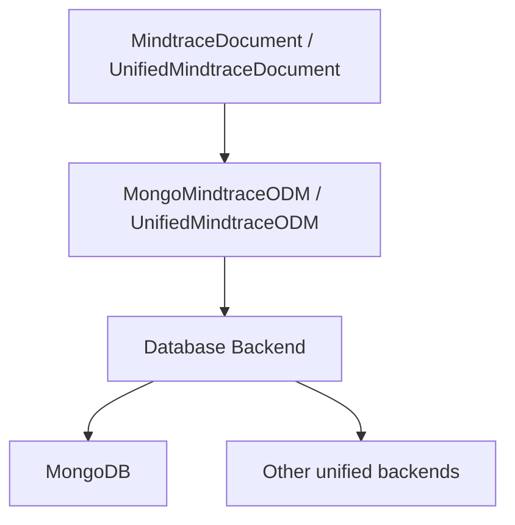
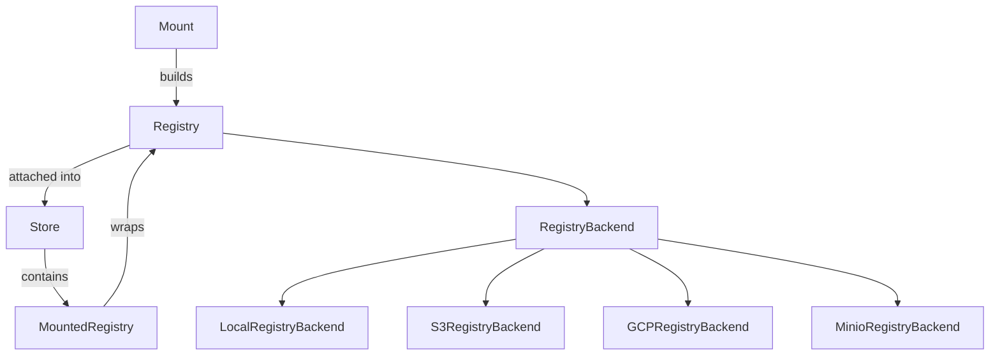
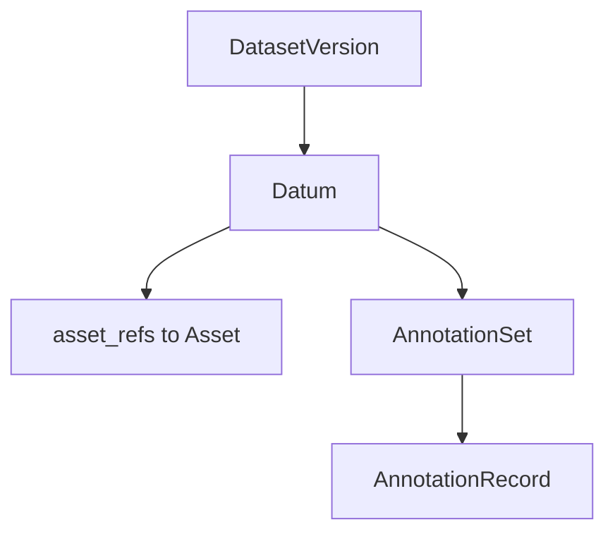
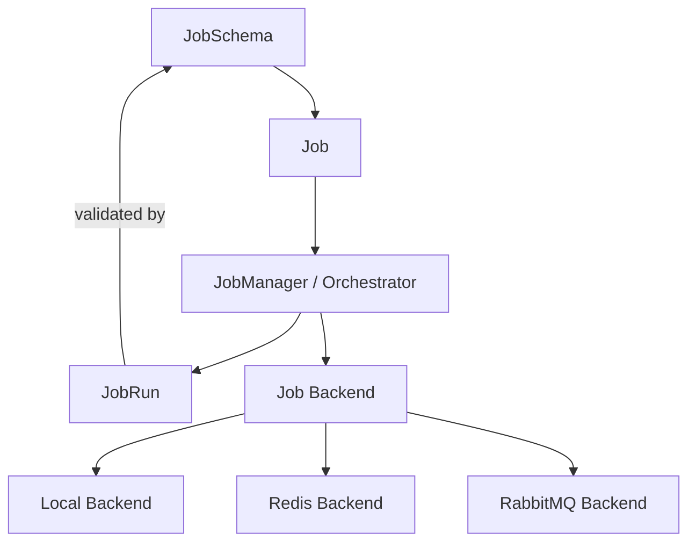
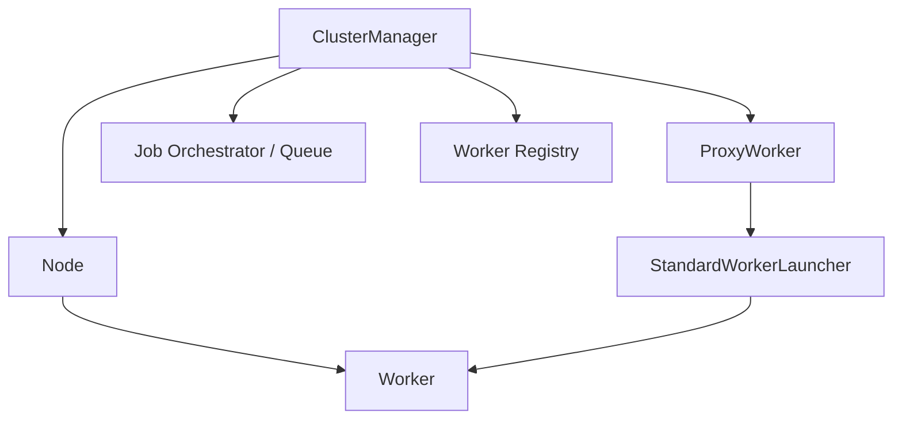
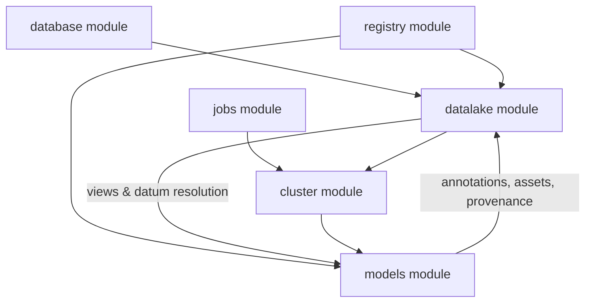
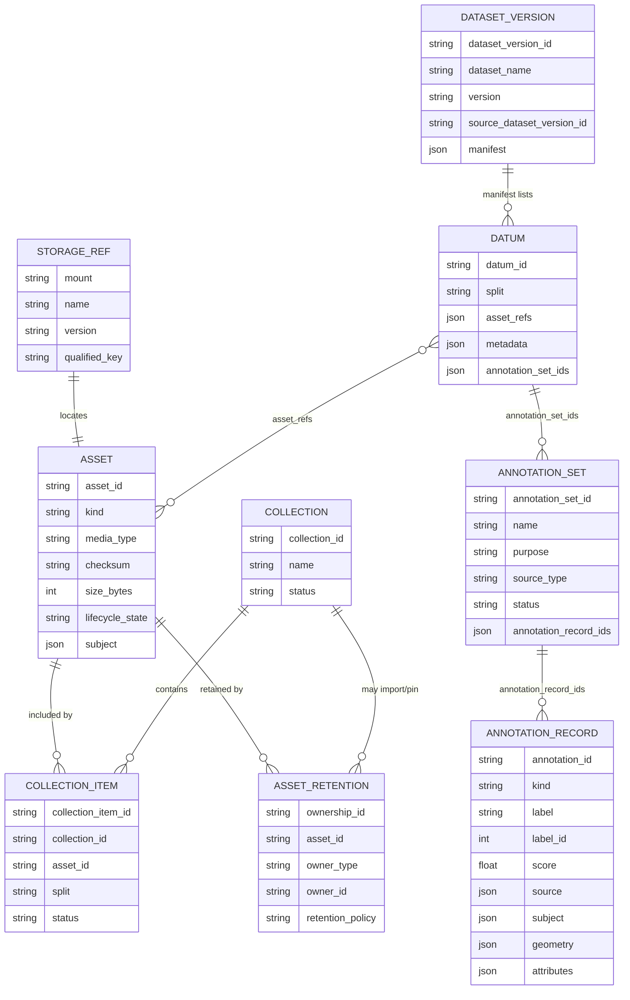

# Datalake V3 Proposal

## Summary

This document proposes **Datalake Version 3 (V3)** for Mindtrace.

V3 is intended as the next architectural step after:

- **V1**: the original `mtrix` Datalake, which focused primarily on dataset packaging, synchronization, and loading
- **V2**: the current `mindtrace.datalake` module, which introduced a simpler and more data-centric persistence model

The purpose of this document is to describe what V3 should be, why it is needed, how it relates to the earlier versions, and what architectural shape makes sense as Mindtrace grows.

At a high level, V3 is trying to accomplish the following:

- provide a clearer and more scalable long-term data architecture for Mindtrace
- move beyond dataset-package management toward a more general canonical persistence layer
- support richer storage topologies and more explicit data ownership boundaries
- support structured, queryable, and reusable data across multiple applications and workflows
- fit cleanly with adjacent modules such as `jobs` and `cluster`
- preserve the useful ideas from earlier iterations without carrying forward their structural limitations

In short, this document lays out a vision for V3 as the long-term data foundation for Mindtrace: scalable, modular, storage-aware, and designed to support rich data workflows across the platform.

---
## Table of Contents

- [Objectives](#objectives)
  - [Goals](#goals)
  - [Non-goals](#non-goals)
- [Version History](#version-history)
  - [V1: The `mtrix` Datalake](#v1-the-mtrix-datalake)
  - [V2: The current `mindtrace.datalake` module](#v2-the-current-mindtracedatalake-module)
    - [The V2 `Dataset` class](#the-v2-dataset-class)
  - [V3: Expanding the current Datalake to match our data needs](#v3-expanding-the-current-datalake-to-match-our-data-needs)
- [Module Structure](#module-structure)
  - [The `database` module](#the-database-module)
  - [The `registry` module](#the-registry-module)
  - [The `datalake` module](#the-datalake-module)
  - [The `jobs` module](#the-jobs-module)
  - [The `cluster` module](#the-cluster-module)
  - [The `models` module (mindtrace-models)](#the-models-module-mindtrace-models)
  - [How everything works together](#how-everything-works-together)
- [V3 Design](#v3-design)
  - [Strongest parts of the proposed V3 design](#strongest-parts-of-the-proposed-v3-design)
  - [Canonical V3 entities](#canonical-v3-entities)
    - [Referencing paradigm (parent → child)](#referencing-paradigm-parent--child)
    - [Subject references](#subject-references)
    - [Canonical entity summary table](#canonical-entity-summary-table)
    - [Collection](#1-collection)
    - [CollectionItem](#2-collectionitem)
    - [AssetRetention](#3-assetretention)
    - [StorageRef](#4-storageref)
    - [Asset](#5-asset)
    - [AnnotationSource](#6-annotationsource)
    - [AnnotationRecord](#7-annotationrecord)
    - [AnnotationSet](#8-annotationset)
    - [Datum](#9-datum)
    - [DatasetVersion](#10-datasetversion)
  - [Canonical semantic rule](#canonical-semantic-rule)
  - [Proposed minimal V3 API](#proposed-minimal-v3-api)
    - [A. Storage / mounts API](#a-storage--mounts-api)
    - [B. Assets API](#b-assets-api)
    - [C. Datasets API](#c-datasets-api)
    - [D. Datum API](#d-datum-api)
    - [E. Annotation API](#e-annotation-api)
  - [Migrating from V1 to V3](#migrating-from-v1-to-v3)
  - [DatasetBuilder](#datasetbuilder)
- [Appendix](#appendix)
  - [Integration notes](#integration-notes)
  - [Open questions](#open-questions)
  - [Recommended V3 implementation stance](#recommended-v3-implementation-stance)

---

## Objectives

### Goals

- Define a canonical data model for Datalake in Mindtrace.
- Support remote payload storage across multiple backends via `Store` / `Registry`.
- Support structured metadata and annotation persistence in a database.
- Preserve immutable dataset-version semantics.
- Support query-generated dataset views.
- Support both Mindtrace-native datasets and HuggingFace dataset interoperability.
- Align with **mindtrace-models** so model runs can persist outputs into the Datalake and consume Datalake-backed data as training or inference inputs without ad hoc glue code.
- Keep the initial V3 API small enough to implement without building the entire future platform at once.

### Non-goals

- Full enterprise data catalog in the initial V3 implementation.
- Full lineage graph and lifecycle management in the initial V3 implementation.
- Arbitrary Python-callable query execution over RPC.
- Fully automatic reference-counted garbage collection across all stored objects in the initial V3 implementation.
- Replacing every existing application-level workflow with Datalake on day one.

---

## Version History

This proposal is easier to understand if the Datalake is viewed as three iterations:

- **V1**: the `mtrix` Datalake
- **V2**: the current `mindtrace.datalake` module
- **V3**: expanding the current Datalake to match the broader data model and storage needs described in this proposal

### V1: The `mtrix` Datalake

The previous `mtrix` package included a `datalake` module that is useful to study because it solved a real set of problems well, but it also reveals why a new Datalake iteration is necessary.

#### What V1 was

The `mtrix` Datalake was primarily a dataset lifecycle and synchronization system.

At a high level it combined:

- a thin top-level `Datalake` facade
- a `ServiceRegistry` for dependency wiring
- service classes for discovery, provisioning, synchronization, loading, and manifest handling
- manifest-driven dataset versioning
- local filesystem dataset layouts
- Hugging Face as a registry / discovery plane
- GCP as blob storage
- Arrow / Hugging Face dataset cache building for loading

In other words, V1 was less a generalized canonical datalake and more a dataset packaging, synchronization, and loading framework.

#### What V1 did

V1 supported a concrete end-to-end workflow:

1. **Create a dataset locally** from a source directory.
2. **Validate it** by attempting to build cache through a Hugging Face `GeneratorBasedBuilder`.
3. **Store it locally** under a conventional directory structure with manifest files, split subdirectories, data files, masks, annotation JSON, and item metadata JSON.
4. **Publish it remotely** by splitting responsibilities across:
   - Hugging Face for dataset repository / manifest / README style coordination
   - GCP for actual data and annotation file blobs
5. **Fetch it back locally** by downloading a manifest first and then lazily filling in missing files.
6. **Load it** by materializing a Hugging Face dataset through a builder and Arrow cache.
7. **Update it incrementally** by comparing against previous versions and copying / merging changed files and annotations.

This gave `mtrix` a practical dataset distribution pipeline with local-first and offline-aware behavior.

#### Strengths of V1

##### 1. Good service decomposition

The split into:

- discovery
- provisioning
- synchronization
- loading
- manifest management

was clean and maintainable. The top-level `Datalake` class remained fairly thin while operational complexity lived in focused service classes.

##### 2. Strong dataset-version packaging model

The manifest-driven dataset-version model was well suited to shipping and loading versioned datasets. It gave a clear package boundary for:

- dataset name
- semantic version
- data type
- split structure
- output definitions
- annotation files
- item metadata files

##### 3. Thoughtful local/offline workflow

The explicit `offline_mode` was operationally useful and reflected real needs. The system was clearly designed around:

- local availability
- remote synchronization when needed
- explicit failure when offline constraints prevented an operation

##### 4. Practical incremental update support

The previous design did support version-to-version update flows, including:

- comparing previous and current versions
- uploading only newly introduced files in some cases
- merging annotation content
- applying removals

That is a meaningful capability and should not be dismissed.

##### 5. Strong Hugging Face integration

If the main consumer abstraction is a Hugging Face dataset, the old design was coherent. The builder/cache flow was aligned with a real consumer story.

#### Limitations of V1

The limitations of V1 are structural rather than cosmetic.

##### 1. It is dataset-package centric, not canonical-data centric

V1 treats the world primarily as:

- dataset names
- dataset versions
- manifests
- split directories
- files inside those directories

That is enough for dataset shipping, but not enough for a reusable canonical data layer.

It does not make the following concepts first-class:

- assets
- storage references independent of local layout
- datums as reusable units of membership
- annotation sets
- atomic annotation records
- multiple storage locations for the same payload

##### 2. Annotations are file-based, not first-class records

Annotations in V1 are largely handled as JSON files per split and per dataset version. They can be merged and copied, but they are not modeled as queryable, canonical records.

That creates several limitations:

- weak support for live annotation CRUD
- poor provenance at the per-annotation level
- difficulty representing multiple overlapping annotation layers
- difficulty querying across annotations independently of dataset package boundaries
- difficulty reusing annotation data outside a specific packaged dataset version

##### 3. Local filesystem layout is doing too much work

V1 is heavily coupled to a particular on-disk representation:

- root dataset directories
- `manifest_v*.json`
- `splits/<split>/...`
- images / meshes / point clouds directories
- masks directories
- annotation and item metadata JSON files

This is practical for one packaging format, but too rigid for a general platform.

##### 4. Remote storage topology is fixed and overly opinionated

V1 effectively assumes:

- Hugging Face for registry / discovery / repository concerns
- GCP for blob storage

That hardcodes vendor roles into the design.

##### 5. No generalized storage namespace or mount abstraction

There is no equivalent of a multi-mount `Store` or unified storage facade.

##### 6. Reuse and composability are limited

Because the main unit is a packaged dataset version, it is difficult to treat:

- an image asset
- a derived artifact
- a label snapshot
- a shared annotation layer

as reusable canonical pieces that can participate in multiple datasets or workflows.

### V2: The current `mindtrace.datalake` module

The current `mindtrace.datalake` module in the Mindtrace repo is already a significant shift away from the original `mtrix` dataset-package model. It is not yet the V3 design proposed in this document, but it does represent a meaningful V2 step.

#### What V2 is

The current V2 module is a lightweight asynchronous datalake centered on a single `Datalake` class and a single `Datum` model.

At a high level, V2 provides:

- MongoDB-backed persistence of `Datum` records
- optional external payload storage through `Registry`
- automatic lazy loading of registry-backed payloads
- derivation tracking through `derived_from`
- querying over datums and derivation chains
- a unified API for storing data either directly in MongoDB or indirectly via registry references

The core mental model in V2 is:

- a `Datum` is the fundamental stored object
- each datum may either hold inline `data` or a `registry_uri` + `registry_key`
- each datum may be derived from another datum
- queries can traverse derivation relationships to build row-shaped result sets

This is a much simpler design than V1 and a much more data-centric design than the old package-based approach.

#### What V2 does

Operationally, the current V2 module supports:

1. **Add datum**
   - store payload directly in MongoDB for smaller values
   - or store payload in a registry and keep only a reference in MongoDB
2. **Get datum**
   - load a datum record from MongoDB
   - if it is registry-backed, transparently load the payload from the referenced registry
3. **Track derivation**
   - maintain parent/child relationships using `derived_from`
4. **Query derived data**
   - support base queries and chained derived queries
   - support strategies like `latest`, `earliest`, `random`, `quickest`, and `missing`
5. **Run aggregation-based query execution**
   - use Mongo aggregation for more efficient chained lookups than the older legacy query path

#### Strengths of V2

##### 1. It is much simpler than V1

The V2 module is dramatically simpler than the old `mtrix` Datalake.

It strips away:

- dataset package layout assumptions
- split-directory orchestration
- Hugging Face repository coupling
- GCP-specific remote role assumptions
- manifest-first lifecycle complexity

and instead focuses on a smaller core:

- datum records
- registry-backed payload indirection
- derivation-aware querying

##### 2. It introduces a canonical persisted record

The `Datum` model is the first real step toward a reusable canonical persistence layer.

Unlike V1, the current module is not primarily organized around dataset package files. It has a real persisted record type with fields for:

- payload or payload reference
- metadata
- derivation relationship
- timestamps

##### 3. It separates heavy payloads from metadata when needed

The `add_datum(...)` path allows a datum to be stored either:

- directly in MongoDB
- or externally in a registry with a MongoDB reference

##### 4. It supports derivation as a first-class relationship

`derived_from` is simple, but powerful. It allows V2 to represent:

- processing pipelines
- generated labels
- transformations
- parent/child data relationships

##### 5. It provides a practical query layer

The aggregation-based `query_data(...)` is a meaningful improvement over purely application-side chained lookups.

#### The V2 `Dataset` class

The current V2 branch also introduces a `Dataset` document model that is worth calling out explicitly.

This `Dataset` class is best understood as a **row/column dataset view over datum references**. In the current design:

- a dataset stores rows as dictionaries of `column -> datum_id`
- each column is associated with a `contract`
- rows are loaded by resolving datum IDs through the Datalake
- the dataset can be converted into a Hugging Face `IterableDataset`

This is a meaningful step forward compared with V1 because it:

- replaces package-directory assumptions with a persisted document model
- makes datasets feel more data-centric and query-oriented
- introduces typed column contracts
- provides a practical bridge into Hugging Face workflows

At the same time, it is still best viewed as part of the V2 transitional architecture rather than the final V3 canonical model.

The current `Dataset` class is strong as:

- a tabular/materialized view over Datalake-backed data
- a convenient persisted document for assembling rows
- an HF interoperability layer

But it is still limited by the broader V2 assumptions:

- it remains heavily datum-centric
- it represents datasets primarily as rows of datum references
- it does not yet express richer canonical entities such as assets, annotation sets, or immutable dataset-version lineage cleanly enough on its own

So in the V1 -> V2 -> V3 evolution, the current `Dataset` class is best interpreted as:

- **more modern than V1’s package/manifest-first model**
- **useful and worth preserving in spirit**
- but ultimately better treated in V3 as a dataset view/materialization layer rather than the entire canonical dataset model

#### Limitations of V2

##### 1. `Datum` is doing too much

The current `Datum` model is carrying several concerns at once:

- payload container
- payload reference
- metadata bag
- derivation node
- query unit

This is a reasonable simplification for V2, but it does not scale cleanly into a richer datalake model.

##### 2. There is no first-class annotation model

Annotations are not modeled as first-class structured records. They can exist only as arbitrary `data` or `metadata` attached to generic datums.

That means V2 lacks:

- atomic annotation records
- annotation-set grouping
- explicit source/provenance model for labels
- strong geometry typing
- clear distinction between labels and arbitrary data payloads

##### 3. There is no explicit asset/storage model

V2 can store payloads in a registry, but it does not yet have an explicit model for:

- asset identity
- storage references as first-class objects
- multiple physical locations for the same logical payload
- mount-aware storage semantics

##### 4. Registry usage is still too primitive

The current module uses `registry_uri` directly and lazily creates `Registry(LocalRegistryBackend(...))` instances.

##### 5. Query model is powerful but not yet a canonical data model

The current aggregation query API is useful, but it is still oriented around:

- ad hoc row construction
- derivation traversal
- generic datum matching

rather than around the higher-level V3 entities that should become canonical.

##### 6. Dataset concepts are not yet explicit enough

Compared to V1, V2 swings strongly away from packaged datasets — which is good. But it does not yet replace them with sufficiently explicit canonical dataset entities.

### V3: Expanding the current Datalake to match our data needs

At a high level, V3 builds on V2 rather than replacing it blindly.

V3 exists because:

- V1 was too package-centric
- V2 is a strong simplification, but still too generic in the wrong places
- the next iteration needs to preserve V2's simplicity while adding explicit structure for assets, annotations, datasets, and storage

Concretely, V3 must add:

#### 1. Generalized storage via `Store` / mounts

V3 needs mount-aware storage semantics and a unified storage facade rather than a raw `registry_uri` field on a generic datum.

#### 2. Explicit payload identity

V3 needs `StorageRef` and `Asset` so payload-bearing objects can be identified and managed independently of the generic datum record.

#### 3. First-class annotation schema

V3 needs:

- `AnnotationSource`
- `AnnotationRecord`
- `AnnotationSet`
- optional **`subject`** on **`AnnotationRecord`** and **`Asset`** via a shared **`SubjectRef`**, so labels and payloads stay canonical without requiring a datum to bundle every asset–annotation pairing ([Subject references](#subject-references))

so labels become canonical structured data rather than arbitrary embedded payloads.

#### 4. Reusable dataset membership model

V3 keeps `Datum`, but narrows its role to dataset membership and composition rather than using it as the one object that represents every kind of stored thing.

#### 5. Immutable dataset versions over canonical entities

V3 reintroduces dataset-version semantics in a cleaner way than V1: a **dataset version** is an immutable **`manifest` of datum ids**; each **datum** references **assets** and **annotation sets**, which in turn list **annotation records**—with **parent → child** references only for **membership** ([Referencing paradigm](#referencing-paradigm-parent--child)). **Association and lineage** to another asset or annotation use a single optional **`subject`** field, orthogonal to that tree ([Subject references](#subject-references)).

#### Summary of the version history

- **V1** solved dataset packaging, synchronization, and HF-oriented loading.
- **V2** introduced a much cleaner canonical datum record plus registry-backed payload indirection and derivation-aware querying.
- **V3** is the next architectural step: expanding V2 into a fuller datalake with explicit assets, annotations, dataset versions, and mount-aware storage.

---


## Module Structure

This section describes how the major Mindtrace modules should relate to one another in the broader V3 architecture.

### The `database` module

#### Main role / responsibility

The `database` module is responsible for structured persistence, querying, indexing, and model-backed storage for Mindtrace records.

Its job is to provide:

- document-oriented persistence for structured application data
- ODM-style model integration
- backend abstraction across supported database/storage engines
- indexing, uniqueness, and query support for higher-level modules

For the Datalake specifically, the `database` module is the structured persistence substrate for canonical metadata and queryable entities.

#### Major classes

- `MindtraceDocument` / `UnifiedMindtraceDocument`
- `MongoMindtraceODM`
- `UnifiedMindtraceODM`
- backend and model configuration types



In the V3 architecture, the `database` module should be the place where canonical Datalake records live as structured, queryable entities, while the `registry` module stores larger payloads and versioned objects externally.


### The `registry` module

#### Main role / responsibility

The `registry` module is responsible for versioned object persistence and multi-backend storage access.

Its job is to provide:

- a version-aware object persistence abstraction
- support for multiple storage backends
- multi-mount composition through `Store`
- materialization and serialization of Python objects

The `registry` module is the storage substrate that V3 should build on, rather than reimplement.

#### Major classes

- `Registry`
- `Store`
- `Mount`
- `MountedRegistry`




### The `datalake` module

#### Main role / responsibility

The `datalake` module is responsible for canonical persisted data models and data-facing query semantics.

Its job is to provide:

- canonical records for assets, annotations, datums, and dataset versions
- persistent metadata and provenance
- queryable structured data
- a clean boundary between canonical state and export/materialization forms
- an integration layer that relies on both `registry` for payload persistence and `database` for structured records

#### Major classes

- `Asset`
- `Datum`
- `AnnotationSet`
- `DatasetVersion`




### The `jobs` module

#### Main role / responsibility

The `jobs` module is responsible for executable work definitions and run lifecycle management.

Its job is to provide:

- job definitions and schemas
- queueing and execution state
- retries and failure handling
- worker-facing input/output contracts

The `jobs` module should remain usable without a hard dependency on the Datalake.

#### Major classes

- `Job`
- `JobManager`
- `JobRun`
- `JobSchema`




### The `cluster` module

#### Main role / responsibility

The `cluster` module is responsible for distributed job orchestration, worker lifecycle management, and execution routing across nodes and workers.

Based on the current module and README, its job is to provide:

- a central orchestrator for submitting and tracking jobs
- worker registration and worker-type registration
- node-managed worker launching
- routing jobs either directly to endpoints or through workers
- support for worker execution environments such as Git-based and Docker-based runs
- integration with the registry for worker distribution and launch metadata

The current cluster module already acts as the practical bridge between execution and infrastructure. In a fuller V3 architecture, it should remain the main integration point between `jobs`, `registry`, and `datalake`.

#### Major classes

- `ClusterManager`
- `Node`
- `Worker`
- `ProxyWorker` / `StandardWorkerLauncher`



The actual current module also includes built-in worker implementations and execution helpers such as:

- `EchoWorker`
- `RunScriptWorker`
- Git and Docker execution environments

So the current Cluster module is not just a scheduler in the abstract. It is already a concrete execution system with:

- orchestration through `ClusterManager`
- node-based worker launching
- worker status tracking
- worker-type registration
- queue/orchestrator integration
- registry-backed worker distribution


### The `models` module (mindtrace-models)

The **`mindtrace-models`** package (the `mindtrace.models` module) is the ML lifecycle layer: architectures, training, evaluation, serving, and **archivers** that serialize model artifacts into the Mindtrace Registry.

For V3, Datalake and models should be **synchronized by contract**, not by turning the Datalake into a training framework or models into a database layer.

#### Main role relative to the Datalake

- **Outputs → Datalake**: Predictions, exported masks, embeddings, evaluation dumps, and other run products should be able to land in the Datalake as canonical **assets**, **annotation sets**, and **annotation records** (and linked **datums** / **dataset versions** where appropriate), with explicit **provenance** (model identity, archiver or checkpoint ref, job/run id, software versions). This extends the spirit of the [V1 output-type mapping](#migrating-from-v1-to-v3) so that mindtrace-models task outputs map to the same V3 entities applications use.
- **Datalake → inputs**: Training and inference pipelines should be able to resolve **dataset views** (immutable `DatasetVersion` materializations or query-derived views) into the tensors, file paths, or **Hugging Face** datasets that models already consume, using a small, stable adapter surface (see below) rather than each job reimplementing datum/asset resolution.

#### Dependency boundary

- **`datalake`** (and its service API) should remain **free of a hard dependency** on PyTorch, Ultralytics, ONNX, and other heavy ML stacks so lightweight clients and services can use it.
- **`mindtrace-models`** may take an **optional** dependency on Datalake client types / HTTP APIs for I/O helpers, or integration can live in a **thin composition layer** (`apps`, job workers, or a dedicated bridge package) that already depends on both. The important part is that **schemas and metadata conventions are shared** (e.g. annotation `kind`, asset kinds, provenance fields) so outputs written by models are indistinguishable from outputs written by other producers.

#### Practical synchronization mechanisms

1. **Shared canonical shapes**: Reuse V3 entity semantics for model outputs (e.g. detection → `AnnotationRecord(kind="bbox")` with `AnnotationSource` pointing at the producing model/run and optional **`subject`** anchoring the input **asset** or prior **annotation**). Archivers continue to own **Registry** serialization of weights and large blobs; Datalake rows reference those payloads via **storage refs / assets** where needed.
2. **Ingress adapters in models**: Typed helpers that accept Datalake identifiers or view descriptors (dataset version + split + column mapping) and yield `Pipeline` / dataloader / HF `Dataset` inputs—mirroring how the module already integrates with the Registry.
3. **Egress hooks in training, evaluation, and serving**: Callbacks, post-inference steps, or evaluation runners that call Datalake APIs (or injected `DatalakePort` interfaces) to persist batches of annotations or assets atomically where the platform requires it.
4. **Jobs / cluster as optional orchestrators**: Long-running training or batch inference jobs remain the natural place to wire credentials, mounts, and retries; the Datalake contract stays the same whether the caller is a notebook, a worker, or a service.

Together, this makes **Registry + Datalake** the single spine for “where blobs and canonical metadata live,” while **mindtrace-models** stays the spine for “how we train, evaluate, and serve,” with a narrow, documented bridge between them.


### How everything works together

At a high level, the intended relationship is:

- **`registry`** provides storage and object persistence primitives
- **`database`** provides structured record persistence and query support
- **`datalake`** provides canonical persisted data entities and data semantics
- **`jobs`** provides executable task definitions and run lifecycle semantics
- **`cluster`** integrates jobs and data in a distributed execution environment
- **`models` (mindtrace-models)** produces and consumes ML artifacts; **synchronized with `datalake`** for canonical dataset membership, annotations, and provenance-backed outputs (see [above](#the-models-module-mindtrace-models))



The intended dependency direction should be:

- `registry` is a lower-level storage substrate
- `database` is a lower-level structured persistence substrate
- `datalake` builds on both `registry` and `database`
- `jobs` remains largely independent of `datalake`
- `cluster` is the primary integration layer between execution and persisted data
- `models` depends on `registry` today for archivers; **optional or composed** integration with `datalake` keeps heavy ML dependencies out of the core Datalake module

This keeps the architecture modular while still allowing tight practical interoperability.


## V3 Design

### Strongest parts of the proposed V3 design

### 1. Split payload storage from metadata storage

This is the strongest architectural decision in the proposed V3 design.

- Payloads such as images, masks, artifacts, and exports belong in Registry / Store-backed object storage.
- Structured metadata, manifests, and annotations belong in a database / ODM layer.

This enables:

- large-scale remote storage on NAS / MinIO / GCP
- lightweight queryability over metadata and labels
- app-independent asset reuse
- clean separation between storage concerns and annotation/query concerns

### 2. `Datum` as the unit of dataset membership

The idea that a dataset is composed of datums is strong and should be central to V3.

A **dataset version** lists datums in its **manifest**; each **datum** points to one or more **assets** (by role) and lists **annotation sets**—see [Referencing paradigm (parent → child)](#referencing-paradigm-parent--child). Optional **`subject`** on records and assets ([Subject references](#subject-references)) allows the same assets and labels to exist and interoperate **outside** that membership tree when no datum wraps them together.

### 3. Immutable `Dataset` with mutable `DatasetBuilder`

This is a very good modeling choice for V3.

- `Dataset` should represent an immutable view / version.
- `DatasetBuilder` should represent a mutable changeset used to construct a new dataset version.

This makes versioning more natural and prevents accidental mutation of registered datasets.

### 4. View semantics by default

Returning dataset views from the Datalake without copying payloads is the right default behavior.

This keeps registration and querying cheap, and aligns with the idea that datasets are reference-based compositions over stored datums and assets.

### 5. Query-generated datasets

Generating datasets from metadata / annotation filters is a powerful capability and should remain a first-class feature.

### 6. Mindtrace-native datasets plus HuggingFace interoperability

Supporting a native Mindtrace data model while providing conversion to / from HuggingFace datasets is a strong long-term direction.

---

### Canonical V3 entities

The following entities define the proposed canonical V3 model.

### Referencing paradigm (parent → child)

The core **dataset / annotation / asset tree** uses **one-way containment**: larger containers hold references to smaller ones; **smaller entities do not store foreign keys back to their parents**.

Intended hierarchy:

```text
DatasetVersion
  └── manifest → Datum (ordered / addressable list of datum ids)
        ├── asset_refs → Asset (role → asset_id; payload identity only flows Datum → Asset)
        └── annotation_set_ids → AnnotationSet
              └── annotation_record_ids → AnnotationRecord
```

Consequences:

- A **`DatasetVersion`** lists **`datum_ids`** in its manifest only. Datums do **not** store `dataset_version_id`.
- A **`Datum`** lists **`annotation_set_ids`** only. Annotation sets do **not** store `datum_id` or `dataset_version_id`.
- An **`AnnotationSet`** lists **`annotation_record_ids`** only. Annotation records do **not** store `datum_id` or `annotation_set_id`.
- An **`Asset`** does not reference datums, datasets, or annotations **for membership**; only parents reference assets in the containment tree. Optional **`subject`** cross-links are separate (see [Subject references](#subject-references)).

`AnnotationSource` is modeled **inside** each `AnnotationRecord` (a value object), not as a separate graph parent of records.

**Query and indexing**: Services may maintain secondary indexes or denormalized projections (e.g. “all records under dataset X”, “all annotations with `subject` = asset A”) for performance, but the **canonical membership shape** should stay parent → child so dataset composition stays predictable.

Workspace and stewardship entities (`Collection`, `CollectionItem`, `AssetRetention`) sit **beside** this tree; where they still use multi-parent foreign keys, treat them as **operational** concerns, not as part of the core dataset containment model above.

### Subject references

**Containment** (who lists whom in a dataset) and **subject linkage** (what a row is anchored to—another asset or annotation) are intentionally **separate**.

Use a small shared value type:

```python
SubjectRef:
    kind: Literal["asset", "annotation"]
    id: str
```

#### `subject` (single optional field)

- **`Asset`** and **`AnnotationRecord`** may each include **`subject: SubjectRef | None`**.
- **`subject`** names the **asset or annotation** this row is **about** or **anchored to**: e.g. an annotation labels that asset or builds on that annotation; a derived asset (crop, mask file, export) points at its source asset or at an annotation that motivated it. **There is no separate “derived_from” field**—one name covers association, provenance, and lineage; interpretation is contextual.
- There is **no restriction** on `kind`: an asset may `subject` another **asset** or an **annotation**; an annotation may `subject` an **asset** or another **annotation**. Either may omit **`subject`** entirely (**root** / primary capture).
- Cycles are not forbidden by the type system; implementations may still enforce policies (e.g. DAG expectations) where useful.

This generalizes the spirit of V2’s `derived_from` on datums into V3’s **`subject`** on assets and annotation rows.

When **`subject`** is set on a record, consumers must **not** rely on a **`Datum`** existing that groups the same asset and annotation set—**the record carries the anchor itself**. When membership-only paths suffice, **`subject`** may be omitted.

#### Geometry and mask assets

Mask-style `geometry` may still embed or reference an `asset_id` for encoded masks; that is complementary to **`subject`** when the semantic anchor is the base image or point cloud.


<details>
<summary>Expand the canonical V3 entity model and relationships</summary>

The following entities define the proposed canonical V3 model.



Relationship summary:

- `StorageRef` describes where a payload lives physically.
- `Asset` is the logical record for a payload-bearing object and points to a `StorageRef`. Assets do not participate in **membership** parents (datums list assets), but may carry optional **`subject`** (`SubjectRef`) to another asset or annotation.
- `Collection` is a workspace/context that uses assets without necessarily owning the underlying payload bytes.
- `CollectionItem` is the membership record connecting a collection to an asset.
- `AssetRetention` records why an asset should continue to be retained independently of collection membership.
- `DatasetVersion` is an immutable view whose **manifest** lists `datum_ids` only.
- `Datum` is the unit of dataset membership: it references **assets by role** and lists **annotation set ids** for all label layers on that sample.
- `AnnotationSet` lists **annotation record ids** only. It may be **datum-linked** (id appears on `datum.annotation_set_ids`) or **free-standing** (no datum parent) for asset-centric or job-scoped batches.
- `AnnotationRecord` is an atomic label; **provenance** lives in an embedded `source` object. Optional **`subject`** (`SubjectRef`) anchors the row to another asset or annotation and is independent of containment parents.
- `DatasetBuilder` is treated separately as a Datalake helper/API concept rather than a canonical persisted entity.

</details>

### Canonical entity summary table

| Entity | Holds references to (children / membership) | Optional cross-links (not parent ids) |
|--------|-----------------------------------------------|--------------------------------------|
| `DatasetVersion` | `manifest` → `Datum` ids | — |
| `Datum` | `asset_refs` → `Asset` ids; `annotation_set_ids` → `AnnotationSet` ids | — |
| `AnnotationSet` | `annotation_record_ids` → `AnnotationRecord` ids | May be datum-linked or free-standing |
| `AnnotationRecord` | (listed only by parent set) | **`subject`**: `SubjectRef \| None`; geometry may still reference mask `asset_id` |
| `Asset` | `storage_ref` | **`subject`**: `SubjectRef \| None` (asset or annotation) |

### 1. `Collection`

A logical workspace, labeling scope, or collaboration boundary.

```python
Collection:
    collection_id: str
    name: str
    description: str | None = None
    status: Literal["active", "archived", "deleted"] = "active"
    metadata: dict[str, Any] = {}
    created_at: datetime
    created_by: str | None = None
    updated_at: datetime
```

Notes:

- A collection organizes work over assets.
- A collection should not be treated as the underlying owner of payload bytes by default.
- Collection-local configuration, workflow metadata, and collaboration state can attach here or to nearby entities.

### 2. `CollectionItem`

A membership record connecting a collection to an asset.

```python
CollectionItem:
    project_item_id: str
    collection_id: str
    asset_id: str
    split: Literal["train", "val", "test"] | None = None
    status: Literal["active", "hidden", "removed"] = "active"
    metadata: dict[str, Any] = {}
    added_at: datetime
    added_by: str | None = None
```

Notes:

- `CollectionItem` answers the question: “is this asset part of this project?”
- Removing an asset from a collection should usually remove this record, not delete the underlying asset.
- This entity is central to avoiding naive destructive reference-count semantics.

### 3. `AssetRetention`

A retention/stewardship record describing why an asset should continue to exist.

```python
AssetRetention:
    ownership_id: str
    asset_id: str
    owner_type: Literal[
        "collection_import",
        "dataset_version",
        "global_corpus",
        "job_run",
        "manual_pin",
        "system",
    ]
    owner_id: str
    retention_policy: Literal["retain", "delete_when_unreferenced", "archive_when_unreferenced"] = "retain"
    metadata: dict[str, Any] = {}
    created_at: datetime
    created_by: str | None = None
```

Notes:

- This is a better fit than a single hard owner field.
- It allows an asset to remain alive even after one collection removes it, so long as another project, dataset version, job result, or durable policy still retains it.
- In V3, asset deletion should be governed by the absence of `CollectionItem` memberships and `AssetRetention` records, not by collection deletion alone.

### 4. `StorageRef`

A reference to a stored payload object.

```python
StorageRef:
    mount: str
    name: str
    version: str | None = "latest"
    qualified_key: str | None = None
```

Notes:

- `mount` maps naturally to a `Store` mount such as `temp`, `nas`, or `gcp`.
- `name` is the unqualified object key within that mount.
- `version` refers to the storage-layer version, not the dataset version.

### 5. `Asset`

A canonical record for a payload-bearing object.

```python
Asset:
    asset_id: str
    kind: Literal["image", "mask", "artifact", "embedding", "document", "other"]
    media_type: str
    storage_ref: StorageRef
    checksum: str | None = None
    size_bytes: int | None = None
    subject: SubjectRef | None = None
    metadata: dict[str, Any] = {}
    created_at: datetime
    created_by: str | None = None
```

Notes:

- An asset is the catalog record for a payload in backing storage.
- This cleanly separates payload storage from dataset membership and annotation meaning.
- **`subject`** uses `SubjectRef` ([Subject references](#subject-references)): optional anchor to another **asset** or **annotation** (unrestricted); omit for primary captures.

### 6. `AnnotationSource`

Describes where an annotation came from.

```python
AnnotationSource:
    type: Literal["human", "machine", "derived"]
    name: str
    version: str | None = None
    metadata: dict[str, Any] = {}
```

Examples:

- `{"type": "human", "name": "review-ui"}`
- `{"type": "machine", "name": "yolo", "version": "1.2.0"}`
- `{"type": "derived", "name": "bbox-to-mask"}`

### 7. `AnnotationRecord`

One atomic annotation. **Parent:** an `AnnotationSet` lists this id in `annotation_record_ids`. Records do **not** store `datum_id` or `annotation_set_id`. Optional **`subject`** ([Subject references](#subject-references)) anchors association or lineage without requiring a wrapping `Datum`.

```python
AnnotationRecord:
    annotation_id: str
    subject: SubjectRef | None = None
    kind: Literal[
        "classification",
        "regression",
        "bbox",
        "rotated_bbox",
        "polygon",
        "polyline",
        "ellipse",
        "keypoint",
        "mask",
        "instance_mask",
        "pointcloud_segmentation",
    ]
    label: str
    label_id: int | None = None
    score: float | None = None
    source: AnnotationSource
    geometry: dict[str, Any]
    attributes: dict[str, Any] = {}
    created_at: datetime
    updated_at: datetime
```

Example geometry payloads:

```json
{ "type": "bbox", "x": 10, "y": 20, "width": 30, "height": 40 }
```

```json
{
  "type": "rotated_bbox",
  "cx": 10,
  "cy": 20,
  "width": 30,
  "height": 40,
  "angle_deg": 15
}
```

```json
{
  "type": "mask",
  "encoding": "rle_row_major_v1",
  "counts": [12, 4, 91],
  "size": [1080, 1920],
  "bbox": { "x": 10, "y": 20, "width": 30, "height": 40 }
}
```

Notes:

- Atomic records are easier to query, edit, and export.
- Job outputs should map into these records rather than become the canonical storage format.
- Set **`subject`** when the annotation applies to a specific **asset** or prior **annotation** without requiring dataset membership to imply that link.

### 8. `AnnotationSet`

A grouping and provenance boundary for annotation records. **Parent (optional):** a `Datum` may list this id in `annotation_set_ids` for dataset-local layers; sets may also be **free-standing** (no datum) when batches are keyed by job, model run, or asset-centric workflows. Sets do **not** store `datum_id` or `dataset_version_id`.

```python
AnnotationSet:
    annotation_set_id: str
    name: str
    purpose: Literal["ground_truth", "prediction", "review", "snapshot", "other"]
    source_type: Literal["human", "machine", "mixed"]
    status: Literal["draft", "active", "archived"]
    annotation_record_ids: list[str] = []
    metadata: dict[str, Any] = {}
    created_at: datetime
    created_by: str | None = None
```

Notes:

- Datum-linked sets support familiar layers (human truth vs machine predictions) inside a dataset row.
- Free-standing sets support pipelines that persist labels before or without constructing a `Datum`.
- Individual records may still use **`subject`** to tie each row to the correct asset or annotation regardless of how the set is grouped.

### 9. `Datum`

The unit of dataset membership. **Parent:** `DatasetVersion.manifest` lists this `datum_id`. Datums do **not** store `dataset_version_id`.

```python
Datum:
    datum_id: str
    split: Literal["train", "val", "test"] | None = None
    asset_refs: dict[str, str]  # role -> asset_id
    metadata: dict[str, Any] = {}
    annotation_set_ids: list[str] = []
    created_at: datetime
```

Notes:

- `asset_refs` can map roles like `image`, `thumbnail`, `aux_mask`, or `roi_crop` to asset IDs.
- Datums reference annotation sets by id instead of embedding annotation payloads.

### 10. `DatasetVersion`

An immutable dataset record. **Parent:** this object lists member datums in `manifest` only.

```python
DatasetVersion:
    dataset_version_id: str
    dataset_name: str
    version: str
    description: str | None = None
    manifest: list[str]  # datum_ids, in stable order
    source_dataset_version_id: str | None = None
    metadata: dict[str, Any] = {}
    created_at: datetime
    created_by: str | None = None
```

Notes:

- Annotation sets and assets are **not** listed on the dataset version; they are reached through each datum (`annotation_set_ids`, `asset_refs`).
- The same `datum_id` may appear in multiple dataset version manifests when versions share identical samples (reuse without duplicating child records).
- A runtime `Dataset` object can wrap this record and provide a Pythonic interface.

### Canonical semantic rule

One of the most important semantic rules for V3 should be:

> **Membership / containment**: **Dataset versions** list **datums**; **datums** list **assets** (by role) and **annotation sets**; **annotation sets** list **annotation records**—and **children in that tree never store parent ids**, so composition always flows from larger to smaller containers.

> **Subject references** (orthogonal): **`Asset`** and **`AnnotationRecord`** may each carry optional **`subject`** (`SubjectRef` to another asset or annotation, unrestricted, or absent)—covering both “what this labels” and “what this came from” without a second field.

> Immutable dataset versions are defined by their **manifest** of datum ids; assets and annotation payloads remain separate rows in the membership tree, while **`subject` links** may cross that tree freely.

This keeps the V3 data model normalized, extensible, and operationally practical.

---

### Proposed minimal V3 API

The API should be split into four slices:

- storage
- assets
- datasets
- annotations

### A. Storage / mounts API

#### `GET /api/v1/datalake/health`

Basic service health.

#### `GET /api/v1/datalake/mounts`

List configured mounts and default mount information.

Example response:

```json
{
  "default_mount": "nas",
  "mounts": [
    {
      "name": "temp",
      "read_only": false,
      "backend": "file:///tmp/mindtrace-store-abc123",
      "version_objects": false,
      "mutable": true
    },
    {
      "name": "nas",
      "read_only": false,
      "backend": "s3://minio/datalake",
      "version_objects": true,
      "mutable": true
    },
    {
      "name": "gcp",
      "read_only": false,
      "backend": "gs://my-bucket/datalake",
      "version_objects": true,
      "mutable": true
    }
  ]
}
```

#### `POST /api/v1/datalake/objects/put`

Persist a raw payload into the configured Store / Registry layer.

Example request:

```json
{
  "mount": "nas",
  "name": "project:p1:image:img1",
  "version": "latest",
  "content_base64": "...",
  "content_type": "image/jpeg",
  "metadata": {
    "filename": "foo.jpg",
    "collection_id": "p1"
  },
  "on_conflict": "overwrite"
}
```

#### `POST /api/v1/datalake/objects/get`

Retrieve a raw payload.

#### `POST /api/v1/datalake/objects/head`

Inspect a storage object without returning the payload.

#### `POST /api/v1/datalake/objects/copy`

Copy an object between mounts.

This is especially important for NAS -> GCP promotion workflows.

### B. Assets API

#### `POST /api/v1/datalake/assets`

Register an asset record for a stored payload.

Example request:

```json
{
  "kind": "image",
  "media_type": "image/jpeg",
  "storage_ref": {
    "mount": "nas",
    "name": "project:p1:image:img1",
    "version": "latest"
  },
  "checksum": "sha256:...",
  "size_bytes": 12345,
  "metadata": {
    "filename": "foo.jpg",
    "collection_id": "p1"
  }
}
```

Optional **`subject`** may be set to a `SubjectRef` (e.g. a crop anchored to a parent image asset, or an artifact anchored to an annotation).

#### `GET /api/v1/datalake/assets/{asset_id}`

Fetch asset metadata.

#### `GET /api/v1/datalake/assets`

List/filter assets by kind, project, metadata, or pagination.

#### `DELETE /api/v1/datalake/assets/{asset_id}`

Delete an asset record. Underlying payload deletion policy may remain conservative in the initial V3 implementation.

### C. Datasets API

#### `POST /api/v1/datalake/datasets`

Create/register a new immutable dataset version.

This should accept:

- dataset name
- version
- manifest / datum membership
- optionally a builder-derived payload

#### `GET /api/v1/datalake/datasets`

List datasets.

#### `GET /api/v1/datalake/datasets/{dataset_name}/versions`

List versions for a dataset.

#### `GET /api/v1/datalake/datasets/{dataset_name}/versions/{version}`

Fetch dataset version metadata.

#### `POST /api/v1/datalake/datasets/{dataset_name}/versions/{version}/view`

Return a paginated dataset view descriptor.

#### `POST /api/v1/datalake/datasets/query`

Create a derived dataset view using structured filters.

Example request:

```json
{
  "dataset": "all",
  "split": "train",
  "filters": [
    { "field": "metadata.label", "op": "eq", "value": "undercut" },
    { "field": "metadata.severity", "op": "gt", "value": 3.0 }
  ]
}
```

This preserves the spirit of `from_query(...)` while replacing a Python `Callable` with a proper service contract.

### D. Datum API

#### `POST /api/v1/datalake/datums`

Create one or more datums. **Membership in a dataset version** is expressed only by appending each `datum_id` to that version’s `manifest` (for example via dataset-version update or builder finalize), not by storing `dataset_version_id` on the datum.

#### `GET /api/v1/datalake/datums/{datum_id}`

Fetch datum metadata.

#### `GET /api/v1/datalake/datums`

Filter datums by dataset version, split, or metadata.

#### `PATCH /api/v1/datalake/datums/{datum_id}`

Update mutable datum metadata before finalization if allowed.

### E. Annotation API

Annotation APIs should follow **parent-scoped** paths where a parent exists: the server appends new child ids to the parent’s list (`datum.annotation_set_ids`, `annotation_set.annotation_record_ids`). **Bodies never include containment parent ids** (`datum_id`, `annotation_set_id`), but **may include `subject`** on each record ([Subject references](#subject-references)).

#### `POST /api/v1/datalake/annotation-sets`

Create a **free-standing** annotation set (not listed on any datum). Use this for asset-centric or job-scoped batches; link into a dataset later by adding the set id to a `datum.annotation_set_ids` if needed.

#### `POST /api/v1/datalake/datums/{datum_id}/annotation-sets`

Create a new annotation set for this datum (empty `annotation_record_ids` initially). The service must append the new `annotation_set_id` to `datum.annotation_set_ids`.

#### `GET /api/v1/datalake/datums/{datum_id}/annotation-sets`

List annotation sets belonging to this datum (resolve via `datum.annotation_set_ids`).

#### `GET /api/v1/datalake/annotation-sets/{annotation_set_id}`

Fetch annotation set metadata (convenience when the id is already known).

#### `POST /api/v1/datalake/annotation-sets/{annotation_set_id}/annotation-records`

Create one or more annotation records. The service assigns ids and appends each to `annotation_set.annotation_record_ids`. Bodies must **not** include `datum_id` or `annotation_set_id`; include **`subject`** when the association must not depend on a datum grouping the same asset and set.

Example request:

```json
{
  "annotations": [
    {
      "subject": { "kind": "asset", "id": "asset-image-1" },
      "kind": "bbox",
      "label": "crack",
      "score": 0.92,
      "source": {
        "type": "machine",
        "name": "yolo",
        "version": "1.0.0"
      },
      "geometry": {
        "type": "bbox",
        "x": 1,
        "y": 2,
        "width": 3,
        "height": 4
      },
      "attributes": {
        "severity": "high"
      }
    }
  ]
}
```

#### `GET /api/v1/datalake/annotation-records`

Filter annotation records by kind, label, source, or **`subject.kind` / `subject.id`**. Filtering **by datum** or **by set** is still defined as traversing the membership tree, or use a secondary index that mirrors that tree plus **`subject`** for direct lookups.

#### `GET /api/v1/datalake/annotation-records/{annotation_id}`

Fetch a single record by id.

#### `PATCH /api/v1/datalake/annotation-records/{annotation_id}`

Update an annotation record.

#### `DELETE /api/v1/datalake/annotation-records/{annotation_id}`

Delete an annotation record and remove its id from the parent `AnnotationSet.annotation_record_ids` (or apply an equivalent tombstone policy).

---


### Migrating from V1 to V3

The V1 `mtrix` Datalake supported a smaller set of task/output types than the V3 design. To preserve backward compatibility in spirit, V3 should explicitly map those V1 output types into canonical V3 entities.

The key principle is:

- **V1 output types** describe task/result categories
- **V3 canonical entities** describe how those results should persist in the Datalake

The table below captures the recommended mapping.

| V1 output type | Meaning in V1 | Recommended V3 representation | Notes |
|---|---|---|---|
| `classification` | Single class-style output | `AnnotationSet` + `AnnotationRecord(kind="classification")` | The annotation set captures source/purpose; each record stores the label and optional score/provenance. |
| `regression` | Scalar numeric output | `AnnotationSet` + `AnnotationRecord(kind="regression")` **or** structured datum/collection metadata, depending on domain semantics | If regression is part of the canonical label space, model it explicitly. If it is operational metadata, store it as structured metadata instead. |
| `detection` | Bounding-box detection output with labels | `AnnotationSet` + `AnnotationRecord(kind="bbox")` | Each detected object should become an atomic bbox annotation record. |
| `image_segmentation` | Mask-based image segmentation | `Asset(kind="mask")` + `AnnotationSet` + `AnnotationRecord(kind="mask")` | Set **`subject`** on the record to the base image **asset**; mask **asset** may use **`subject`** and/or geometry `asset_id`; datum packaging is optional. |
| `pointcloud_segmentation` | Per-point segmentation/classification for point clouds | `AnnotationSet` + `AnnotationRecord(kind="pointcloud_segmentation")` **or** a dedicated pointcloud annotation entity if introduced | V3 should support this explicitly even if the first implementation uses a specialized annotation kind before a richer pointcloud model exists. |

### Migration guidance

To migrate V1 semantics into V3 cleanly:

1. Preserve the **task meaning** of each V1 output type.
2. Persist the result using **canonical V3 entities**, not V1-shaped output blobs as the source of truth.
3. Keep provenance such as:
   - original task/output type
   - producing model or run
   - source dataset/collection context
4. Treat legacy package outputs and caches as **derived/imported forms**, not as the canonical V3 persistence model.

### Immediate compatibility requirement

At minimum, V3 should preserve support for the full V1 output surface:

- classification
- regression
- detection
- image segmentation
- pointcloud segmentation

That support does not require V3 to preserve the exact V1 storage format. It does require V3 to provide a canonical way to represent all of those semantics in the new data model.

### DatasetBuilder

`DatasetBuilder` should not be treated as a canonical persisted entity.

Instead, it should be treated as a separate Datalake-facing helper/API concept used to:

- stage changes to dataset membership
- construct new immutable `DatasetVersion`s
- support ergonomic SDK workflows for dataset authoring and revision

In other words:

- `DatasetVersion` is canonical persisted state
- `DatasetBuilder` is a mutable construction helper that may be exposed by the Datalake API or SDK, but should not sit in the canonical entity model itself

## Appendix

### Integration notes

This proposal is intentionally framed as a public Mindtrace design rather than an application-specific integration plan.

A consumer of the Datalake module should be able to:

- store payloads through the storage / asset APIs
- reference canonical Datalake asset IDs from higher-level application records
- use the annotation APIs for live label CRUD when appropriate
- generate dataset exports from canonical assets and annotation records
- promote objects across mounts through storage copy endpoints

This keeps Datalake positioned as the canonical persistence and access layer while allowing downstream applications to remain thin clients over that data model.

#### mindtrace-models synchronization

To make **model outputs** and **Datalake entries** first-class counterparts:

- **Egress (models → Datalake)**: Standardize how training, evaluation, and serving persist results—prefer **parent-scoped** batch APIs where a dataset row exists, and optional **`subject`** on **`AnnotationRecord`** and on derived **assets** (crops, masks, exports) so outputs remain meaningful without forcing a **datum** to bundle every asset–label pair.
- **Ingress (Datalake → models)**: Provide stable “view → loader” patterns: from a `DatasetVersion` or query-derived view descriptor to the structures `Pipeline` / `Trainer` / `EvaluationRunner` already expect, including HF interop where that is the native consumer.
- **Single source of truth**: Large tensors and checkpoints stay in **Registry** via archivers; the Datalake holds **references, metadata, and structured labels** so queries and dataset versions stay coherent without duplicating blob logic inside `mindtrace.models`.

Whether the Python glue ships inside `mindtrace-models` as an extra, inside `mindtrace.apps`, or as a small shared bridge module is an implementation choice; the **contract** (entity shapes, metadata keys, and API endpoints) should be owned with the V3 Datalake design so both sides evolve together.

---


### Open questions

The following are intentionally left open for later design decisions:

1. **Reference counting and garbage collection**
   - Should v1 maintain explicit reference counts on assets?
   - Should this be derived rather than eagerly tracked?

2. **Taxonomy / ontology support**
   - Should class maps and label ontologies become first-class entities in v1 or later?

3. **Transaction semantics**
   - How tightly do we want to coordinate DB writes and Store writes?
   - Is eventual consistency acceptable in v1?

4. **Query language**
   - What structured filter language should be adopted for dataset and annotation queries?

5. **Runtime SDK surface**
   - How much of the Python ergonomic layer (`Dataset`, `DatasetBuilder`, HF interop helpers) should ship in the first implementation?

6. **Access control / multi-tenant concerns**
   - Should authorization remain outside the Datalake service in the initial V3 implementation, or be partly absorbed later?

7. **mindtrace-models ↔ Datalake integration placement**
   - Should ingress/egress helpers live in `mindtrace-models` (optional extra), in `mindtrace.apps` / job workers only, or in a small dedicated bridge package?
   - What is the minimum API surface on the Datalake side (SDK vs HTTP) that models need for batch write and stream read paths?

8. **`subject` graph policy**
   - Should the service reject cycles, cap depth, or treat `subject` as an unstructured anchor with no graph guarantees?

---

### Recommended V3 implementation stance

A practical first implementation of V3 should:

- preserve the Registry / Store + database split
- implement explicit canonical entities for assets, datums, dataset versions, annotation sets, and atomic annotation records
- implement **`SubjectRef`** and optional **`subject`** on assets and annotation records, with indexes for common query paths
- keep the service API small and explicit
- avoid overpromising advanced lifecycle mechanics in the first cut

In short: build the Datalake as a canonical data layer with a narrow, clear contract, not as a one-off app-specific storage helper and not as a giant platform on day one.
