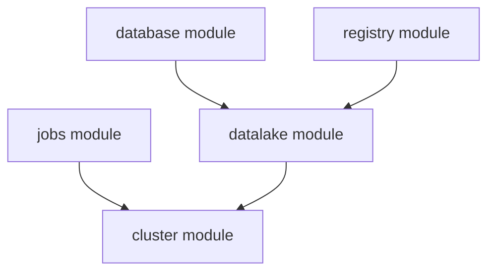
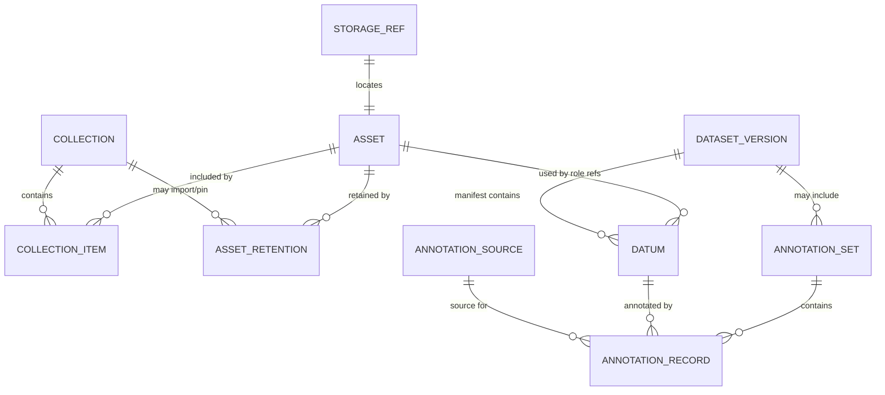

# Mindtrace Datalake

The Mindtrace Datalake is the canonical data layer for Mindtrace. It sits on **`mindtrace.database`** (structured records) and **`mindtrace.registry`** (object storage and mounts) and exposes a unified model for assets, collections, annotations, and immutable dataset versions.

**Start here**

- **[Happy path](./HAPPY_PATH.md)** — local stack, direct upload, **dataset sync** vs **replication**, and operational caveats.
- **Docker (Mongo + MinIO + `DatalakeService`)** — [docker/datalake/README.md](../../docker/datalake/README.md) at the repository root.

---

## What you can do today

| Area | Role |
|------|------|
| **`DatalakeService`** | HTTP/MCP-facing API over `AsyncDatalake` (typed tasks, FastAPI). |
| **Objects & uploads** | Put bytes in storage (`objects.put` or upload-session flow), then reference them from canonical records. |
| **Canonical model** | Assets, collections, datums, dataset versions, annotations — persisted in Mongo, payloads in configured mounts. |
| **Training exports** | Typed, relocatable Hugging Face exports for classification, detection, and segmentation. |
| **PyTorch adapters** | Build split-aware, indexable Datasets and ready-to-train DataLoaders from saved Hugging Face exports. |
| **Dataset sync** | Export/import **dataset version** bundles between lakes (`dataset_versions.export`, `import_prepare`, `import_commit`, and **caller-staged** `import_session_*` for cross-store payloads). |
| **Replication** | Metadata-first mirroring and payload lifecycle (`replication.*` tasks — upsert, hydrate, reconcile, status, reclaim). |

**Sync vs replication (short):**

- **Dataset sync** — move a **named, versioned dataset snapshot** as an import/export bundle. Dataset-centric.
- **Replication** — mirror **assets** across lakes with a metadata-first pipeline and optional hydration/reclaim. Asset-centric.

Same-lake **`metadata_only`** transfer policies are supported where implemented; **cross-lake `metadata_only` import is intentionally rejected** until unresolved-placeholder semantics exist. See the [happy path](./HAPPY_PATH.md) and GitHub issues for detail.

---

## Relationship to other Mindtrace modules

- **`mindtrace.database`** — persistence for canonical documents.
- **`mindtrace.registry`** — mounts, stores, and `StorageRef` resolution.
- **`mindtrace.jobs`** / **`mindtrace.cluster`** — execution and orchestration consume datalake data; they should not define the canonical schema.


```mermaid
flowchart TD
    DB[database module]
    REG[registry module]

    DB --> DL[datalake module]
    REG --> DL

    JOBS[jobs module] --> CL[cluster module]
    DL --> CL
```

---

## DataVault (`AsyncDataVault` / `DataVault`)

**DataVault** is a small facade over **`save(alias, payload, …)`** and **`load(alias)`**: it creates/links assets, registers aliases, and reads objects through the same registry stack as **`AsyncDatalake`**.

- **In-process:** `AsyncDataVault(async_datalake)` or `DataVault(datalake)` (or pass an explicit **`LocalAsyncDataVaultBackend`** / **`LocalDataVaultBackend`**).
- **Remote HTTP/MCP:** `cm = DatalakeService.connect(url="http://…")`, then **`DataVault(cm)`** or **`AsyncDataVault(cm)`**. The facade recognizes the service client and uses **`DatalakeServiceDataVaultBackend`** / **`DatalakeServiceAsyncDataVaultBackend`** automatically. You can still pass those backends explicitly if you prefer.

When the lake is running in **Docker** (Mongo + MinIO + `DatalakeService`), see **[docker/datalake/README.md](../../docker/datalake/README.md#using-datavault-against-the-compose-stack)** for a copy-paste sample against `http://localhost:8080`.

---

## Datalake service (`DatalakeService`)

The package provides **`DatalakeService`**, which wraps **`AsyncDatalake`** with the Mindtrace **`Service`** layer (FastAPI + MCP). Initialization can be lazy; live processes may enable startup initialization and background helpers (for example upload-session reconciliation).

Example (adjust host/port and Mongo URIs for your environment):

```python
from mindtrace.datalake import DatalakeService

service = DatalakeService.launch(
    host="localhost",
    port=8080,
    mongo_db_uri="mongodb://localhost:27017",
    mongo_db_name="datalake",
)
# Use async handlers or the service’s app/routes per your deployment.
```

### Task families (overview)

Includes, among others:

- **`health`**, **`summary`**, **`mounts`**
- **`objects.*`** — put/get/head/copy, upload session create/complete
- **`assets.*`**, **`assets.get_by_alias`**, **`aliases.add`**, **`collections.*`**, **`collection_items.*`**, **`asset_retentions.*`**
- **`annotation_*`**, **`datums.*`**
- **`dataset_versions.*`** — CRUD, resolve, **export**, **import_prepare**, **import_commit**
- **`replication.*`** — **upsert_batch**, **hydrate_asset_payload**, **reconcile**, **mark_local_delete_eligible**, **delete_local_payload**, **reclaim_verified_payloads**, **status**

Exact wire format and paths depend on how the shared `Service` framework exposes tasks; treat names above as the stable task identifiers.

---

## Storage model

Structured records live in the database layer; large payloads live in registry-backed storage. Mounts can target local disk, S3-compatible endpoints (including MinIO), GCS, etc., via **`Mount`** and store configuration.

---

## Design reference (V3 direction)

The datalake is evolving from earlier internal versions toward a fuller **V3** canonical model. The sections below summarize that direction; they are **not** an exhaustive API spec.

### Implementation status (historical labels)

- **V1** — older `mtrix`-era datalake (packaging and loading).
- **V2** — current `mindtrace.datalake` center of gravity (`Datum`, queries, etc.).
- **V3** — design direction: clearer entities, registry mounts, service-oriented access.

### Canonical V3 concepts

- **Collection**, **CollectionItem**, **AssetRetention**
- **StorageRef**, **Asset**
- **Annotation** schema/set/record model
- **Datum**, **DatasetVersion**
- **DatasetBuilder** (helper for constructing new versions — not the same as a persisted version record)

### Entity relationships (conceptual)


```mermaid
erDiagram
    STORAGE_REF ||--|| ASSET : "locates"
    ASSET ||--o{ COLLECTION_ITEM : "included by"
    COLLECTION ||--o{ COLLECTION_ITEM : "contains"
    ASSET ||--o{ ASSET_RETENTION : "retained by"
    COLLECTION ||--o{ ASSET_RETENTION : "may import/pin"
    ASSET ||--o{ DATUM : "used by role refs"
    DATASET_VERSION ||--o{ DATUM : "manifest contains"
    DATASET_VERSION ||--o{ ANNOTATION_SET : "may include"
    ANNOTATION_SET ||--o{ ANNOTATION_RECORD : "contains"
    DATUM ||--o{ ANNOTATION_RECORD : "annotated by"
    ANNOTATION_SOURCE ||--o{ ANNOTATION_RECORD : "source for"
```

### Annotations

V3 aims for first-class annotation types (classification, bbox, mask, keypoint, etc.) with provenance. See `docs/datalake-v3-proposal.md` in the repository for the full proposal.

### Design principles

1. Canonical data should outlive individual workflows.
2. Storage location should be separate from logical identity.
3. Datasets should be immutable views over reusable entities.
4. Annotations should be structured, queryable, and provenance-aware.
5. Collections should not imply destructive ownership of shared assets.
6. Execution systems integrate with the datalake; they do not define its schema.

---

## Hugging Face training exports

The Datalake can materialize immutable DatasetVersions as typed, relocatable Hugging Face `Dataset` or `DatasetDict`
artifacts. Training consumes the saved artifact and does not require a live MongoDB, object store, or Datalake
connection:

```text
Datalake DatasetVersion
        ↓ typed Hugging Face export
relocatable Dataset / DatasetDict
        ↓ build_datasets(...)
train / val / test PyTorch Datasets
        ↓ build_dataloaders(...)
train / val / test PyTorch DataLoaders
```

`build_datasets()` returns one indexable PyTorch-compatible Dataset per available or requested split.
`build_dataloaders()` delegates to it, then adds batching, train-only shuffling, workers, seeding, and task-specific
collation. Both accept one shared transform or a split-keyed transform mapping.

The public task API is:

- `task="classification"` — infer single-label or multi-label classification from the schema.
- `task="detection"` — full-image object detection.
- `task="segmentation"` — infer semantic or instance segmentation from the schema.

Explicit `semantic_segmentation` and `instance_segmentation` aliases are also accepted when profile validation is
preferred to inference.

The five built-in runtime profiles are:

1. **Single-label classification** — scalar `torch.long` target, normally used with `CrossEntropyLoss`.
2. **Multi-label classification** — fixed-length multi-hot `torch.float32` target, normally used with
   `BCEWithLogitsLoss`.
3. **Object detection** — one full image with all boxes and labels.
4. **Semantic segmentation** — one full image and categorical class-ID mask, including an ignore index.
5. **Instance segmentation** — one full image with per-instance masks, boxes, labels, areas, and crowd flags.

### Included example datasets

The check marks show the tasks and splits supported by the bundled importers. VOC has no public labeled 2012 test
split. Penn-Fudan has no official splits, so its importer creates a deterministic filename-hash train/validation
split.

<table>
  <thead>
    <tr>
      <th rowspan="2">Dataset</th>
      <th colspan="5">Tasks</th>
      <th colspan="3">Splits</th>
    </tr>
    <tr>
      <th>Single-label classification</th>
      <th>Multi-label classification</th>
      <th>Detection</th>
      <th>Semantic segmentation</th>
      <th>Instance segmentation</th>
      <th>Train</th>
      <th>Val</th>
      <th>Test</th>
    </tr>
  </thead>
  <tbody>
    <tr>
      <td>Oxford Flowers102</td>
      <td>✅</td>
      <td></td>
      <td></td>
      <td></td>
      <td></td>
      <td>✅</td>
      <td>✅</td>
      <td>✅</td>
    </tr>
    <tr>
      <td>Pascal VOC 2012</td>
      <td>✅</td>
      <td>✅</td>
      <td>✅</td>
      <td>✅</td>
      <td></td>
      <td>✅</td>
      <td>✅</td>
      <td></td>
    </tr>
    <tr>
      <td>Penn-Fudan Pedestrian</td>
      <td></td>
      <td></td>
      <td></td>
      <td></td>
      <td>✅</td>
      <td>✅</td>
      <td>✅</td>
      <td></td>
    </tr>
  </tbody>
</table>

- **Flowers102** imports its official train, validation, and test splits into one immutable DatasetVersion.
- **Pascal VOC 2012** creates a canonical union and task-specific DatasetVersions in one pass. Detection and
  whole-image multi-label classification use the Main split. Single-label classification uses lightweight region
  Datums and crops each bounding box during export. Semantic segmentation uses the independent Segmentation split
  and preserves background ID `0` and ignore ID `255`. For VOC train, the 5,717 Main images and 1,464 Segmentation
  images overlap by 1,151, so the canonical union stores 6,030 unique JPEG Assets once.
- **Penn-Fudan Pedestrian** contains 170 images and 345 pedestrian instances. Each image and indexed mask PNG is
  stored once. The HF export materializes per-object binary masks, and the runtime adapter returns torchvision
  Mask R-CNN targets.

### End-to-end example

Install all optional importer, Hugging Face, and PyTorch dependencies from the monorepo root:

```bash
uv sync --all-extras --dev
```

Start a local MongoDB container:

```bash
docker run --detach \
  --name mindtrace-datalake-mongodb \
  --publish 27017:27017 \
  mongo:7
```

The examples use the `datalake` database. Remove the container afterward with:

```bash
docker rm --force mindtrace-datalake-mongodb
```

#### Import Flowers102, VOC, and Penn-Fudan

```python
from pathlib import Path

from mindtrace.core import Config
from mindtrace.datalake import (
    Datalake,
    Flowers102ImportConfig,
    PascalVocImportConfig,
    PennFudanImportConfig,
    import_flowers102,
    import_pascal_voc,
    import_penn_fudan,
)

mindtrace_temp = Path(Config().MINDTRACE_DIR_PATHS.TEMP_DIR).expanduser()
data_root = mindtrace_temp / "datasets"
export_root = mindtrace_temp / "exports"

data_root.mkdir(parents=True, exist_ok=True)
export_root.mkdir(parents=True, exist_ok=True)

with Datalake.create(
    mongo_db_uri="mongodb://localhost:27017",
    mongo_db_name="datalake",
) as datalake:
    import_flowers102(
        datalake,
        Flowers102ImportConfig(
            root_dir=data_root / "flowers102",
            dataset_name="flowers-102",
            splits=("train", "val", "test"),
            download=True,
        ),
    )

    import_pascal_voc(
        datalake,
        PascalVocImportConfig(
            root_dir=data_root / "pascal-voc-2012",
            dataset_name="pascal-voc-2012-train",
            split="train",
            download=True,
        ),
    )

    import_penn_fudan(
        datalake,
        PennFudanImportConfig(
            root_dir=data_root / "penn-fudan",
            download=True,
            val_fraction=0.2,
            split_seed=42,
        ),
    )
```

Importers create immutable DatasetVersions and fail if the target name/version already exists. The downloaded source
trees are reusable, but rerunning the import requires new target versions or a clean Datalake.

#### Export every supported task

This cell uses persisted names and versions, so it remains usable after a Python or notebook restart:

```python
from pathlib import Path

from mindtrace.core import Config
from mindtrace.datalake import Datalake

mindtrace_temp = Path(Config().MINDTRACE_DIR_PATHS.TEMP_DIR).expanduser()
export_root = mindtrace_temp / "exports"
export_root.mkdir(parents=True, exist_ok=True)

exports = {
    "flowers102-single-label": (
        "flowers-102",
        "1.0.0",
        {"task": "classification"},
    ),
    "voc-single-label": (
        "pascal-voc-2012-train-classification-single-label",
        "1.2.1",
        {"task": "classification"},
    ),
    "voc-multi-label": (
        "pascal-voc-2012-train-classification-multi-label",
        "1.2.1",
        {"task": "classification"},
    ),
    "voc-detection": (
        "pascal-voc-2012-train-detection",
        "1.2.1",
        {"task": "detection"},
    ),
    "voc-semantic-segmentation": (
        "pascal-voc-2012-train-semantic-segmentation",
        "1.2.1",
        {"task": "segmentation"},
    ),
    "penn-fudan-instance-segmentation": (
        "penn-fudan-ped",
        "1.0.0",
        {"task": "segmentation"},
    ),
}

with Datalake.create(
    mongo_db_uri="mongodb://localhost:27017",
    mongo_db_name="datalake",
) as datalake:
    for destination_name, (dataset_name, dataset_version, options) in exports.items():
        datalake.export_dataset_version_to_format(
            dataset_name,
            dataset_version,
            format="huggingface",
            destination=export_root / destination_name,
            include_media=True,
            overwrite=True,
            exporter_options=options,
        )
```

The exports embed media for relocation, preserve ordered class mappings and source lineage, and normalize task
records into stable HF schemas.

#### Build all associated Datasets and DataLoaders

```python
from pathlib import Path

from mindtrace.core import Config
from mindtrace.models.training import build_dataloaders, build_datasets
from torchvision import transforms

mindtrace_temp = Path(Config().MINDTRACE_DIR_PATHS.TEMP_DIR).expanduser()
export_root = mindtrace_temp / "exports"

classification_transform = transforms.Compose(
    [
        transforms.Resize((224, 224)),
        transforms.ToTensor(),
    ]
)

dataset_specs = {
    "flowers102": (
        export_root / "flowers102-single-label",
        "classification",
        classification_transform,
    ),
    "voc_single_label": (
        export_root / "voc-single-label",
        "classification",
        classification_transform,
    ),
    "voc_multi_label": (
        export_root / "voc-multi-label",
        "classification",
        classification_transform,
    ),
    "voc_detection": (export_root / "voc-detection", "detection", None),
    "voc_semantic": (export_root / "voc-semantic-segmentation", "segmentation", None),
    "penn_fudan_instance": (
        export_root / "penn-fudan-instance-segmentation",
        "segmentation",
        None,
    ),
}

datasets = {
    name: build_datasets(path, task=task, transforms=transform)
    for name, (path, task, transform) in dataset_specs.items()
}

# Direct random access to a Mask R-CNN-shaped instance-segmentation sample.
image, target = datasets["penn_fudan_instance"]["train"][0]
# target["boxes"]:   FloatTensor[N, 4] in xyxy
# target["labels"]:  LongTensor[N]
# target["masks"]:   BoolTensor[N, H, W]
# target["area"]:    FloatTensor[N]
# target["iscrowd"]: LongTensor[N]

loaders = {
    name: build_dataloaders(
        path,
        task=task,
        transforms=transform,
        batch_size=32 if task == "classification" else 4,
        num_workers=0,
        seed=42,
    )
    for name, (path, task, transform) in dataset_specs.items()
}

flowers_train_loader = loaders["flowers102"]["train"]
flowers_val_loader = loaders["flowers102"]["val"]
flowers_test_loader = loaders["flowers102"]["test"]
voc_detection_train_loader = loaders["voc_detection"]["train"]
voc_semantic_train_loader = loaders["voc_semantic"]["train"]
penn_fudan_train_loader = loaders["penn_fudan_instance"]["train"]
penn_fudan_val_loader = loaders["penn_fudan_instance"]["val"]
```

Both builders return dictionaries keyed by available or requested split names. Pass `splits=(...)` to select a
subset. One transform may be shared across splits, or `transforms={"train": ..., "val": ..., "test": ...}` may
provide split-specific preprocessing.

Classification images must have a consistent shape before default collation can stack them. Detection, semantic
segmentation, and instance segmentation use list-based collation because image sizes and target counts vary.
Geometric detection and segmentation transforms receive the image and target together so boxes and masks remain
aligned. Semantic mask resizing must use nearest-neighbour interpolation.

### Runtime target contracts

- Single-label classification: `(image, scalar LongTensor)`.
- Multi-label classification: `(image, FloatTensor[num_classes])`.
- Detection: `(image, target)` where `target` contains `boxes`, `labels`, `area`, `iscrowd`, and `difficult`.
- Semantic segmentation: `(image, LongTensor[H, W])`.
- Instance segmentation: `(image, target)` where `target` contains `boxes`, `labels`, `masks`, `area`, and
  `iscrowd`.

Detection and instance targets follow torchvision conventions. The detection adapter is source-dataset-generic but
expects the canonical Mindtrace HF detection schema: embedded image media, absolute pixel-space `xywh` boxes, and
contiguous category IDs. VOC `difficult` remains available as its own boolean tensor and is also projected into the
torchvision/COCO-compatible `iscrowd` ignore channel; this is an evaluator compatibility mapping, not an assertion
that the source concepts are identical. The instance adapter similarly consumes the canonical Mindtrace HF
objects-with-masks schema.

COCO support is outside the current scope.

---

## Jobs and cluster

Jobs should own execution lifecycle; cluster orchestration should resolve datalake inputs/outputs. Task output schemas are not canonical datalake schemas — persist results as datalake entities (e.g. annotation sets/records) when they represent durable data.

---

## What this README is not

This file is an entry point, not a full API reference. For deeper V3 discussion see **`docs/datalake-v3-proposal.md`**. For a practical walkthrough of today’s features, use **[HAPPY_PATH.md](./HAPPY_PATH.md)**.
