# Mindtrace Hardware Component

The Mindtrace Hardware Component provides a unified interface for managing industrial hardware devices including cameras, PLCs, sensors, and actuators. The component is designed with modularity, extensibility, and production-ready reliability in mind.

## 🎯 Overview

This component offers:
- **Unified Configuration System**: Single configuration for all hardware components
- **Multiple Camera Backends**: Support for Daheng, Basler, OpenCV cameras with mock implementations
- **Network Bandwidth Management**: Intelligent concurrent capture limiting for GigE cameras
- **Multiple PLC Backends**: Support for Allen Bradley PLCs with LogixDriver, SLCDriver, and CIPDriver
- **Async Operations**: Thread-safe asynchronous operations for both cameras and PLCs
- **Graceful Error Handling**: Comprehensive exception system with detailed error messages
- **Industrial-Grade Architecture**: Production-ready design for manufacturing environments
- **Extensible Design**: Easy to add new hardware backends and components

## 📁 Component Structure

```
mindtrace/hardware/
└── mindtrace/
    └── hardware/
        ├── __init__.py        # Lazy imports for CameraManager and PLCManager
        ├── core/
        │   ├── config.py      # Unified hardware configuration system
        │   └── exceptions.py  # Hardware-specific exception hierarchy
        ├── cameras/
        │   ├── camera_manager.py  # Main camera management interface
        │   ├── backends/
        │   │   ├── base.py        # Abstract base camera class
        │   │   ├── daheng/        # Daheng camera implementation + mock
        │   │   │   ├── daheng_camera.py
        │   │   │   └── mock_daheng.py
        │   │   ├── basler/        # Basler camera implementation + mock
        │   │   │   ├── basler_camera.py
        │   │   │   └── mock_basler.py
        │   │   └── opencv/        # OpenCV camera implementation
        │   │       └── opencv_camera.py
        ├── plcs/
        │   ├── plc_manager.py     # Main PLC management interface
        │   ├── backends/
        │   │   ├── base.py        # Abstract base PLC class
        │   │   └── allen_bradley/ # Allen Bradley PLC implementation + mock
        │   │       ├── allen_bradley_plc.py
        │   │       └── mock_allen_bradley.py
        ├── sensors/               # Sensor implementations (future)
        ├── actuators/             # Actuator implementations (future)
        └── tests/                 # Comprehensive test suite
            └── unit/
                ├── cameras/
                │   └── test_cameras.py
                └── plcs/
                    └── test_plcs.py
```

## 🚀 Quick Start

### Installation

Install the base hardware component:

```bash
# quick clone and install
git clone https://github.com/Mindtrace/mindtrace.git
cd mindtrace
uv sync --extra cameras-all
```

### Camera Backend Setup

The hardware component provides automated setup commands for camera backends. Use these commands to install the required SDKs and dependencies:

#### Setup All Camera Backends
```bash
# Interactive setup for all supported camera backends
mindtrace-setup-cameras
```

#### Individual Camera Backend Setup
```bash
# Setup Daheng cameras (installs gxipy SDK)
mindtrace-setup-daheng

# Setup Basler cameras (installs pypylon SDK)
mindtrace-setup-basler
```

#### Camera Backend Removal
```bash
# Remove Daheng camera support
mindtrace-uninstall-daheng

# Remove Basler camera support
mindtrace-uninstall-basler
```

### Camera Quick Start

```python
import asyncio
from mindtrace.hardware.mindtrace.hardware import CameraManager

async def camera_example():
    # Initialize camera manager with mock support for testing
    async with CameraManager(include_mocks=True) as manager:
        # Discover available cameras
        cameras = manager.discover_cameras()
        print(f"Found cameras: {cameras}")
        
        # Initialize and get a camera using the proper pattern
        if cameras:
            await manager.initialize_camera(cameras[0])
            camera_proxy = manager.get_camera(cameras[0])
            
            # Capture image
            image = await camera_proxy.capture()
            print(f"Captured image: {image.shape}")
            
            # Configure camera
            success = await camera_proxy.configure(
                exposure=15000,
                gain=2.0,
                trigger_mode="continuous"
            )
            print(f"Configuration success: {success}")

asyncio.run(camera_example())
```

### PLC Quick Start

```python
import asyncio
from mindtrace.hardware.mindtrace.hardware import PLCManager

async def plc_example():
    # Initialize PLC manager
    manager = PLCManager()
    
    # Discover available PLCs
    discovered = await manager.discover_plcs()
    print(f"Found PLCs: {discovered}")
    
    # Register and connect a PLC
    success = await manager.register_plc(
        "TestPLC", 
        "AllenBradley", 
        "192.168.1.100", 
        plc_type="logix"
    )
    
    if success:
        # Read tags
        tags = await manager.read_tag("TestPLC", ["Motor1_Speed", "Conveyor_Status"])
        print(f"Tag values: {tags}")
        
        # Write tags
        results = await manager.write_tag("TestPLC", [("Pump1_Command", True)])
        print(f"Write success: {results}")
    
    # Cleanup
    await manager.cleanup()

asyncio.run(plc_example())
```

## 📋 Camera Manager API

The `CameraManager` class provides a comprehensive async interface for managing multiple camera backends with the new CameraProxy pattern. All camera operations are asynchronous and thread-safe.

### Modern Camera Management with CameraProxy

```python
from mindtrace.hardware.mindtrace.hardware import CameraManager

async def modern_camera_usage():
    # Initialize with network bandwidth management (important for GigE cameras)
    async with CameraManager(include_mocks=True, max_concurrent_captures=2) as manager:
        # Discover cameras
        cameras = manager.discover_cameras()
        
        # Initialize and get camera proxy for unified interface
        await manager.initialize_camera(cameras[0])
        camera_proxy = manager.get_camera(cameras[0])
        
        # Use camera through proxy
        image = await camera_proxy.capture()
        
        # Configure through proxy
        await camera_proxy.configure(
            exposure=20000,
            gain=1.5,
            trigger_mode="continuous"
        )
        
        # Get camera information
        info = await camera_proxy.get_sensor_info()
        print(f"Camera info: {info}")
        
        # Check network bandwidth management info
        bandwidth_info = manager.get_network_bandwidth_info()
        print(f"Bandwidth management: {bandwidth_info}")
```

### Backend Discovery and Management

```python
# Get available backends
manager = CameraManager(include_mocks=True)
backends = manager.get_available_backends()
backend_info = manager.get_backend_info()
print(f"Available backends: {backends}")
print(f"Backend details: {backend_info}")

# Discover cameras across all backends
cameras = manager.discover_cameras()
print(f"All cameras: {cameras}")
```

### Convenience Functions

For quick single-camera operations, you can use the convenience function:

```python
from mindtrace.hardware.mindtrace.hardware.cameras.camera_manager import initialize_and_get_camera

async def quick_camera_access():
    # Initialize and get camera in one step
    camera = await initialize_and_get_camera(
        "MockDaheng:test_camera",
        exposure=20000,
        gain=1.5,
        trigger_mode="continuous"
    )
    
    # Use camera immediately
    image = await camera.capture()
    print(f"Captured image: {image.shape}")
    
    # Note: Remember to properly close the camera when done
    await camera.close()
```

### Camera Discovery and Setup

```python
async def camera_setup():
    async with CameraManager(include_mocks=True) as manager:
        # Discover cameras
        cameras = manager.discover_cameras()
        
        # Initialize and get specific camera
        await manager.initialize_camera('Daheng:cam1')
        camera = manager.get_camera('Daheng:cam1')
        
        # Initialize camera with configuration during initialization
        await manager.initialize_camera(
            'Basler:serial123',
            exposure=20000,
            gain=2.0,
            trigger_mode="continuous"
        )
        camera = manager.get_camera('Basler:serial123')
        
        # Check active cameras
        active = manager.get_active_cameras()
        print(f"Active cameras: {active}")
```

### Image Capture and Configuration

```python
async def image_operations():
    async with CameraManager() as manager:
        # Initialize camera first
        await manager.initialize_camera('Daheng:cam1')
        camera = manager.get_camera('Daheng:cam1')
        
        # Basic capture
        image = await camera.capture()
        
        # Capture with save
        image = await camera.capture(save_path='captured.jpg')
        
        # Multiple configuration methods
        await camera.configure(
            exposure=15000,
            gain=1.5,
            roi=(100, 100, 800, 600),
            trigger_mode="continuous",
            pixel_format="BGR8",
            white_balance="auto",
            image_enhancement=True
        )
        
        # Individual setting methods
        await camera.set_exposure(20000)
        camera.set_gain(2.0)
        camera.set_roi(0, 0, 1920, 1080)
        await camera.set_trigger_mode("trigger")
        camera.set_pixel_format("RGB8")
```

### Batch Operations

```python
async def batch_operations():
    async with CameraManager(include_mocks=True) as manager:
        cameras = manager.discover_cameras()[:3]  # Get first 3 cameras
        
        # Initialize all cameras first
        await manager.initialize_cameras(cameras)
        
        # Batch configuration
        configurations = {
            cameras[0]: {"exposure": 15000, "gain": 1.0},
            cameras[1]: {"exposure": 20000, "gain": 1.5},
            cameras[2]: {"exposure": 25000, "gain": 2.0}
        }
        results = await manager.batch_configure(configurations)
        
        # Batch capture
        images = await manager.batch_capture(cameras)
        for camera_name, image in images.items():
            print(f"Captured from {camera_name}: {image.shape}")
```

### Network Bandwidth Management

The camera manager includes intelligent network bandwidth management to prevent network saturation when using multiple GigE cameras:

```python
async def bandwidth_management_example():
    # Initialize with conservative bandwidth management
    manager = CameraManager(include_mocks=True, max_concurrent_captures=1)
    
    try:
        cameras = manager.discover_cameras()[:4]
        
        # Initialize all cameras first
        await manager.initialize_cameras(cameras)
        
        # Get bandwidth management information
        bandwidth_info = manager.get_network_bandwidth_info()
        print(f"Current settings: {bandwidth_info}")
        
        # Batch capture with bandwidth limiting
        # Only 1 camera will capture at a time, preventing network saturation
        results = await manager.batch_capture(cameras)
        
        # Dynamically adjust bandwidth limits
        manager.set_max_concurrent_captures(2)  # Allow 2 concurrent captures
        print(f"Updated limit: {manager.get_max_concurrent_captures()}")
        
        # HDR capture also respects bandwidth limits
        hdr_results = await manager.batch_capture_hdr(
            camera_names=cameras[:2],
            exposure_levels=3,
            return_images=False
        )
        
    finally:
        await manager.close_all_cameras()

# Different bandwidth management strategies
async def bandwidth_strategies():
    # Conservative: Ensures no network saturation (recommended for critical applications)
    conservative_manager = CameraManager(max_concurrent_captures=1)
    
    # Balanced: Allows some concurrency while managing bandwidth (recommended for most applications)
    balanced_manager = CameraManager(max_concurrent_captures=2)
    
    # Aggressive: Higher concurrency (only for high-bandwidth networks)
    aggressive_manager = CameraManager(max_concurrent_captures=3)
    
    # Get recommended settings
    info = balanced_manager.get_network_bandwidth_info()
    print(f"Recommended settings: {info['recommended_settings']}")
```

### Advanced Camera Control

```python
async def advanced_control():
    async with CameraManager() as manager:
        # Initialize camera first
        await manager.initialize_camera('Basler:serial123')
        camera = manager.get_camera('Basler:serial123')
        
        # Exposure control
        exposure_range = await camera.get_exposure_range()
        current_exposure = await camera.get_exposure()
        await camera.set_exposure(15000.0)
        
        # Gain control
        gain_range = camera.get_gain_range()
        current_gain = camera.get_gain()
        camera.set_gain(2.0)
        
        # ROI control
        camera.set_roi(100, 100, 800, 600)
        roi = camera.get_roi()
        camera.reset_roi()
        
        # Pixel format control
        formats = camera.get_available_pixel_formats()
        current_format = camera.get_pixel_format()
        camera.set_pixel_format("RGB8")
        
        # White balance control
        wb_modes = camera.get_available_white_balance_modes()
        current_wb = await camera.get_white_balance()
        await camera.set_white_balance("auto")
        
        # Configuration management
        await camera.save_config("camera_config.json")
        await camera.load_config("camera_config.json")
```

## 📋 PLC Manager API

The `PLCManager` class provides a comprehensive async interface for managing PLCs in industrial environments. All PLC operations are asynchronous and thread-safe.

### Initialization and Backend Management

```python
from mindtrace.hardware.mindtrace.hardware import PLCManager

# Initialize with specific backends
manager = PLCManager()

# Register additional backends
success = manager.register_backend("AllenBradley")

# Get backend information
backends = manager.get_supported_backends()
available = manager.get_available_backends()
status = manager.get_backend_status()
```

### PLC Discovery and Registration

```python
# Discover PLCs on network
plcs = manager.get_available_plcs()
# Returns: ['AllenBradley:192.168.1.100:Logix', 'AllenBradley:192.168.1.101:SLC']

# Register PLCs
await manager.register_plc("ProductionPLC", "192.168.1.100", plc_type="logix")
await manager.register_plc("PackagingPLC", "192.168.1.101", plc_type="slc")

# Get registered PLCs
registered = manager.get_registered_plcs()
# Returns: ['ProductionPLC', 'PackagingPLC']
```

### PLC Connection Management

```python
# Connect individual PLC
success = await manager.connect_plc("ProductionPLC")

# Connect all registered PLCs
results = await manager.connect_all_plcs()
# Returns: {'ProductionPLC': True, 'PackagingPLC': True}

# Check connection status
status = await manager.is_plc_connected("ProductionPLC")
connected_plcs = await manager.get_connected_plcs()

# Disconnect PLCs
await manager.disconnect_plc("ProductionPLC")
await manager.disconnect_all_plcs()
```

### Tag Operations

```python
# Read single tag
value = await manager.read_tag("ProductionPLC", "Motor1_Speed")
# Returns: 1500.0

# Read multiple tags
values = await manager.read_tags("ProductionPLC", ["Motor1_Speed", "Conveyor_Status", "Temperature_Tank1"])
# Returns: {'Motor1_Speed': 1500.0, 'Conveyor_Status': True, 'Temperature_Tank1': 75.2}

# Write single tag
success = await manager.write_tag("ProductionPLC", "Pump1_Command", True)
# Returns: True

# Write multiple tags
results = await manager.write_tags("ProductionPLC", [
    ("Motor1_Speed", 1800.0),
    ("Conveyor_Direction", 1),
    ("Valve1_Open", True)
])
# Returns: {'Motor1_Speed': True, 'Conveyor_Direction': True, 'Valve1_Open': True}
```

### Batch Operations

```python
# Batch read from multiple PLCs
batch_results = await manager.read_tags_batch([
    ("ProductionPLC", ["Motor1_Speed", "Conveyor_Status"]),
    ("PackagingPLC", ["N7:0", "B3:0"])
])
# Returns: {
#     'ProductionPLC': {'Motor1_Speed': 1500.0, 'Conveyor_Status': True},
#     'PackagingPLC': {'N7:0': 1500, 'B3:0': True}
# }

# Batch write to multiple PLCs
batch_results = await manager.write_tags_batch([
    ("ProductionPLC", [("Pump1_Command", True), ("Motor1_Speed", 1600.0)]),
    ("PackagingPLC", [("N7:1", 2200), ("B3:1", False)])
])
```

### PLC Information and Diagnostics

```python
# Get PLC information
info = await manager.get_plc_info("ProductionPLC")
# Returns detailed PLC information including model, firmware, etc.

# Get available tags
tags = await manager.get_plc_tags("ProductionPLC")
# Returns list of all available tags on the PLC

# Get tag information
tag_info = await manager.get_tag_info("ProductionPLC", "Motor1_Speed")
# Returns detailed tag information including type, description, etc.
```

## 🌐 FastAPI REST API

The hardware component includes a complete **FastAPI REST API** that provides web-based access to all camera management features. The API is production-ready with sub-millisecond response times and comprehensive validation.

### API Architecture Overview

```mermaid
graph TB
    App["🚀 FastAPI Application<br/>Port 8000 | Sub-millisecond Response"]
    Middleware["🛡️ Middleware<br/>CORS | Logging | Exception Handling"]
    DI["💉 Dependency Injection<br/>CameraManager | Validation"]
    
    Backend["🖥️ Backend Management<br/>4 endpoints"]
    Camera["📷 Camera Operations<br/>8 endpoints"]
    AsyncConfig["⚡ Async Configuration<br/>9 endpoints"]
    SyncConfig["🔧 Sync Configuration<br/>12 endpoints"]
    Capture["📸 Image Capture<br/>4 endpoints"]
    Persistence["💾 Config Persistence<br/>4 endpoints"]
    Network["🌐 Network Management<br/>4 endpoints"]
    
    RequestModels["📝 Request Models<br/>35+ Pydantic Models"]
    ResponseModels["📤 Response Models<br/>Structured Responses"]
    
    CameraManager["📷 CameraManager<br/>Discovery | Init | Config | Capture"]
    CameraProxy["🎭 Camera Proxy Pattern<br/>Abstraction | Thread Safety"]
    
    OpenCV["📹 OpenCV Backend<br/>Consumer Cameras"]
    Daheng["🔬 Daheng Backend<br/>Industrial Cameras"]
    Basler["🎯 Basler Backend<br/>High-end Cameras"]
    MockBackends["🎪 Mock Implementations<br/>Testing & Development"]
    
    HDR["🌅 HDR Capture<br/>Multi-exposure"]
    BatchOps["📦 Batch Operations<br/>Multi-camera"]
    ConfigMgmt["💾 Configuration Management<br/>Export/Import"]
    NetworkOpt["🌐 Network Optimization<br/>Bandwidth Management"]
    
    Performance["⚡ Performance Metrics<br/>0.0002s - 0.0043s<br/>45+ Endpoints<br/>100% Test Coverage"]
    
    App --> Middleware
    Middleware --> DI
    DI --> Backend
    DI --> Camera
    DI --> AsyncConfig
    DI --> SyncConfig
    DI --> Capture
    DI --> Persistence
    DI --> Network
    
    Backend --> RequestModels
    Camera --> RequestModels
    AsyncConfig --> RequestModels
    SyncConfig --> RequestModels
    Capture --> RequestModels
    Persistence --> RequestModels
    Network --> RequestModels
    
    RequestModels --> ResponseModels
    ResponseModels --> CameraManager
    
    CameraManager --> CameraProxy
    CameraProxy --> OpenCV
    CameraProxy --> Daheng
    CameraProxy --> Basler
    CameraProxy --> MockBackends
    
    CameraManager --> HDR
    CameraManager --> BatchOps
    CameraManager --> ConfigMgmt
    CameraManager --> NetworkOpt
    
    HDR --> Performance
    BatchOps --> Performance
    ConfigMgmt --> Performance
    NetworkOpt --> Performance
    
    classDef fastapi fill:#e1f5fe,stroke:#01579b,stroke-width:2px
    classDef router fill:#f3e5f5,stroke:#4a148c,stroke-width:2px
    classDef validation fill:#fff8e1,stroke:#ff6f00,stroke-width:2px
    classDef hardware fill:#e8f5e8,stroke:#1b5e20,stroke-width:2px
    classDef backend fill:#fff3e0,stroke:#e65100,stroke-width:2px
    classDef feature fill:#fce4ec,stroke:#880e4f,stroke-width:2px
    classDef performance fill:#f1f8e9,stroke:#33691e,stroke-width:2px
    
    class App,Middleware,DI fastapi
    class Backend,Camera,AsyncConfig,SyncConfig,Capture,Persistence,Network router
    class RequestModels,ResponseModels validation
    class CameraManager,CameraProxy hardware
    class OpenCV,Daheng,Basler,MockBackends backend
    class HDR,BatchOps,ConfigMgmt,NetworkOpt feature
    class Performance performance
```



### API Features

- **45+ Production-Ready Endpoints** across 7 specialized routers
- **Sub-millisecond Performance** (0.0002s - 0.0043s response times)
- **Comprehensive Validation** with 35+ Pydantic models
- **Batch Operations** for efficient multi-camera management
- **HDR Capture Support** with configurable exposure levels
- **Network Management** with bandwidth monitoring and concurrency control
- **Configuration Persistence** with file-based export/import
- **Real-time Status Monitoring** for cameras and backends

### Starting the API Server

```bash
# Start the FastAPI development server
cd mindtrace/hardware
python -m uvicorn mindtrace.hardware.api.app:app --reload --port 8000

# For production deployment
python -m uvicorn mindtrace.hardware.api.app:app --host 0.0.0.0 --port 8000 --workers 4
```

### API Endpoints Overview

#### Backend Management (`/api/v1/backends` - 4 endpoints)
```bash
# List available backends
curl http://localhost:8000/api/v1/backends/

# Get backend information
curl http://localhost:8000/api/v1/backends/info

# Get specific backend info
curl http://localhost:8000/api/v1/backends/OpenCV

# Backend health check
curl http://localhost:8000/api/v1/backends/status/health
```

#### Camera Discovery & Lifecycle (`/api/v1/cameras` - 8 endpoints)
```bash
# Discover cameras
curl http://localhost:8000/api/v1/cameras/discover

# Discover cameras from specific backend
curl "http://localhost:8000/api/v1/cameras/discover?backend=OpenCV"

# List active cameras
curl http://localhost:8000/api/v1/cameras/active

# Initialize camera
curl -X POST http://localhost:8000/api/v1/cameras/initialize \
  -H "Content-Type: application/json" \
  -d '{"camera": "OpenCV:opencv_camera_0", "test_connection": true}'

# Check camera status
curl "http://localhost:8000/api/v1/cameras/status?camera=OpenCV:opencv_camera_0"

# Get camera information
curl "http://localhost:8000/api/v1/cameras/info?camera=OpenCV:opencv_camera_0"

# Close camera
curl -X DELETE "http://localhost:8000/api/v1/cameras/?camera=OpenCV:opencv_camera_0"

# Close all cameras
curl -X DELETE http://localhost:8000/api/v1/cameras/all
```

#### Async Configuration (`/api/v1/cameras/config/async` - 9 endpoints)
```bash
# Exposure control
curl "http://localhost:8000/api/v1/cameras/config/async/exposure?camera=OpenCV:opencv_camera_0"
curl -X PUT http://localhost:8000/api/v1/cameras/config/async/exposure \
  -H "Content-Type: application/json" \
  -d '{"camera": "OpenCV:opencv_camera_0", "exposure": 20000.0}'

# Trigger mode control
curl "http://localhost:8000/api/v1/cameras/config/async/trigger-mode?camera=OpenCV:opencv_camera_0"
curl -X PUT http://localhost:8000/api/v1/cameras/config/async/trigger-mode \
  -H "Content-Type: application/json" \
  -d '{"camera": "OpenCV:opencv_camera_0", "mode": "continuous"}'

# White balance control
curl "http://localhost:8000/api/v1/cameras/config/async/white-balance?camera=OpenCV:opencv_camera_0"
curl -X PUT http://localhost:8000/api/v1/cameras/config/async/white-balance \
  -H "Content-Type: application/json" \
  -d '{"camera": "OpenCV:opencv_camera_0", "mode": "auto"}'
```

#### Sync Configuration (`/api/v1/cameras/config/sync` - 12 endpoints)
```bash
# Gain control
curl "http://localhost:8000/api/v1/cameras/config/sync/gain?camera=OpenCV:opencv_camera_0"
curl -X PUT http://localhost:8000/api/v1/cameras/config/sync/gain \
  -H "Content-Type: application/json" \
  -d '{"camera": "OpenCV:opencv_camera_0", "gain": 2.0}'

# ROI management
curl "http://localhost:8000/api/v1/cameras/config/sync/roi?camera=OpenCV:opencv_camera_0"
curl -X PUT http://localhost:8000/api/v1/cameras/config/sync/roi \
  -H "Content-Type: application/json" \
  -d '{"camera": "OpenCV:opencv_camera_0", "x": 100, "y": 100, "width": 800, "height": 600}'

# Pixel format control
curl "http://localhost:8000/api/v1/cameras/config/sync/pixel-format?camera=OpenCV:opencv_camera_0"
curl -X PUT http://localhost:8000/api/v1/cameras/config/sync/pixel-format \
  -H "Content-Type: application/json" \
  -d '{"camera": "OpenCV:opencv_camera_0", "format": "RGB8"}'
```

#### Image Capture (`/api/v1/cameras/capture` - 4 endpoints)
```bash
# Single capture
curl -X POST http://localhost:8000/api/v1/cameras/capture/ \
  -H "Content-Type: application/json" \
  -d '{"camera": "OpenCV:opencv_camera_0", "save_path": "capture.jpg"}'

# Batch capture
curl -X POST http://localhost:8000/api/v1/cameras/capture/batch \
  -H "Content-Type: application/json" \
  -d '{"cameras": ["OpenCV:opencv_camera_0", "OpenCV:opencv_camera_1"]}'

# HDR capture
curl -X POST http://localhost:8000/api/v1/cameras/capture/hdr \
  -H "Content-Type: application/json" \
  -d '{"camera": "OpenCV:opencv_camera_0", "exposure_levels": 5, "exposure_multiplier": 2.0}'

# Batch HDR capture
curl -X POST http://localhost:8000/api/v1/cameras/capture/hdr/batch \
  -H "Content-Type: application/json" \
  -d '{"cameras": ["OpenCV:opencv_camera_0"], "exposure_levels": 3}'
```

#### Network Management (`/api/v1/network` - 4 endpoints)
```bash
# Get bandwidth information
curl http://localhost:8000/api/v1/network/bandwidth

# Get concurrent capture limit
curl http://localhost:8000/api/v1/network/concurrent-limit

# Set concurrent capture limit
curl -X POST http://localhost:8000/api/v1/network/concurrent-limit \
  -H "Content-Type: application/json" \
  -d '{"limit": 2}'

# Network health check
curl http://localhost:8000/api/v1/network/health
```

### Python API Client Examples

#### Basic API Client Usage
```python
import asyncio
import aiohttp

async def api_client_example():
    """Complete API client example using aiohttp"""
    
    async with aiohttp.ClientSession() as session:
        base_url = "http://localhost:8000"
        
        # 1. Discover cameras
        async with session.get(f"{base_url}/api/v1/cameras/discover") as response:
            cameras_data = await response.json()
            cameras = cameras_data["data"]
            print(f"Discovered cameras: {cameras}")
        
        if not cameras:
            print("No cameras found!")
            return
        
        camera_name = cameras[0]
        
        # 2. Initialize camera
        init_data = {"camera": camera_name, "test_connection": True}
        async with session.post(f"{base_url}/api/v1/cameras/initialize", 
                               json=init_data) as response:
            result = await response.json()
            print(f"Initialization: {result['success']}")
        
        # 3. Configure camera
        exposure_data = {"camera": camera_name, "exposure": 15000.0}
        async with session.put(f"{base_url}/api/v1/cameras/config/async/exposure", 
                              json=exposure_data) as response:
            result = await response.json()
            print(f"Exposure set: {result['success']}")
        
        # 4. Capture image
        capture_data = {"camera": camera_name, "save_path": "api_capture.jpg"}
        async with session.post(f"{base_url}/api/v1/cameras/capture/", 
                               json=capture_data) as response:
            result = await response.json()
            print(f"Capture completed: {result['success']}")
        
        # 5. HDR capture
        hdr_data = {
            "camera": camera_name,
            "exposure_levels": 3,
            "exposure_multiplier": 2.0,
            "return_images": True
        }
        async with session.post(f"{base_url}/api/v1/cameras/capture/hdr", 
                               json=hdr_data) as response:
            result = await response.json()
            print(f"HDR capture: {result['data']['successful_captures']} images")
        
        # 6. Network management
        async with session.get(f"{base_url}/api/v1/network/bandwidth") as response:
            bandwidth_info = await response.json()
            print(f"Network bandwidth: {bandwidth_info['data']}")

asyncio.run(api_client_example())
```

#### Production API Client
```python
import asyncio
import aiohttp
from typing import List, Dict, Any

class CameraAPIClient:
    """Production-ready Camera API client"""
    
    def __init__(self, base_url: str = "http://localhost:8000"):
        self.base_url = base_url
        self.session = None
    
    async def __aenter__(self):
        self.session = aiohttp.ClientSession()
        return self
    
    async def __aexit__(self, exc_type, exc_val, exc_tb):
        if self.session:
            await self.session.close()
    
    async def discover_cameras(self, backend: str = None) -> List[str]:
        """Discover available cameras"""
        url = f"{self.base_url}/api/v1/cameras/discover"
        params = {"backend": backend} if backend else {}
        
        async with self.session.get(url, params=params) as response:
            data = await response.json()
            return data["data"]
    
    async def initialize_camera(self, camera: str, test_connection: bool = True) -> bool:
        """Initialize a camera"""
        url = f"{self.base_url}/api/v1/cameras/initialize"
        data = {"camera": camera, "test_connection": test_connection}
        
        async with self.session.post(url, json=data) as response:
            result = await response.json()
            return result["success"]
    
    async def capture_image(self, camera: str, save_path: str = None) -> Dict[str, Any]:
        """Capture image from camera"""
        url = f"{self.base_url}/api/v1/cameras/capture/"
        data = {"camera": camera}
        if save_path:
            data["save_path"] = save_path
        
        async with self.session.post(url, json=data) as response:
            return await response.json()
    
    async def batch_capture(self, cameras: List[str]) -> Dict[str, Any]:
        """Capture from multiple cameras"""
        url = f"{self.base_url}/api/v1/cameras/capture/batch"
        data = {"cameras": cameras}
        
        async with self.session.post(url, json=data) as response:
            return await response.json()
    
    async def configure_exposure(self, camera: str, exposure: float) -> bool:
        """Configure camera exposure"""
        url = f"{self.base_url}/api/v1/cameras/config/async/exposure"
        data = {"camera": camera, "exposure": exposure}
        
        async with self.session.put(url, json=data) as response:
            result = await response.json()
            return result["success"]
    
    async def get_network_bandwidth_info(self) -> Dict[str, Any]:
        """Get network bandwidth information"""
        url = f"{self.base_url}/api/v1/network/bandwidth"
        
        async with self.session.get(url) as response:
            result = await response.json()
            return result["data"]

# Usage example
async def production_api_usage():
    async with CameraAPIClient() as client:
        # Discover and initialize cameras
        cameras = await client.discover_cameras()
        print(f"Found cameras: {cameras}")
        
        if cameras:
            # Initialize first camera
            success = await client.initialize_camera(cameras[0])
            print(f"Camera initialized: {success}")
            
            # Configure camera
            await client.configure_exposure(cameras[0], 20000.0)
            
            # Capture image
            result = await client.capture_image(cameras[0], "production_capture.jpg")
            print(f"Capture result: {result}")
            
            # Get network info
            bandwidth_info = await client.get_network_bandwidth_info()
            print(f"Network status: {bandwidth_info}")

asyncio.run(production_api_usage())
```

### API Testing

```bash
# Test the complete API suite
cd mindtrace/hardware
python test_camera_api.py

# Expected output:
# ✅ All 45+ endpoints tested successfully
# ⚡ Sub-millisecond response times (0.0002s - 0.0043s)
# 🔧 All 7 routers working correctly
# 📊 Performance metrics and validation results
```

### API Performance Characteristics

- **Response Times**: 0.0002s - 0.0043s (sub-millisecond)
- **Concurrent Requests**: Supports multiple simultaneous operations
- **Error Handling**: Comprehensive HTTP status codes and error messages
- **Validation**: Complete request/response validation with Pydantic
- **Documentation**: Auto-generated OpenAPI/Swagger documentation at `/docs`
- **Health Monitoring**: Built-in health checks and status endpoints

### API Documentation

Once the server is running, visit:
- **Interactive API Docs**: http://localhost:8000/docs
- **ReDoc Documentation**: http://localhost:8000/redoc
- **OpenAPI Schema**: http://localhost:8000/openapi.json

## ⚙️ Configuration

### Camera Configuration

The camera configuration has been streamlined to include only actively used settings:

```python
from mindtrace.hardware.mindtrace.hardware.core.config import get_hardware_config

config = get_hardware_config()
camera_settings = config.get_config().cameras

# Core camera settings
camera_settings.image_quality_enhancement    # bool = False
camera_settings.retrieve_retry_count         # int = 3
camera_settings.trigger_mode                 # str = "continuous"
camera_settings.exposure_time               # float = 1000.0
camera_settings.white_balance               # str = "auto"
camera_settings.gain                        # float = 1.0

# Network bandwidth management settings
camera_settings.max_concurrent_captures     # int = 2 (important for GigE cameras)

# OpenCV-specific settings
camera_settings.opencv_default_width        # int = 1280
camera_settings.opencv_default_height       # int = 720
camera_settings.opencv_default_fps          # int = 30
camera_settings.opencv_default_exposure     # float = -1.0
camera_settings.opencv_exposure_range_min   # float = -13.0
camera_settings.opencv_exposure_range_max   # float = -1.0
camera_settings.opencv_width_range_min      # int = 160
camera_settings.opencv_width_range_max      # int = 1920
camera_settings.opencv_height_range_min     # int = 120
camera_settings.opencv_height_range_max     # int = 1080

# Timeout and discovery settings
camera_settings.timeout_ms                  # int = 5000
camera_settings.max_camera_index           # int = 10

# Mock and testing settings
camera_settings.mock_camera_count           # int = 25

# Image enhancement settings
camera_settings.enhancement_gamma           # float = 2.2
camera_settings.enhancement_contrast        # float = 1.2
```

### PLC Configuration

```python
plc_settings = config.get_config().plcs

# PLC connection settings
plc_settings.auto_discovery              # bool = True
plc_settings.connection_timeout          # float = 10.0
plc_settings.read_timeout               # float = 5.0
plc_settings.write_timeout              # float = 5.0
plc_settings.retry_count                # int = 3
plc_settings.retry_delay                # float = 1.0
plc_settings.max_concurrent_connections  # int = 10
plc_settings.keep_alive_interval        # float = 30.0
plc_settings.reconnect_attempts         # int = 3
plc_settings.default_scan_rate          # int = 1000
```

### Environment Variables

Configure hardware settings using environment variables:

```bash
# Camera settings
export MINDTRACE_HW_CAMERA_IMAGE_QUALITY="true"
export MINDTRACE_HW_CAMERA_RETRY_COUNT="3"
export MINDTRACE_HW_CAMERA_DEFAULT_EXPOSURE="1000.0"
export MINDTRACE_HW_CAMERA_WHITE_BALANCE="auto"
export MINDTRACE_HW_CAMERA_TIMEOUT_MS="5000"
export MINDTRACE_HW_CAMERA_MAX_INDEX="10"
export MINDTRACE_HW_CAMERA_MOCK_COUNT="25"
export MINDTRACE_HW_CAMERA_ENHANCEMENT_GAMMA="2.2"
export MINDTRACE_HW_CAMERA_ENHANCEMENT_CONTRAST="1.2"

# Network bandwidth management (critical for GigE cameras)
export MINDTRACE_HW_CAMERA_MAX_CONCURRENT_CAPTURES="2"

# OpenCV specific settings
export MINDTRACE_HW_CAMERA_OPENCV_WIDTH="1280"
export MINDTRACE_HW_CAMERA_OPENCV_HEIGHT="720"
export MINDTRACE_HW_CAMERA_OPENCV_FPS="30"

# PLC settings
export MINDTRACE_HW_PLC_CONNECTION_TIMEOUT="10.0"
export MINDTRACE_HW_PLC_READ_TIMEOUT="5.0"
export MINDTRACE_HW_PLC_WRITE_TIMEOUT="5.0"
export MINDTRACE_HW_PLC_RETRY_COUNT="3"
export MINDTRACE_HW_PLC_RETRY_DELAY="1.0"

# Backend control
export MINDTRACE_HW_CAMERA_DAHENG_ENABLED="true"
export MINDTRACE_HW_CAMERA_BASLER_ENABLED="true"
export MINDTRACE_HW_CAMERA_OPENCV_ENABLED="true"
export MINDTRACE_HW_PLC_ALLEN_BRADLEY_ENABLED="true"
export MINDTRACE_HW_PLC_MOCK_ENABLED="false"
```

### Configuration File

Create a `hardware_config.json` file for persistent configuration:

```json
{
  "cameras": {
    "image_quality_enhancement": false,
    "retrieve_retry_count": 3,
    "trigger_mode": "continuous",
    "exposure_time": 1000.0,
    "white_balance": "auto",
    "gain": 1.0,
    "max_concurrent_captures": 2,
    "opencv_default_width": 1280,
    "opencv_default_height": 720,
    "opencv_default_fps": 30,
    "opencv_default_exposure": -1.0,
    "timeout_ms": 5000,
    "max_camera_index": 10,
    "mock_camera_count": 25,
    "enhancement_gamma": 2.2,
    "enhancement_contrast": 1.2
  },
  "backends": {
    "daheng_enabled": true,
    "basler_enabled": true,
    "opencv_enabled": true,
    "mock_enabled": false,
    "discovery_timeout": 10.0
  },
  "plcs": {
    "auto_discovery": true,
    "connection_timeout": 10.0,
    "read_timeout": 5.0,
    "write_timeout": 5.0,
    "retry_count": 3,
    "retry_delay": 1.0,
    "max_concurrent_connections": 10,
    "keep_alive_interval": 30.0,
    "reconnect_attempts": 3,
    "default_scan_rate": 1000
  },
  "plc_backends": {
    "allen_bradley_enabled": true,
    "siemens_enabled": true,
    "modbus_enabled": true,
    "mock_enabled": false,
    "discovery_timeout": 15.0
  }
}
```

## 🎭 Supported Backends

### Camera Backends

#### Daheng Cameras
- **SDK**: gxipy
- **Setup**: `mindtrace-setup-daheng` or `pip install mindtrace-hardware[cameras-daheng]`
- **Features**: Industrial cameras with advanced controls
- **Supported Models**: All Daheng USB3 and GigE cameras
- **Trigger Modes**: Continuous, Software Trigger, Hardware Trigger
- **Image Enhancement**: Gamma correction, contrast adjustment, color correction
- **Configuration**: Unified JSON format with exposure, gain, ROI, pixel format
- **Mock Support**: Comprehensive mock implementation for testing

#### Basler Cameras
- **SDK**: pypylon
- **Setup**: Install Basler pylon SDK + `mindtrace-setup-basler`
- **Features**: High-performance industrial cameras
- **Supported Models**: All Basler USB3, GigE, and CameraLink cameras
- **Advanced Features**: ROI selection, gain control, pixel format selection
- **Trigger Modes**: Continuous, Software Trigger, Hardware Trigger
- **Configuration**: Unified JSON format with graceful feature degradation
- **Mock Support**: Full mock implementation with realistic behavior

#### OpenCV Cameras
- **SDK**: opencv-python (included by default)
- **Setup**: No additional setup required
- **Features**: USB cameras, webcams, IP cameras
- **Supported Devices**: Any device supported by OpenCV VideoCapture
- **Platform Support**: Windows, Linux, macOS
- **Configuration**: Unified JSON format adapted for OpenCV limitations

#### Mock Cameras
- **Purpose**: Testing and development without physical hardware
- **Features**: Configurable test patterns, realistic behavior simulation
- **Configuration**: Configurable number of mock cameras via `mock_camera_count`

### PLC Backends

#### Allen Bradley PLCs
- **SDK**: pycomm3
- **Setup**: `pip install pycomm3` (automatically handled)
- **Features**: Complete Allen Bradley PLC support with multiple drivers
- **Mock Support**: Comprehensive mock implementation for testing

**Supported Drivers:**

1. **LogixDriver** - ControlLogix, CompactLogix, Micro800
   - **Features**: Tag-based programming, multiple tag read/write
   - **Supported Models**: ControlLogix, CompactLogix, GuardLogix, Micro800
   - **Capabilities**: 
     - Tag discovery and enumeration
     - Data type detection
     - Online/offline status monitoring
     - PLC information retrieval

2. **SLCDriver** - SLC500 and MicroLogix PLCs
   - **Features**: Data file addressing with comprehensive support
   - **Supported Models**: SLC500, MicroLogix 1000/1100/1400/1500
   - **Data Files Supported**:
     - Integer files (N7, N9, N10-N12)
     - Binary files (B3, B10-B12)
     - Timer files (T4) with PRE/ACC/EN/TT/DN
     - Counter files (C5) with PRE/ACC/CU/CD/DN/OV/UN
     - Float files (F8)
     - Control files (R6) with LEN/POS/EN/EU/DN/EM
     - Status files (S2)
     - Input/Output files (I:x.y, O:x.y) with bit access

3. **CIPDriver** - Generic Ethernet/IP Devices
   - **Features**: CIP object messaging for diverse industrial devices
   - **Supported Models**: PowerFlex Drives, POINT I/O Modules, Generic CIP devices
   - **CIP Objects Supported**:
     - Identity Object (0x01) - Device identification
     - Message Router Object (0x02) - Object discovery
     - Assembly Object (0x04) - I/O data exchange
     - Connection Manager Object (0x06) - Connection status
     - Parameter Object (0x0F) - Drive parameters

**Device Types Supported:**
- **Drives (0x02)**: Speed/torque control and monitoring
- **I/O Modules (0x07)**: Digital/analog I/O access
- **HMI Devices (0x2B)**: Human machine interfaces
- **Generic CIP (0x00)**: Basic CIP functionality

#### Mock PLC Backend
- **Purpose**: Testing and development without physical PLCs
- **Features**: 
  - Complete simulation of all three driver types
  - Realistic tag data generation with variation
  - Configurable error simulation
  - Deterministic behavior for testing
- **Tag Support**: Full simulation of Logix, SLC, and CIP addressing schemes

## 🚨 Exception Handling

The component provides a clean, hierarchical exception system based on actual usage:

### Base Exceptions
```python
from mindtrace.hardware.mindtrace.hardware.core.exceptions import (
    HardwareError,              # Base for all hardware errors
    HardwareOperationError,     # General hardware operation failures
    HardwareTimeoutError,       # Timeout operations
    SDKNotAvailableError,       # SDK availability issues
)
```

### Camera Exceptions
```python
from mindtrace.hardware.mindtrace.hardware.core.exceptions import (
    CameraError,                # Base camera error
    CameraNotFoundError,        # Camera discovery failures
    CameraInitializationError,  # Camera initialization failures
    CameraCaptureError,         # Image capture failures
    CameraConfigurationError,   # Configuration issues
    CameraConnectionError,      # Connection problems
    CameraTimeoutError,         # Camera operation timeouts
)
```

### PLC Exceptions
```python
from mindtrace.hardware.mindtrace.hardware.core.exceptions import (
    PLCError,                   # Base PLC error
    PLCNotFoundError,           # PLC discovery failures
    PLCConnectionError,         # PLC connection issues
    PLCInitializationError,     # PLC initialization failures
    PLCCommunicationError,      # Communication failures
    PLCTimeoutError,            # PLC operation timeouts
    PLCConfigurationError,      # Configuration issues
    PLCTagError,                # Base for tag operations
    PLCTagNotFoundError,        # Tag not found
    PLCTagReadError,            # Tag read failures
    PLCTagWriteError,           # Tag write failures
)
```

### Exception Usage Examples

```python
# Camera exception handling
try:
    async with CameraManager(include_mocks=True) as manager:
        camera_proxy = await manager.get_camera('Daheng:cam1')
        image = await camera_proxy.capture()
except CameraNotFoundError:
    print("Camera not found")
except CameraCaptureError as e:
    print(f"Capture failed: {e}")
except CameraTimeoutError:
    print("Capture timed out")
except SDKNotAvailableError as e:
    print(f"SDK not available: {e.installation_instructions}")

# PLC exception handling
try:
    manager = PLCManager()
    await manager.register_plc("TestPLC", "AllenBradley", "192.168.1.100")
    values = await manager.read_tags("TestPLC", ["Motor1_Speed", "Conveyor_Status"])
except PLCNotFoundError:
    print("PLC not registered")
except PLCConnectionError:
    print("PLC connection failed")
except PLCTagNotFoundError as e:
    print(f"Tag not found: {e}")
except PLCTimeoutError:
    print("PLC operation timed out")
```

## 🔧 Advanced Usage Examples

### Example 1: Industrial Automation System

```python
import asyncio
from mindtrace.hardware.mindtrace.hardware import CameraManager, PLCManager

async def industrial_automation():
    # Initialize managers with network bandwidth management
    async with CameraManager(max_concurrent_captures=2) as camera_manager:
        plc_manager = PLCManager()
        
        try:
            # Setup cameras with bandwidth management
            cameras = camera_manager.discover_cameras()
            await camera_manager.initialize_camera(cameras[0])
            inspection_camera = camera_manager.get_camera(cameras[0])
            
            # Check bandwidth management status
            bandwidth_info = camera_manager.get_network_bandwidth_info()
            print(f"Network bandwidth management: {bandwidth_info}")
            
            # Setup PLCs
            await plc_manager.register_plc("ProductionPLC", "AllenBradley", "192.168.1.100", plc_type="logix")
            await plc_manager.connect_plc("ProductionPLC")
            
            # Production cycle
            for cycle in range(10):
                print(f"Production cycle {cycle + 1}")
                
                # Check PLC status
                conveyor_running = await plc_manager.read_tag("ProductionPLC", "Conveyor_Status")
                if not conveyor_running:
                    # Start conveyor
                    await plc_manager.write_tag("ProductionPLC", "Conveyor_Command", True)
                    await asyncio.sleep(1)
                
                # Wait for part detection
                part_detected = await plc_manager.read_tag("ProductionPLC", "PartDetector_Sensor")
                if part_detected:
                    # Capture image for quality inspection (respects bandwidth limits)
                    image = await inspection_camera.capture(f"inspection_cycle_{cycle}.jpg")
                    print(f"Captured inspection image: {image.shape}")
                    
                    # Process part (simulate)
                    await asyncio.sleep(0.5)
                    
                    # Update production counter
                    current_count = await plc_manager.read_tag("ProductionPLC", "Production_Count")
                    await plc_manager.write_tag("ProductionPLC", "Production_Count", current_count + 1)
                
                await asyncio.sleep(2)
                
        finally:
            await plc_manager.cleanup()

asyncio.run(industrial_automation())
```

### Example 2: Multi-PLC Coordination

```python
import asyncio
from mindtrace.hardware.mindtrace.hardware import PLCManager

async def multi_plc_coordination():
    manager = PLCManager()
    
    # Register multiple PLCs
    plc_configs = [
        ("ProductionPLC", "192.168.1.100", "logix"),
        ("PackagingPLC", "192.168.1.101", "slc"),
        ("QualityPLC", "192.168.1.102", "cip")
    ]
    
    for name, ip, plc_type in plc_configs:
        await manager.register_plc(name, ip, plc_type=plc_type)
    
    # Connect all PLCs
    results = await manager.connect_all_plcs()
    print(f"Connection results: {results}")
    
    # Coordinate production between PLCs
    while True:
        # Read status from all PLCs
        batch_read_data = [
            ("ProductionPLC", ["Production_Ready", "Part_Count"]),
            ("PackagingPLC", ["N7:0", "B3:0"]),  # SLC addressing
            ("QualityPLC", ["Parameter:10"])      # CIP addressing
        ]
        
        results = await manager.read_tags_batch(batch_read_data)
        
        # Coordination logic
        production_ready = results["ProductionPLC"]["Production_Ready"]
        packaging_ready = results["PackagingPLC"]["B3:0"]
        quality_status = results["QualityPLC"]["Parameter:10"]
        
        if production_ready and packaging_ready and quality_status == 1:
            # Start coordinated operation
            batch_write_data = [
                ("ProductionPLC", [("Start_Production", True)]),
                ("PackagingPLC", [("B3:1", True)]),
                ("QualityPLC", [("Parameter:11", 1)])
            ]
            
            write_results = await manager.write_tags_batch(batch_write_data)
            print(f"Coordinated start: {write_results}")
        
        await asyncio.sleep(1)

# Run with proper error handling
try:
    asyncio.run(multi_plc_coordination())
except KeyboardInterrupt:
    print("Coordination stopped")
```

### Example 3: Complete Testing Setup with Mocks

```python
import asyncio
import os
from mindtrace.hardware.mindtrace.hardware import CameraManager, PLCManager

async def testing_setup():
    # Enable mock backends for testing
    os.environ['MINDTRACE_HW_CAMERA_MOCK_ENABLED'] = 'true'
    os.environ['MINDTRACE_HW_PLC_MOCK_ENABLED'] = 'true'
    
    # Initialize with mock backends and bandwidth management
    async with CameraManager(include_mocks=True, max_concurrent_captures=3) as camera_manager:
        plc_manager = PLCManager()
        
        try:
            # Test camera functionality with bandwidth management
            cameras = camera_manager.discover_cameras()
            print(f"Mock cameras available: {cameras}")
            
            # Initialize cameras first
            await camera_manager.initialize_cameras(cameras[:2])
            
            # Check bandwidth management info
            bandwidth_info = camera_manager.get_network_bandwidth_info()
            print(f"Bandwidth management: {bandwidth_info}")
            
            # Test image capture (respects bandwidth limits)
            for camera_name in cameras[:2]:
                camera = camera_manager.get_camera(camera_name)
                await camera.configure(image_enhancement=True)
                image = await camera.capture()
                print(f"Mock image captured from {camera_name}: {image.shape}")
            
            # Initialize third camera for batch capture test
            if len(cameras) > 2:
                await camera_manager.initialize_camera(cameras[2])
            
            # Test batch capture with bandwidth management
            batch_results = await camera_manager.batch_capture(cameras[:3])
            print(f"Batch capture results: {len(batch_results)} images")
            
            # Test PLC functionality
            await plc_manager.register_plc("TestPLC", "192.168.1.100", plc_type="auto")
            await plc_manager.connect_plc("TestPLC")
            
            # Test tag operations
            tag_values = await plc_manager.read_tags("TestPLC", [
                "Motor1_Speed",      # Logix style
                "N7:0",             # SLC style
                "Parameter:1"       # CIP style
            ])
            print(f"Mock tag values: {tag_values}")
            
            # Test tag writing
            write_results = await plc_manager.write_tags("TestPLC", [
                ("Motor1_Speed", 1600.0),
                ("N7:1", 2200),
                ("Parameter:2", 1485.2)
            ])
            print(f"Mock write results: {write_results}")
            
        finally:
            await plc_manager.cleanup()

asyncio.run(testing_setup())
```

## 🛠️ Development and Testing

### Test Structure

The hardware component uses a well-organized test structure:

```
mindtrace/hardware/mindtrace/hardware/tests/
├── __init__.py                 # Main test package
└── unit/                       # Unit tests only
    ├── cameras/               # Camera-specific tests
    │   ├── __init__.py
    │   └── test_cameras.py    # All camera unit tests
    ├── __init__.py
    └── plcs/                  # PLC-specific tests
        ├── __init__.py
        └── test_plcs.py       # All PLC unit tests
```

### Running Tests

```bash
# Run all hardware unit tests
cd mindtrace/hardware/
pytest mindtrace/hardware/tests/unit/


# Run all camera unit tests
cd mindtrace/hardware/
pytest mindtrace/hardware/tests/unit/cameras/

# Run all PLC unit tests
cd mindtrace/hardware/
pytest mindtrace/hardware/tests/unit/plcs/

# Run specific camera tests
cd mindtrace/hardware/
pytest mindtrace/hardware/tests/unit/cameras/test_cameras.py

# Run specific PLC tests
cd mindtrace/hardware/
pytest mindtrace/hardware/tests/unit/plcs/test_plcs.py

# Run with coverage
pytest --cov=mindtrace.hardware mindtrace/hardware/tests/unit/

# Run with verbose output
pytest mindtrace/hardware/tests/unit/ -v

# Run specific test classes
pytest mindtrace/hardware/tests/unit/cameras/test_cameras.py::TestMockDahengCamera
pytest mindtrace/hardware/tests/unit/plcs/test_plcs.py::TestMockAllenBradleyPLC
```


### Mock Testing

Both camera and PLC systems include comprehensive mock implementations for testing:

```bash
# Test with mock cameras
export MINDTRACE_HW_CAMERA_MOCK_ENABLED=true
export MINDTRACE_HW_CAMERA_MOCK_COUNT=25

# Test with mock PLCs
export MINDTRACE_HW_PLC_MOCK_ENABLED=true
export MINDTRACE_MOCK_AB_CAMERAS=25  # Number of mock Allen Bradley PLCs
```

### Test Categories

#### Camera Unit Tests (`mindtrace/hardware/tests/unit/cameras/test_cameras.py`)
- **MockDahengCamera Tests**: Initialization, connection, capture, configuration
- **MockBaslerCamera Tests**: Basler-specific features and serial connections
- **CameraManager Tests**: Backend registration, discovery, batch operations
- **Network Bandwidth Management Tests**: Concurrent capture limiting, dynamic adjustment, bandwidth info
- **Error Handling Tests**: Timeout, connection, and configuration errors
- **Performance Tests**: Concurrent capture, rapid sequences, resource cleanup
- **Configuration Tests**: Persistence, validation, trigger modes

#### PLC Unit Tests (`mindtrace/hardware/tests/unit/plcs/test_plcs.py`)
- **MockAllenBradleyPLC Tests**: Initialization, connection, auto-detection
- **LogixDriver Tests**: Tag operations, writing, discovery
- **SLCDriver Tests**: Data files, timers, counters, I/O operations
- **CIPDriver Tests**: Assembly, parameter, identity operations
- **PLCManager Tests**: Registration, discovery, batch operations
- **Error Handling Tests**: Connection, tag read/write, recovery
- **Performance Tests**: Concurrent operations, rapid sequences, cleanup

### Adding New Hardware Components

1. Create a new directory under `mindtrace/hardware/mindtrace/hardware/`
2. Implement the component following the established patterns
3. Add configuration options to `core/config.py`
4. Add appropriate exceptions to `core/exceptions.py`
5. Create both real and mock implementations
6. Add comprehensive unit tests in `tests/unit/[component]/`
7. Update this README with usage examples

## 📄 License

This component is part of the Mindtrace project. See the main project LICENSE file for details.


