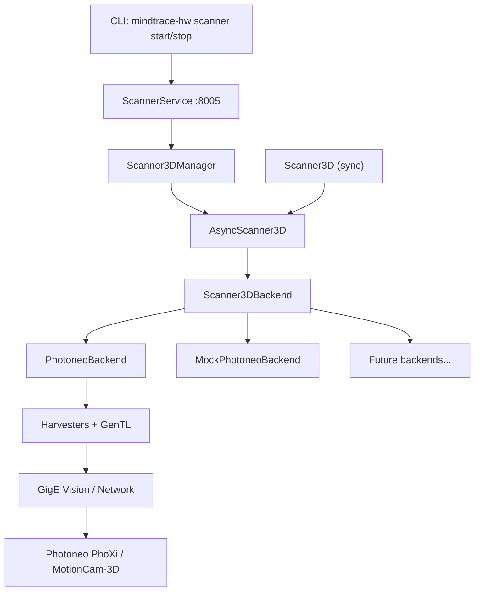
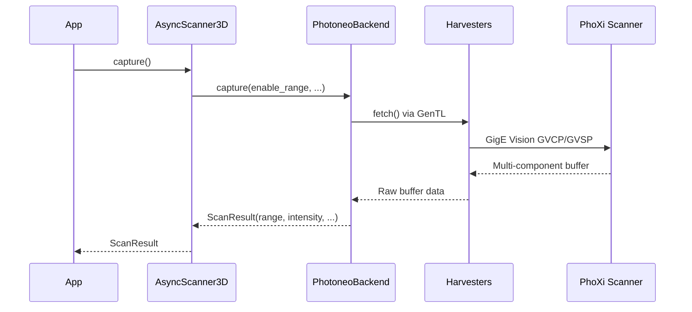

# MindTrace 3D Scanner System

A unified async 3D scanner interface for structured-light scanners (Photoneo PhoXi, MotionCam-3D) via GigE Vision. Supports multi-component capture (range, intensity, confidence, normals, color), point cloud generation, and full scanner configuration through a consistent API.

## Table of Contents

- [Quick Start](#quick-start)
- [System Architecture](#system-architecture)
- [Usage](#usage)
- [Backends](#backends)
- [Configuration](#configuration)
- [Service Layer](#service-layer)
- [SDK Setup](#sdk-setup)
- [Testing](#testing)
- [API Reference](#api-reference)
- [Extending](#extending)

## Quick Start

```python
from mindtrace.hardware.scanners_3d import AsyncScanner3D

# Open first available Photoneo scanner
scanner = await AsyncScanner3D.open()

# Capture 3D scan
result = await scanner.capture()
print(f"Range: {result.range_shape}, Intensity: {result.intensity_shape}")

# Generate point cloud
point_cloud = await scanner.capture_point_cloud()
print(f"Points: {point_cloud.num_points}")
point_cloud.save_ply("output.ply")

await scanner.close()
```

## System Architecture



### Layer Summary

| Layer | Module | Purpose |
|-------|--------|---------|
| **Backend** | `backends/` | Direct SDK communication (Harvesters/GenTL) |
| **Core** | `core/` | High-level async/sync wrappers, data models |
| **Service** | `services/scanners_3d/` | REST API + MCP endpoints |
| **CLI** | `cli/commands/scanner.py` | Service lifecycle management |
| **Setup** | `setup/` | SDK installation and verification |

### Data Flow



## Usage

### Async Interface (Recommended)

```python
from mindtrace.hardware.scanners_3d import AsyncScanner3D

# Open by backend and serial number
scanner = await AsyncScanner3D.open("Photoneo:ABC123")

# Multi-component capture
result = await scanner.capture(
    enable_range=True,
    enable_intensity=True,
    enable_confidence=True,
    enable_normal=True,
    enable_color=True,
    timeout_ms=10000,
)

# Access components
print(f"Range: {result.range_shape}")        # (H, W) float32
print(f"Intensity: {result.intensity_shape}") # (H, W) float32
print(f"Normals: {result.normal_map.shape}")  # (H, W, 3) float32

# Point cloud with downsampling
point_cloud = await scanner.capture_point_cloud(
    include_colors=True,
    include_confidence=True,
    downsample_factor=2,
)
point_cloud.save_ply("scan.ply")

await scanner.close()
```

### Sync Interface

```python
from mindtrace.hardware.scanners_3d import Scanner3D

# Sync wrapper runs a background event loop
with Scanner3D() as scanner:
    result = scanner.capture()
    point_cloud = scanner.capture_point_cloud()
    point_cloud.save_ply("scan.ply")
```

### Mock Backend (No Hardware)

```python
from mindtrace.hardware.scanners_3d import AsyncScanner3D

# Use mock for development and testing
scanner = await AsyncScanner3D.open("MockPhotoneo")
result = await scanner.capture()
print(f"Mock scan: {result.range_shape}")  # (1200, 1920)
await scanner.close()

# Or specific mock device
scanner = await AsyncScanner3D.open("MockPhotoneo:MOCK002")  # PhoXi 3D Scanner L
```

### Scanner Discovery

```python
from mindtrace.hardware.scanners_3d.backends.photoneo import PhotoneoBackend

# Find all Photoneo scanners on the network
serials = PhotoneoBackend.discover()
print(f"Found: {serials}")  # ['ABC123', 'DEF456']

# Detailed discovery
devices = PhotoneoBackend.discover_detailed()
for dev in devices:
    print(f"{dev['model']} (SN: {dev['serial_number']})")
```

## Backends

### Photoneo (`PhotoneoBackend`)

Production backend for Photoneo PhoXi and MotionCam-3D scanners using the Harvesters library with Matrix Vision mvGenTL Producer over GigE Vision.

**Supported hardware:**
- Photoneo PhoXi 3D Scanner (S, M, L, XL)
- Photoneo MotionCam-3D

**Requirements:**
- `harvesters` library (`pip install harvesters`)
- Matrix Vision mvGenTL Producer v2.49.0 (install via `mindtrace-scanner-photoneo install`)
- GigE Vision network (host networking for device discovery)
- Photoneo firmware >= 1.13.0

**Scan components:**

| Component | Array Shape | Type | Description |
|-----------|-------------|------|-------------|
| Range | (H, W) | float32 | Depth/distance map |
| Intensity | (H, W) | float32 | Reflected light intensity |
| Confidence | (H, W) | float32 | Per-pixel confidence [0, 1] |
| Normal | (H, W, 3) | float32 | Surface normal vectors |
| Color | (H, W, 3) | uint8 | RGB texture (if color camera) |

### Mock Photoneo (`MockPhotoneoBackend`)

Full-fidelity mock that mirrors every PhotoneoBackend method. Generates synthetic scan data (gradient patterns, random noise) without any hardware or SDK dependencies.

**Mock devices:**

| Serial | Model | Resolution |
|--------|-------|------------|
| MOCK001 | PhoXi 3D Scanner M | 1920 x 1200 |
| MOCK002 | PhoXi 3D Scanner L | 2064 x 1544 |

Use for unit tests, CI pipelines, and offline development.

## Configuration

### Bulk Configuration

```python
from mindtrace.hardware.scanners_3d.core.models import (
    ScannerConfiguration,
    CodingQuality,
    OperationMode,
)

# Get current settings
config = await scanner.get_configuration()
print(f"Exposure: {config.exposure_time}ms, Quality: {config.coding_quality}")

# Apply new settings (only non-None values are applied)
new_config = ScannerConfiguration(
    operation_mode=OperationMode.SCANNER,
    coding_quality=CodingQuality.HIGH,
    exposure_time=15.0,
    led_power=2048,
)
await scanner.set_configuration(new_config)
```

### Individual Settings

```python
# Exposure
await scanner.set_exposure_time(10.24)
exposure = await scanner.get_exposure_time()

# Trigger mode
await scanner.set_trigger_mode("Software")  # or "Continuous", "Hardware"
mode = await scanner.get_trigger_mode()
```

### Capabilities

```python
caps = await scanner.get_capabilities()
print(f"Model: {caps.model}")
print(f"Qualities: {caps.coding_qualities}")     # ['Ultra', 'High', 'Fast']
print(f"Exposure range: {caps.exposure_range}")   # (0.01, 100.0) ms
print(f"LED power range: {caps.led_power_range}") # (0, 4095)
```

### All Configuration Parameters

| Parameter | Type | Description |
|-----------|------|-------------|
| `operation_mode` | OperationMode | Camera, Scanner, or Mode_2D |
| `coding_strategy` | CodingStrategy | Normal, Interreflections |
| `coding_quality` | CodingQuality | Ultra, High, Fast |
| `exposure_time` | float | Exposure in milliseconds |
| `single_pattern_exposure` | float | Per-pattern exposure (ms) |
| `shutter_multiplier` | int | Shutter multiplier |
| `scan_multiplier` | int | Scan multiplier |
| `color_exposure` | float | Color camera exposure (ms) |
| `led_power` | int | LED power (0-4095) |
| `laser_power` | int | Laser power (1-4095) |
| `texture_source` | TextureSource | LED, Computed, Laser, Focus, Color |
| `output_topology` | OutputTopology | Raw, RegularGrid, FullGrid |
| `camera_space` | CameraSpace | PrimaryCamera, ColorCamera |
| `normals_estimation_radius` | int | Radius for normal estimation |
| `max_inaccuracy` | float | Max allowed inaccuracy (mm) |
| `hole_filling` | bool | Enable hole filling |
| `calibration_volume_only` | bool | Limit to calibrated volume |
| `trigger_mode` | TriggerMode | Software, Hardware, Continuous |
| `hardware_trigger` | bool | Enable hardware trigger |
| `hardware_trigger_signal` | HardwareTriggerSignal | Falling, Rising, Both |
| `maximum_fps` | float | FPS limit (0 = unlimited) |

## Service Layer

### Starting the Service

```bash
# Via CLI
mindtrace-hw scanner start --api-port 8005

# Or programmatically
from mindtrace.hardware.services.scanners_3d import ScannerService
service = ScannerService.launch(port=8005)
```

Swagger UI: `http://localhost:8005/docs`

### REST Endpoints

| Endpoint | Method | Description |
|----------|--------|-------------|
| `/health` | GET | Health check |
| `/scanners/backends` | GET | List available backends |
| `/scanners/backends/info` | GET | Backend details |
| `/scanners/discover` | POST | Discover scanners |
| `/scanners/open` | POST | Open scanner |
| `/scanners/open/batch` | POST | Open multiple scanners |
| `/scanners/close` | POST | Close scanner |
| `/scanners/close/batch` | POST | Close multiple scanners |
| `/scanners/close/all` | POST | Close all scanners |
| `/scanners/active` | GET | List active scanners |
| `/scanners/status` | POST | Scanner status |
| `/scanners/info` | POST | Scanner information |
| `/scanners/capabilities` | POST | Scanner capabilities |
| `/scanners/configure` | POST | Set configuration |
| `/scanners/configure/batch` | POST | Batch configure |
| `/scanners/config/get` | POST | Get configuration |
| `/scanners/capture` | POST | Capture scan |
| `/scanners/capture/batch` | POST | Batch capture |
| `/scanners/capture/pointcloud` | POST | Capture point cloud |
| `/scanners/capture/pointcloud/batch` | POST | Batch point cloud |
| `/system/diagnostics` | GET | System diagnostics |

### Connection Manager (Typed Client)

```python
from mindtrace.hardware.services.scanners_3d import ScannerConnectionManager

client = ScannerConnectionManager("scanner_service")

# Discover and open
devices = await client.discover_scanners()
await client.open_scanner("Photoneo:ABC123")

# Capture via service
result = await client.capture("Photoneo:ABC123")
```

## SDK Setup

The Photoneo backend requires the Matrix Vision mvGenTL Producer. The setup script handles installation across platforms.

### Install

```bash
# Via entry point
mindtrace-scanner-photoneo install -v

# Or directly
python mindtrace/hardware/mindtrace/hardware/scanners_3d/setup/setup_photoneo.py install -v
```

### Verify

```bash
mindtrace-scanner-photoneo verify -v
# Checks: Harvesters library, GenTL Producer (CTI file), GENICAM_GENTL64_PATH
```

### Discover

```bash
# Photoneo scanners only
mindtrace-scanner-photoneo discover

# All GigE Vision devices
mindtrace-scanner-photoneo discover --all
```

### Platform Support

| Platform | Install | Uninstall | Notes |
|----------|---------|-----------|-------|
| Linux (x86_64) | Bash installer + tgz | `sudo rm -rf /opt/mvIMPACT_Acquire` | Requires sudo |
| Windows (x64) | GUI installer (exe) | Uninstaller or Control Panel | Requires admin |
| macOS (ARM64) | DMG mount + pkg | Remove app + framework dirs | Requires sudo |

### Environment

After installation, set `GENICAM_GENTL64_PATH` for Harvesters to locate the GenTL Producer:

```bash
# Automatic (new login sessions)
source /etc/profile.d/genicam.sh

# Manual
export GENICAM_GENTL64_PATH=/opt/mvIMPACT_Acquire/lib/x86_64
```

## Testing

```bash
# Unit tests (no hardware needed)
pytest tests/unit/mindtrace/hardware/scanners_3d/ -v

# Integration tests (requires scanner on network)
pytest tests/integration/mindtrace/hardware/scanners_3d/ -v

# CI pipeline
bash scripts/run_tests.sh --unit --integration hardware
```

## API Reference

### Core Classes

| Class | Description |
|-------|-------------|
| `AsyncScanner3D` | Async high-level scanner interface |
| `Scanner3D` | Synchronous wrapper (background event loop) |
| `Scanner3DBackend` | Abstract base for backend implementations |
| `PhotoneoBackend` | Photoneo PhoXi/MotionCam backend |
| `MockPhotoneoBackend` | Mock backend for testing |

### Data Models

| Model | Description |
|-------|-------------|
| `ScanResult` | Multi-component scan data (range, intensity, confidence, normals, color) |
| `PointCloudData` | 3D point cloud with optional colors, normals, confidence |
| `CoordinateMap` | Pre-computed coordinate maps for point cloud generation |
| `ScannerConfiguration` | Scanner settings (exposure, quality, trigger, etc.) |
| `ScannerCapabilities` | Available features and parameter ranges |

### AsyncScanner3D Methods

| Method | Description |
|--------|-------------|
| `open(name)` | Factory: open scanner by name (`"Photoneo:serial"`, `"MockPhotoneo"`) |
| `close()` | Close scanner and release resources |
| `capture(...)` | Capture multi-component scan data |
| `capture_point_cloud(...)` | Capture and generate 3D point cloud |
| `get_capabilities()` | Get available features and ranges |
| `get_configuration()` | Get current settings |
| `set_configuration(config)` | Apply settings (non-None values only) |
| `set_exposure_time(ms)` | Set exposure in milliseconds |
| `get_exposure_time()` | Get current exposure |
| `set_trigger_mode(mode)` | Set trigger mode |
| `get_trigger_mode()` | Get current trigger mode |

### PointCloudData Methods

| Method | Description |
|--------|-------------|
| `save_ply(path)` | Save to PLY file |
| `downsample(factor)` | Downsample by factor |
| `filter_by_confidence(threshold)` | Filter points by confidence |
| `num_points` | Number of points (property) |

## File Structure

```
scanners_3d/
├── __init__.py                          # Module exports
├── README.md
├── backends/
│   ├── __init__.py
│   ├── scanner_3d_backend.py            # Abstract base class
│   └── photoneo/
│       ├── __init__.py
│       ├── photoneo_backend.py          # Harvesters/GigE implementation
│       └── mock_photoneo_backend.py     # Mock for testing
├── core/
│   ├── __init__.py
│   ├── models.py                        # ScanResult, PointCloudData, enums
│   ├── async_scanner_3d.py              # Async high-level interface
│   └── scanner_3d.py                    # Sync wrapper
└── setup/
    ├── __init__.py
    └── setup_photoneo.py                # SDK install/verify/discover
```

## Extending

### Add a New Scanner Backend

```python
from mindtrace.hardware.scanners_3d.backends.scanner_3d_backend import Scanner3DBackend
from mindtrace.hardware.scanners_3d.core.models import ScanResult, PointCloudData

class MyScanner3DBackend(Scanner3DBackend):
    """Backend for a new 3D scanner brand."""

    @staticmethod
    def discover() -> list[str]:
        # Return list of serial numbers
        return ["SERIAL001"]

    async def initialize(self) -> bool:
        # Connect to scanner
        return True

    async def capture(self, timeout_ms=10000, **kwargs) -> ScanResult:
        # Capture scan data
        return ScanResult(range_map=my_depth_array)

    async def close(self) -> None:
        # Release resources
        pass

    # Override individual config methods as supported by hardware
    async def set_exposure_time(self, milliseconds: float) -> None:
        self._sdk.set_exposure(milliseconds)

    async def get_exposure_time(self) -> float:
        return self._sdk.get_exposure()
```

Then register it in `AsyncScanner3D.open()` to support `"MyScanner:serial"` syntax.
