# MindTrace Unified Sensor System

A **minimal, unified sensor system** that provides both sensor data reading and publishing capabilities through a consistent async interface. The system abstracts different communication backends (MQTT, HTTP, Serial) for seamless integration with various sensor ecosystems.

## 🚀 Quick Start

```python
from mindtrace.hardware.sensors import AsyncSensor, MQTTSensorBackend

# Create MQTT sensor
backend = MQTTSensorBackend("mqtt://localhost:1883")
async with AsyncSensor("temp001", backend, "sensors/temperature") as sensor:
    data = await sensor.read()
    print(f"Temperature: {data}")
```

## 🏗️ System Architecture

The system provides two complementary interfaces for complete sensor ecosystem management:

### Data Reading (AsyncSensor)

```mermaid
graph TD
    A[AsyncSensor] --> B[SensorBackend]
    B --> C[MQTTSensorBackend ✅]
    B --> D[HTTPSensorBackend 🔄]
    B --> E[SerialSensorBackend 🔄]
    C --> F[MQTT Broker]
    D --> G[REST API]
    E --> H[Serial Device]
```


### Data Publishing (SensorSimulator) 

```mermaid
graph TD
    A[SensorSimulator] --> B[SensorSimulatorBackend]
    B --> C[MQTTSensorSimulator ✅]
    B --> D[HTTPSensorSimulator 🔄]
    B --> E[SerialSensorSimulator 🔄]
    C --> F[MQTT Broker]
    D --> G[REST API]
    E --> H[Serial Device]
```


### Communication Patterns

**MQTT Protocol:**


**HTTP Protocol (Future):**


**Serial Protocol (Future):**


## 📖 Usage

### Data Reading with AsyncSensor

```python
from mindtrace.hardware.sensors import AsyncSensor, MQTTSensorBackend

# Create backend
backend = MQTTSensorBackend("mqtt://broker.url:1883")

# Create sensor
sensor = AsyncSensor("sensor_id", backend, "topic/path")

# Use with context manager (recommended)
async with sensor:
    data = await sensor.read()
    
# Or manual connection
await sensor.connect()
data = await sensor.read()
await sensor.disconnect()
```

### Data Publishing with SensorSimulator

```python
from mindtrace.hardware.sensors import SensorSimulator, MQTTSensorSimulator

# Create simulator backend
backend = MQTTSensorSimulator("mqtt://broker.url:1883")

# Create simulator
simulator = SensorSimulator("sim_id", backend, "topic/path")

# Publish data
async with simulator:
    await simulator.publish({"temperature": 23.5, "unit": "C"})
    
# Or manual connection
await simulator.connect()
await simulator.publish({"temperature": 23.5, "unit": "C"})
await simulator.disconnect()
```

### Multiple Sensors with Manager

```python
from mindtrace.hardware.sensors import SensorManager

# Create manager
manager = SensorManager()

# Register sensors
manager.register_sensor(
    sensor_id="office_temp",
    backend_type="mqtt",
    connection_params={"broker_url": "mqtt://localhost:1883"},
    address="sensors/office/temperature"
)

manager.register_sensor(
    sensor_id="lab_humidity", 
    backend_type="mqtt",
    connection_params={"broker_url": "mqtt://localhost:1883"},
    address="sensors/lab/humidity"
)

# Bulk operations
await manager.connect_all()
readings = await manager.read_all()
await manager.disconnect_all()

# Results: {"office_temp": {...}, "lab_humidity": {...}}
```

### Backend Factories

```python
from mindtrace.hardware.sensors import create_backend, create_simulator_backend

# Create sensor backend using factory
sensor_backend = create_backend("mqtt", broker_url="mqtt://localhost:1883")
sensor = AsyncSensor("temp001", sensor_backend, "sensors/temperature")

# Create simulator backend using factory
sim_backend = create_simulator_backend("mqtt", broker_url="mqtt://localhost:1883")
simulator = SensorSimulator("temp_sim", sim_backend, "sensors/temperature")

# Supported types: "mqtt", "http", "serial"
```

## 🔧 Backend Configuration

### MQTT Backend (Readers)

```python
from mindtrace.hardware.sensors import MQTTSensorBackend

backend = MQTTSensorBackend(
    broker_url="mqtt://localhost:1883",
    identifier="client_id",          # Optional
    username="user",                 # Optional  
    password="pass",                 # Optional
    keepalive=60                     # Optional
)
```

### MQTT Simulator (Publishers)

```python
from mindtrace.hardware.sensors import MQTTSensorSimulator

simulator_backend = MQTTSensorSimulator(
    broker_url="mqtt://localhost:1883",
    identifier="simulator_id",       # Optional
    username="user",                 # Optional  
    password="pass",                 # Optional
    keepalive=60                     # Optional
)
```

### HTTP Backend (Future Work)

```python
# Reader
from mindtrace.hardware.sensors import HTTPSensorBackend
backend = HTTPSensorBackend(
    base_url="http://api.sensors.com",
    auth_token="secret123",          # Optional
    timeout=30.0                     # Optional
)

# Publisher  
from mindtrace.hardware.sensors import HTTPSensorSimulator
simulator_backend = HTTPSensorSimulator(
    base_url="http://api.sensors.com",
    auth_token="secret123",          # Optional
    timeout=30.0                     # Optional
)
# Note: Both raise NotImplementedError until implemented
```

### Serial Backend (Future Work)

```python
# Reader
from mindtrace.hardware.sensors import SerialSensorBackend
backend = SerialSensorBackend(
    port="/dev/ttyUSB0",
    baudrate=9600,                   # Optional
    timeout=5.0                      # Optional
)

# Publisher
from mindtrace.hardware.sensors import SerialSensorSimulator
simulator_backend = SerialSensorSimulator(
    port="/dev/ttyUSB0",
    baudrate=9600,                   # Optional  
    timeout=5.0                      # Optional
)
# Note: Both raise NotImplementedError until implemented
```

## 📊 Real-World Example

```python
import asyncio
from mindtrace.hardware.sensors import SensorManager

async def smart_building_monitor():
    manager = SensorManager()
    
    # Register building sensors
    sensors = [
        ("hvac_temp", "mqtt", {"broker_url": "mqtt://building.local"}, "hvac/temperature"),
        ("outdoor_weather", "http", {"base_url": "http://api.weather.com"}, "/current"),
        ("arduino_co2", "serial", {"port": "/dev/ttyUSB0"}, "READ_CO2"),
    ]
    
    for sensor_id, backend_type, params, address in sensors:
        manager.register_sensor(sensor_id, backend_type, params, address)
    
    # Monitor loop
    await manager.connect_all()
    
    while True:
        readings = await manager.read_all()
        
        for sensor_id, data in readings.items():
            if "error" not in data:
                print(f"{sensor_id}: {data}")
        
        await asyncio.sleep(30)  # Read every 30 seconds

# Run monitoring
asyncio.run(smart_building_monitor())
```

## 🧪 Testing & Examples

### Live Integration Example

See the complete working example in `samples/hardware/sensors/`:

1. **Start MQTT Broker**:
   ```bash
   cd samples/hardware/sensors
   docker-compose up -d
   ```

2. **Terminal 1 - Publish Data**:
   ```bash
   uv run python publish_sensor_data.py
   ```

3. **Terminal 2 - Read Data**:
   ```bash
   uv run python read_sensor_data.py
   ```

This demonstrates the complete sensor ecosystem: simulated sensors publishing realistic data and consumers reading it through the unified interface.

### Public MQTT Broker Testing

```python
# Publisher
from mindtrace.hardware.sensors import SensorSimulator, MQTTSensorSimulator
backend = MQTTSensorSimulator("mqtt://test.mosquitto.org:1883")
async with SensorSimulator("test_sim", backend, "test/topic") as simulator:
    await simulator.publish({"temperature": 23.5, "unit": "C"})

# Reader
from mindtrace.hardware.sensors import AsyncSensor, MQTTSensorBackend
backend = MQTTSensorBackend("mqtt://test.mosquitto.org:1883")
async with AsyncSensor("test", backend, "test/topic") as sensor:
    data = await sensor.read()
    print(data)  # {"temperature": 23.5, "unit": "C"}
```

## 🔍 API Reference

### AsyncSensor (Data Reader)

| Method | Description |
|--------|-------------|
| `async connect()` | Connect to backend |
| `async disconnect()` | Disconnect from backend |
| `async read()` | Read sensor data |
| `is_connected` | Connection status property |
| `sensor_id` | Sensor ID property |

### SensorSimulator (Data Publisher)

| Method | Description |
|--------|-------------|
| `async connect()` | Connect to backend |
| `async disconnect()` | Disconnect from backend |
| `async publish(data)` | Publish sensor data |
| `is_connected` | Connection status property |
| `simulator_id` | Simulator ID property |

### SensorManager

| Method | Description |
|--------|-------------|
| `register_sensor(id, type, params, address)` | Add sensor |
| `remove_sensor(sensor_id)` | Remove sensor |
| `get_sensor(sensor_id)` | Get sensor by ID |
| `list_sensors()` | List all sensor IDs |
| `async connect_all()` | Connect all sensors |
| `async disconnect_all()` | Disconnect all sensors |
| `async read_all()` | Read from all sensors |
| `sensor_count` | Number of sensors property |

### Backend Factories

| Function | Description |
|----------|-------------|
| `create_backend(type, **params)` | Create sensor backend by type |
| `create_simulator_backend(type, **params)` | Create simulator backend by type |
| `register_backend(name, class)` | Register custom sensor backend |
| `register_simulator_backend(name, class)` | Register custom simulator backend |
| `get_available_backends()` | List available sensor backend types |
| `get_available_simulator_backends()` | List available simulator backend types |

## ⚠️ Error Handling

```python
from mindtrace.hardware.sensors import AsyncSensor, MQTTSensorBackend

backend = MQTTSensorBackend("mqtt://nonexistent:1883")
sensor = AsyncSensor("test", backend, "topic")

try:
    await sensor.connect()
except ConnectionError as e:
    print(f"Connection failed: {e}")

try:
    data = await sensor.read()
except ConnectionError as e:
    print(f"Not connected: {e}")
```

## 📁 File Structure

```
sensors/
├── __init__.py                 # Main exports
├── core/
│   ├── sensor.py               # AsyncSensor class
│   ├── simulator.py            # SensorSimulator class
│   ├── manager.py              # SensorManager class  
│   └── factory.py              # Backend & simulator factories
├── backends/                   # Sensor data readers
│   ├── base.py                 # SensorBackend interface
│   ├── mqtt.py                 # MQTT implementation ✅
│   ├── http.py                 # HTTP placeholder 🔄
│   └── serial.py               # Serial placeholder 🔄
├── simulators/                 # Sensor data publishers
│   ├── base.py                 # SensorSimulatorBackend interface
│   ├── mqtt.py                 # MQTT implementation ✅
│   ├── http.py                 # HTTP placeholder 🔄
│   └── serial.py               # Serial placeholder 🔄
└── samples/                    # Usage examples
    └── hardware/sensors/       # Live integration tests
```

## 🔮 Extending

### Add Custom Sensor Backend (Reader)

```python
from mindtrace.hardware.sensors.backends.base import SensorBackend

class CustomSensorBackend(SensorBackend):
    async def connect(self):
        # Your connection logic
        pass
    
    async def disconnect(self):
        # Your disconnection logic  
        pass
    
    async def read_data(self, address):
        # Your data reading logic
        return {"custom": "data"}
    
    def is_connected(self):
        return True

# Register and use it
from mindtrace.hardware.sensors import register_backend, create_backend
register_backend("custom", CustomSensorBackend)
backend = create_backend("custom", param1="value")
```

### Add Custom Simulator Backend (Publisher)

```python
from mindtrace.hardware.sensors.simulators.base import SensorSimulatorBackend

class CustomSensorSimulator(SensorSimulatorBackend):
    async def connect(self):
        # Your connection logic
        pass
    
    async def disconnect(self):
        # Your disconnection logic  
        pass
    
    async def publish_data(self, address, data):
        # Your data publishing logic
        print(f"Publishing {data} to {address}")
    
    def is_connected(self):
        return True

# Register and use it
from mindtrace.hardware.sensors import register_simulator_backend, create_simulator_backend
register_simulator_backend("custom", CustomSensorSimulator)
sim_backend = create_simulator_backend("custom", param1="value")
```

## 🚀 Implementation Status

| Protocol | Reader | Publisher | Status |
|----------|--------|-----------|---------|
| **MQTT** | AsyncSensor + MQTTSensorBackend | SensorSimulator + MQTTSensorSimulator | ✅ **Fully Implemented** |
| **HTTP** | AsyncSensor + HTTPSensorBackend | SensorSimulator + HTTPSensorSimulator | 🔄 **Future Work** |
| **Serial** | AsyncSensor + SerialSensorBackend | SensorSimulator + SerialSensorSimulator | 🔄 **Future Work** |

## 🚀 Roadmap

**Immediate Goals:**
- **HTTP Backend**: REST API sensor support for both reading and publishing
- **Serial Backend**: Arduino/device communication for both directions
- **Enhanced Testing**: More integration test scenarios

**Future Enhancements:**
- **Modbus Backend**: Industrial sensor protocols
- **Advanced Features**: Data caching, filtering, alerting
