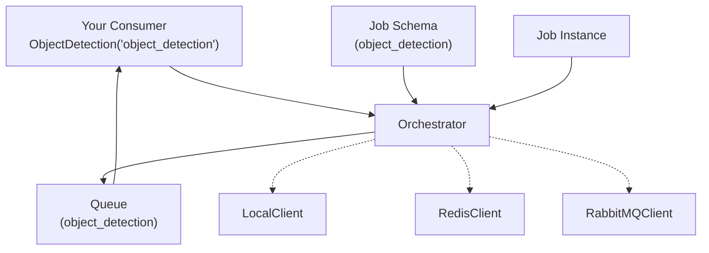

# Mindtrace Jobs

A job queue system that works with different backends (local, Redis, RabbitMQ).

## What's Included

**Core Components:**
- `Consumer` - Base class for processing jobs
- `Orchestrator` - Manages job queues and routing
- `Job`, `JobSchema`, `JobInput`, `JobOutput` - Job data structures
- `LocalClient`, `RedisClient`, `RabbitMQClient` - Backend implementations

**Backends:**
- **Local**
- **Redis**
- **RabbitMQ**

## Architecture 



## Basic Example

```python
from mindtrace.jobs import Orchestrator, LocalClient, Consumer, JobSchema, JobInput, JobOutput, job_from_schema

# Set up the orchestrator with local backend
orchestrator = Orchestrator(LocalClient())

# Define your job schema
class ObjectDetectionInput(JobInput):
    image_path: str = "/default/path.jpg"

class ObjectDetectionOutput(JobOutput):
    objects: list = []

schema = JobSchema(name="object_detection", input=ObjectDetectionInput(), output=ObjectDetectionOutput())
orchestrator.register(schema)

# Create a consumer
class ObjectDetection(Consumer):
    def run(self, job):
        logic here

# Connect and consume jobs
consumer = ObjectDetection("object_detection")
consumer.connect(orchestrator)

# Add a job to the queue
job = job_from_schema(schema, ObjectDetectionInput(image_path="/path/to/image.jpg"))
orchestrator.publish("object_detection", job)

# Process jobs
consumer.consume(num_messages=1)
```

## Using Different Backends

### Redis Backend
```python
from mindtrace.jobs import RedisClient

# Requires Redis server running
redis_backend = RedisClient(host="localhost", port=6379, db=0)
orchestrator = Orchestrator(redis_backend)

consumer = ObjectDetection("object_detection")
consumer.connect(orchestrator)
consumer.consume()
```

### RabbitMQ Backend
```python
from mindtrace.jobs import RabbitMQClient

# Requires RabbitMQ server running
rabbitmq_backend = RabbitMQClient(
    host="localhost", 
    port=5672, 
    username="user", 
    password="password"
)
orchestrator = Orchestrator(rabbitmq_backend)

consumer = ObjectDetection("object_detection")
consumer.connect(orchestrator)
consumer.consume()
```

## API Reference

### Consumer
```python
class Consumer:
    def __init__(self, job_type_name: str)
    def connect(self, orchestrator: Orchestrator)
    def consume(self, num_messages: Optional[int] = None)
    def run(self, job: Job)  # Implement this method
```

### Orchestrator
```python
class Orchestrator:
    def __init__(self, backend)
    def register(self, schema: JobSchema) -> str
    def publish(self, queue_name: str, job: Job) -> str
    def receive_message(self, queue_name: str) -> Optional[Job]
    def count_queue_messages(self, queue_name: str) -> int
```
