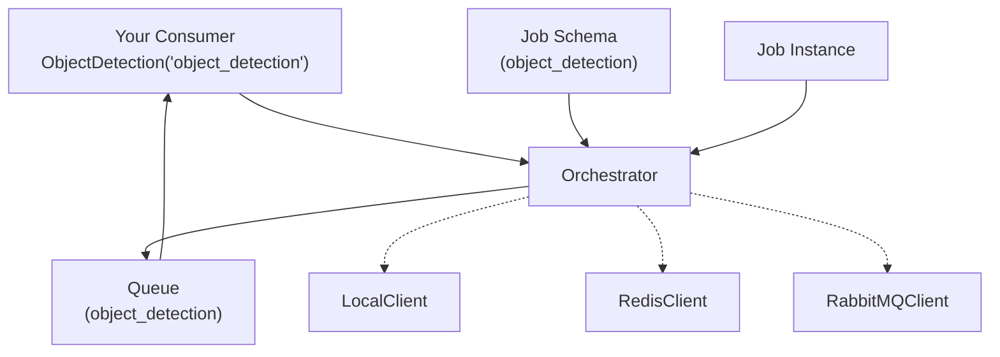

# Mindtrace Jobs

A job queue system that works with different backends (local, Redis, RabbitMQ).

## What's Included

**Core Components:**
- `Consumer` - Base class for processing jobs
- `Orchestrator` - Manages job queues and routing
- `Job`, `JobSchema` - Job data structures
- `LocalClient`, `RedisClient`, `RabbitMQClient` - Backend implementations

**Backends:**
- **Local**
- **Redis**
- **RabbitMQ**

## Architecture 



## Basic Example

```python
from mindtrace.jobs import Orchestrator, LocalClient, Consumer, JobSchema, job_from_schema
from pydantic import BaseModel

# Set up the orchestrator with local backend
orchestrator = Orchestrator(LocalClient())

# Define your job input/output models (inherit from BaseModel directly)
class ObjectDetectionInput(BaseModel):
    image_path: str = "/default/path.jpg"
    model_name: str = "yolo"
    confidence_threshold: float = 0.5

class ObjectDetectionOutput(BaseModel):
    objects: list = []
    confidence: float = 0.0

schema = JobSchema(name="object_detection", input=ObjectDetectionInput(), output=ObjectDetectionOutput())
orchestrator.register(schema)

# Create a consumer
class ObjectDetection(Consumer):
    def run(self, job_dict: dict) -> dict:
        # Access input data from the dict
        input_data = job_dict.get('input_data', {})
        image_path = input_data.get('image_path')
        model_name = input_data.get('model_name')
        confidence = input_data.get('confidence_threshold')
        
        # Your processing logic here
        detected_objects = self.detect_objects(image_path, model_name, confidence)
        
        return {
            "objects": detected_objects,
            "confidence": 0.95
        }

# Connect and consume jobs
consumer = ObjectDetection("object_detection")
consumer.connect(orchestrator)

# Add a job to the queue
job = job_from_schema(schema, ObjectDetectionInput(
    image_path="/path/to/image.jpg",
    model_name="yolo",
    confidence_threshold=0.8
))
orchestrator.publish("object_detection", job)

# Process jobs
consumer.consume(num_messages=1)
```

## Using Different Backends

### Redis Backend
```python
from mindtrace.jobs import RedisClient

# Requires Redis server running
redis_backend = RedisClient(host="localhost", port=6379, db=0)
orchestrator = Orchestrator(redis_backend)

consumer = ObjectDetection("object_detection")
consumer.connect(orchestrator)
consumer.consume()
```

### RabbitMQ Backend
```python
from mindtrace.jobs import RabbitMQClient

# Requires RabbitMQ server running
rabbitmq_backend = RabbitMQClient(
    host="localhost", 
    port=5672, 
    username="user", 
    password="password"
)
orchestrator = Orchestrator(rabbitmq_backend)

consumer = ObjectDetection("object_detection")
consumer.connect(orchestrator)
consumer.consume()
```

## Priority Queues

### Local Priority Queue
```python
# Declare priority queue
backend = LocalClient()
orchestrator = Orchestrator(backend)
backend.declare_queue("priority_tasks", queue_type="priority")

# Publish with different priorities (higher numbers = higher priority)
orchestrator.publish("priority_tasks", urgent_job, priority=10)
orchestrator.publish("priority_tasks", normal_job, priority=5)
orchestrator.publish("priority_tasks", background_job, priority=1)
```

### Redis Priority Queue
```python
redis_backend = RedisClient()
orchestrator = Orchestrator(redis_backend)
redis_backend.declare_queue("redis_priority", queue_type="priority")

# Higher priority jobs processed first
orchestrator.publish("redis_priority", critical_job, priority=100)
orchestrator.publish("redis_priority", normal_job, priority=50)
```

### RabbitMQ Priority Queue
```python
rabbitmq_backend = RabbitMQClient()
orchestrator = Orchestrator(rabbitmq_backend)
# RabbitMQ supports max priority 0-255
rabbitmq_backend.declare_queue("rabbitmq_priority", max_priority=255)

orchestrator.publish("rabbitmq_priority", critical_job, priority=255)
orchestrator.publish("rabbitmq_priority", normal_job, priority=128)
```

## API Reference

### Consumer
```python
class Consumer:
    def __init__(self, job_type_name: str)
    def connect(self, orchestrator: Orchestrator)
    def consume(self, num_messages: Optional[int] = None)
    def run(self, job_dict: dict) -> dict  # Implement this method
```

### Orchestrator
```python
class Orchestrator:
    def __init__(self, backend)
    def register(self, schema: JobSchema) -> str
    def publish(self, queue_name: str, job: Job, **kwargs) -> str
    def receive_message(self, queue_name: str) -> Optional[dict]
    def count_queue_messages(self, queue_name: str) -> int
```
