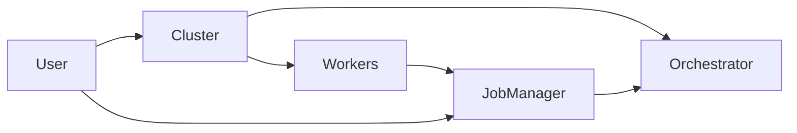

# Component Responsibilities and Connections

## Overview

The job management system consists of three main components that work together to provide a complete job execution and management solution:

- **🏗️ Cluster**: Job execution engine
- **🔄 Orchestrator**: Message queue and routing system  
- **📋 Job Manager**: Job lifecycle and analytics layer

## Component Responsibilities

### 🏗️ Cluster

**Primary Role**: Job Execution Engine

**What it does:**
- Executes jobs on distributed workers across machines
- Manages worker lifecycle (spawn, monitor, cleanup)
- Handles resource allocation and scheduling
- Provides job submission interface (`cluster.submit()`)
- Routes jobs to appropriate worker types

**Key Methods:**
```python
cluster.submit(job)                    # Submit job for execution
cluster.register_worker(name, worker)  # Register worker type
cluster.launch_worker(machine, name)   # Start static worker
cluster.cancel_job(cluster_job_id)     # Cancel running job
cluster.get_job_status(cluster_job_id) # Get execution status
```

**Worker Types Managed:**
- **Dynamic Workers**: Spawned per job (GitWorker for code execution)
- **Static Workers**: Long-running processes (ModelBank for inference)

**Responsibilities:**
- ✅ Job execution on remote machines
- ✅ Worker spawning and management
- ✅ Resource allocation
- ✅ Real-time job monitoring
- ✅ Job cancellation and cleanup

---

### 🔄 Orchestrator

**Primary Role**: Message Queue and Routing System

**What it does:**
- Manages job queues using pluggable backends
- Routes messages between components
- Handles job persistence to queues
- Provides queue management operations
- Abstracts backend implementation details

**Key Methods:**
```python
orchestrator.publish(queue_name, job)     # Send job to queue
orchestrator.receive_message(queue_name)  # Get job from queue
orchestrator.clean_queue(queue_name)      # Clear queue
orchestrator.count_queue_messages(queue)  # Get queue size
```

**Supported Backends:**
- **Local Backend**: In-memory queues for development
- **Redis Backend**: Redis-based queues for production
- **RabbitMQ Backend**: Enterprise message queuing

**Responsibilities:**
- ✅ Queue management across different backends
- ✅ Message routing and delivery
- ✅ Job persistence in queues
- ✅ Backend abstraction
- ✅ Queue monitoring and statistics

---

### 📋 Job Manager

**Primary Role**: Job Lifecycle and Analytics Layer

**What it does:**
- Tracks job metadata and execution history
- Provides job management operations (restart, cancel, bulk actions)
- Maintains job status and progress tracking
- Offers analytics and reporting capabilities
- Handles failed job recovery

**Key Methods:**
```python
job_manager.register_job(id, definition, cluster_id)  # Track new job
job_manager.update_job_status(id, status, results)    # Update progress
job_manager.list_jobs(status_filter)                  # Query jobs
job_manager.restart_job(job_id)                       # Resubmit failed job
job_manager.get_queue_stats()                         # System analytics
job_manager.bulk_action(job_ids, action)              # Mass operations
```

**Job Lifecycle States:**
- `QUEUED` → `RUNNING` → `COMPLETED`/`FAILED`/`CANCELLED`

**Responsibilities:**
- ✅ Job metadata storage and tracking
- ✅ Execution history and analytics
- ✅ Failed job identification and restart
- ✅ Bulk operations on multiple jobs
- ✅ System monitoring and statistics
- ✅ Job lifecycle management

## Component Connections

### Connection Flow



### 1. User ↔ Cluster
**Purpose**: Job submission and worker management
```python
# User submits jobs directly to cluster
cluster_job_id = cluster.submit(job)
cluster.register_worker("worker_name", worker_instance)
```

### 2. User ↔ Job Manager  
**Purpose**: Job tracking and management
```python
# User tracks and manages job lifecycle
job_manager.register_job(mgr_id, job_def, cluster_job_id)
failed_jobs = job_manager.list_jobs(ExecutionStatus.FAILED)
job_manager.restart_job(failed_job_id)
```

### 3. Cluster ↔ Orchestrator
**Purpose**: Job queuing and distribution
```python
# Cluster uses orchestrator for job queuing
orchestrator.publish("jobs.vbrain", job)
job = orchestrator.receive_message("jobs.detection")
```

### 4. Cluster ↔ Workers
**Purpose**: Job execution
```python
# Cluster spawns workers and routes jobs
worker = GitWorker("repo", branch="main")
cluster_job_id = cluster.submit(job)  # Routes to appropriate worker
```

### 5. Job Manager ↔ Orchestrator
**Purpose**: Job persistence and storage
```python
# Job Manager uses orchestrator's storage capabilities
# (Currently in-memory, future: database backend)
```

### 6. Workers ↔ Job Manager
**Purpose**: Status updates and progress tracking
```python
# Workers report status back to Job Manager
job_manager.update_job_status(job_id, ExecutionStatus.RUNNING)
job_manager.update_job_status(job_id, ExecutionStatus.COMPLETED, results=output)
```

## Data Flow Example

### Complete Job Lifecycle

```
1. User → Cluster: cluster.submit(vbrain_job)
   ↓
2. Cluster → Orchestrator: orchestrator.publish("jobs.vbrain", job)
   ↓  
3. User → Job Manager: job_manager.register_job(mgr_id, job_def, cluster_job_id)
   ↓
4. Cluster → Workers: spawn GitWorker on machine N
   ↓
5. Workers → Job Manager: job_manager.update_job_status(mgr_id, RUNNING)
   ↓
6. Workers → Job Manager: job_manager.update_job_status(mgr_id, COMPLETED, results)
   ↓
7. Job Manager → Orchestrator: persist job execution data
```

## Separation of Concerns

| Component | Focus | Handles |
|-----------|-------|---------|
| **Cluster** | Execution | Worker management, job running, resource allocation |
| **Orchestrator** | Infrastructure | Queues, message routing, backend abstraction |
| **Job Manager** | Management | Tracking, analytics, lifecycle, bulk operations |

## Benefits of This Architecture

### 🔧 **Modularity**
- Each component has clear responsibilities
- Components can be developed/updated independently
- Easy to test individual components

### 🔄 **Flexibility** 
- Orchestrator backends can be swapped (Local → Redis → RabbitMQ)
- Job Manager can be enhanced without affecting Cluster
- New worker types can be added to Cluster independently

### 📈 **Scalability**
- Cluster handles distributed execution
- Orchestrator manages queue scaling
- Job Manager provides centralized monitoring

### 🛠️ **Maintainability**
- Clear boundaries between components
- Single responsibility principle
- Easy debugging and troubleshooting

## Integration Points

### When to Use Each Component

**Use Cluster when:**
- Submitting jobs for execution
- Managing workers across machines
- Canceling running jobs
- Getting real-time execution status

**Use Orchestrator when:**
- Building queue-based systems
- Needing backend flexibility
- Implementing message patterns
- Managing job persistence

**Use Job Manager when:**
- Tracking job history
- Analyzing system performance
- Restarting failed jobs
- Performing bulk operations
- Monitoring system health 