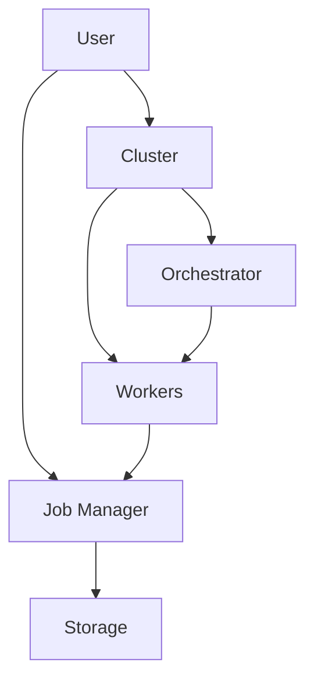
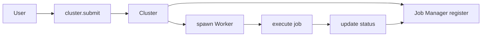
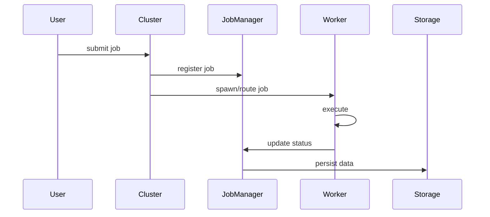
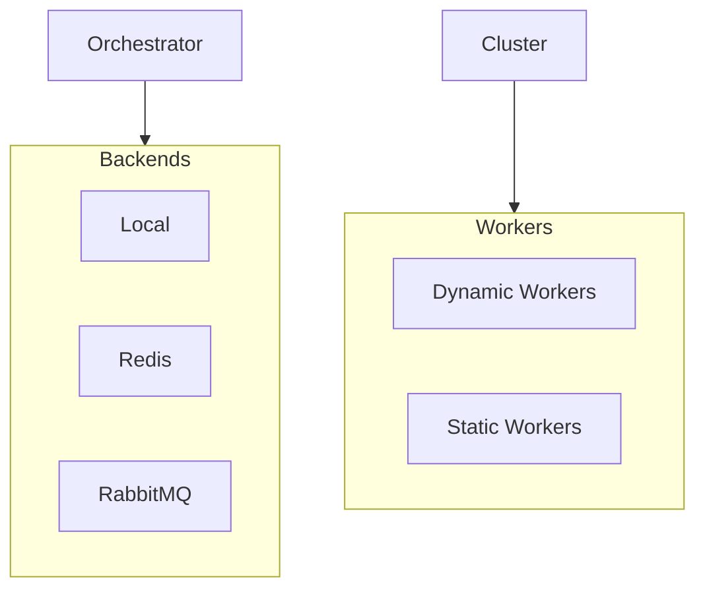

# System Architecture: Job Management with Cluster Integration

## System Overview



## Detailed Flow



## Sequence Diagram



## Component Types



## Key Benefits

- **Job History & Analytics**: Track all jobs across worker types
- **Failed Job Recovery**: Identify and restart failed jobs
- **System Monitoring**: Queue statistics and performance metrics
- **Bulk Operations**: Mass actions on multiple jobs
- **Clean Architecture**: Cluster handles execution, Job Manager handles lifecycle

## Example Usage

```python
# Setup
cluster = Cluster.connect()
job_manager = JobManager(orchestrator)

# Submit and track job
cluster_job_id = cluster.submit(job)
job_manager.register_job(mgr_id, job_def, cluster_job_id)

# Monitor and manage
failed_jobs = job_manager.list_jobs(ExecutionStatus.FAILED)
job_manager.restart_job(failed_job_id)
```