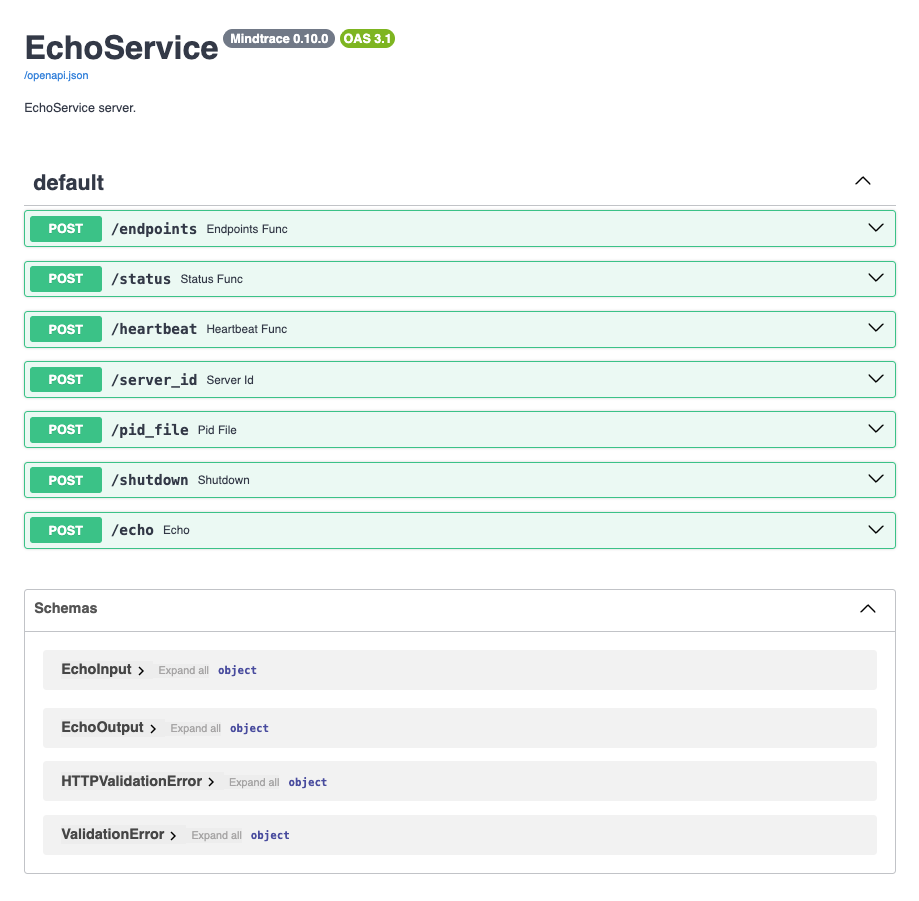

[](https://pypi.org/project/mindtrace-services/)
[](https://github.com/mindtrace/mindtrace/blob/main/mindtrace/services/LICENSE)
[](https://pepy.tech/projects/mindtrace-services)

# Mindtrace Services

The `Services` module provides Mindtrace’s typed microservice framework. It enables you to define a `Service` once with `TaskSchema` endpoint contracts, launch it as a process, connect to it through an auto-generated client, and optionally expose those endpoints as MCP tools.

## Features

- **Typed service definition** with `Service` + `TaskSchema`
- **FastAPI-backed HTTP services** with standard lifecycle endpoints
- **Auto-generated clients** via `ConnectionManager` generation
- **Built-in launch/connect workflow** for local service processes
- **First-class MCP support** through FastMCP
- **Service composition utilities** such as `Gateway` and proxy connection managers
- **Concrete integrations** such as Discord service wrappers and sample services

## Quick Start

```python
import time

from pydantic import BaseModel

from mindtrace.core import TaskSchema
from mindtrace.services import Service


class EchoInput(BaseModel):
    message: str
    delay: float = 0.0


class EchoOutput(BaseModel):
    echoed: str


echo_task = TaskSchema(
    name="echo",
    input_schema=EchoInput,
    output_schema=EchoOutput,
)


class EchoService(Service):
    def __init__(self, *args, **kwargs):
        super().__init__(*args, **kwargs)
        self.add_endpoint("echo", self.echo, schema=echo_task)

    def echo(self, payload: EchoInput) -> EchoOutput:
        if payload.delay > 0:
            time.sleep(payload.delay)
        return EchoOutput(echoed=payload.message)


cm = EchoService.launch(host="localhost", port=8080, wait_for_launch=True)
print(cm.status())
print(cm.echo(message="Hello"))
cm.shutdown()
```

You can inspect the generated FastAPI docs at <http://localhost:8080/docs> while the service is running.



You can also call the service directly over HTTP:

```bash
curl -X POST http://localhost:8080/echo \
  -H "Content-Type: application/json" \
  -d '{"message": "Hello from curl", "delay": 0.0}'
```

If you are working in Python, you usually do not need to make raw `curl` requests at all. You can connect to the same running service and get a convenient `cm` instead:

```python
cm = EchoService.connect("http://localhost:8080")
print(cm.echo(message="Hello again"))
```

## Service

`Service` is the server-side abstraction. A service instance:

- builds a FastAPI app
- tracks registered endpoints and their schemas
- mounts an MCP server
- provides standard lifecycle endpoints
- can be launched in a separate process with `Service.launch()`

A minimal service subclass looks like this:

```python
from mindtrace.services import Service


class EchoService(Service):
    def __init__(self, *args, **kwargs):
        super().__init__(*args, **kwargs)
        self.add_endpoint("echo", self.echo, schema=echo_task)
```

## TaskSchema

`TaskSchema` is the typed contract for an endpoint. It defines:

- the endpoint name
- the input schema
- the output schema

That same schema is reused across the package for:

- FastAPI request validation
- generated connection manager methods
- output parsing on the client side
- MCP tool exposure

Example:

```python
from pydantic import BaseModel

from mindtrace.core import TaskSchema


class EchoInput(BaseModel):
    message: str


class EchoOutput(BaseModel):
    echoed: str


echo_task = TaskSchema(
    name="echo",
    input_schema=EchoInput,
    output_schema=EchoOutput,
)
```

## Defining Endpoints

Register endpoints with `add_endpoint()`:

```python
self.add_endpoint(
    path="echo",
    func=self.echo,
    schema=echo_task,
    as_tool=True,
)
```

Important behavior:

- routes are registered as **POST** endpoints by default
- the endpoint schema is stored in the service for later client generation
- the function is wrapped with service logging/instrumentation
- setting `as_tool=True` exposes the same function as an MCP tool

## Built-in Endpoints

Every `Service` automatically registers a standard set of lifecycle and introspection endpoints:

- `endpoints` — list registered endpoint names
- `status` — current service status
- `heartbeat` — structured health/liveness payload
- `server_id` — unique server ID
- `pid_file` — PID file path for the launched process
- `shutdown` — stop the running service

These endpoints are available over HTTP, and some are also exposed as MCP tools.

## ConnectionManager

`ConnectionManager` is the client-side abstraction for talking to a running service over HTTP. It provides common lifecycle methods such as:

- `status()` / `astatus()`
- `shutdown()` / `ashutdown()`
- `mcp_client` for talking to the same service via MCP

Example:

```python
from mindtrace.services import Service


cm = Service.connect("http://localhost:8080")
print(cm.status())
cm.shutdown(block=False)
```

## Auto-Generated Connection Managers

If a service does not register a custom client class, Mindtrace generates one automatically from the service’s registered endpoint schemas. Each endpoint becomes:

- a synchronous client method
- an asynchronous client method prefixed with `a`

For example, an `echo` endpoint becomes:

- `cm.echo(...)`
- `await cm.aecho(...)`

For a generated client, this means you can write:

```python
cm = EchoService.launch(wait_for_launch=True)
result = cm.echo(message="Hello")
print(result.echoed)
```

If no custom connection manager is registered, `generate_connection_manager()` creates one dynamically from the service definition.

For each registered endpoint:

- a sync method is generated
- an async method is generated
- input kwargs are validated against the endpoint input schema
- HTTP responses are parsed into the endpoint output schema

### Method naming

- endpoint `echo` → `echo()` and `aecho()`
- dotted endpoint names are converted to valid Python method names by replacing `.` with `_`

### Validation controls

Generated methods support:

- `validate_input=True`
- `validate_output=True`

These can be disabled when raw payload handling is needed.

Examples:

```python
# Default behavior: validate kwargs against the input schema
# and parse the response into the output schema
result = cm.echo(message="Hello")
print(result.echoed)
```

```python
# Skip input validation and send the payload as-is
result = cm.echo(validate_input=False, message="Hello", delay=0.0)

# Skip output validation to receive the raw response dict
raw_result = cm.echo(message="Hello", validate_output=False)
print(raw_result)
```

### When to write a custom connection manager

A custom connection manager is worth using when you want:

- richer convenience methods than one-method-per-endpoint
- custom retry or caching behavior
- special authentication flows
- a more domain-specific client surface

Otherwise, the generated client is usually enough.

Example:

```python
import requests

from mindtrace.services import ConnectionManager, Service


class EchoConnectionManager(ConnectionManager):
    def echo(self, message: str, delay: float = 0.0):
        response = requests.post(
            f"{str(self.url).rstrip('/')}/echo",
            json={"message": message, "delay": delay},
            timeout=60,
        )
        response.raise_for_status()
        return response.json()

    def echo_twice(self, message: str):
        first = self.echo(message)
        second = self.echo(message)
        return [first["echoed"], second["echoed"]]


class EchoService(Service):
    pass


EchoService.register_connection_manager(EchoConnectionManager)
cm = EchoService.connect("http://localhost:8080")
print(cm.echo_twice("Hello"))
```

After registering the custom connection manager, `EchoService.connect(...)` or `EchoService.launch(...)` returns an `EchoConnectionManager` instead of an auto-generated one.

## Launching and Connecting

### `launch()`

`Service.launch()`:

- resolves the target URL
- checks that no service is already running there
- spawns a subprocess launcher
- optionally waits for the service to become reachable
- returns a connection manager when `wait_for_launch=True`

Common arguments:

- `url` — explicit full service URL
- `host` / `port` — host and port override
- `wait_for_launch` — wait until the service is available
- `timeout` — startup timeout in seconds
- `block` — keep the calling process blocked while the service runs
- `num_workers` — worker count for the launched service

Example:

```python
cm = EchoService.launch(
    host="localhost",
    port=8080,
    wait_for_launch=True,
    timeout=30,
)
print(cm.status())
```

### `connect()`

`Service.connect()` attaches to an already-running service and returns the appropriate connection manager.

Example:

```python
cm = EchoService.connect("http://localhost:8080")
print(cm.status())
print(cm.echo(message="Connected"))
```

## URL and Configuration Behavior

In most cases, you can either provide an explicit URL or let the service use its configured defaults.

Examples:

```python
# Explicit full URL
cm = EchoService.connect("http://localhost:8080")
```

```python
# Host/port convenience when launching
cm = EchoService.launch(host="localhost", port=8080, wait_for_launch=True)
```

If you do not pass either, the service falls back to its configured default URL.

MCP paths are also configuration-driven, so the mounted MCP endpoint is built from the service URL plus the configured MCP mount and app paths.

## MCP Integration

MCP (Model Context Protocol) is a standard way to expose application functionality as structured tools for AI clients. If you are familiar with FastAPI, you can think of MCP as a tool-oriented interface sitting alongside your normal HTTP routes: instead of calling REST endpoints directly, an MCP client can discover available tools and invoke them with structured inputs.

In `mindtrace-services`, every service creates and mounts a FastMCP app alongside its normal FastAPI routes.

### Expose an endpoint as a tool

```python
self.add_endpoint("echo", self.echo, schema=echo_task, as_tool=True)
```

This makes the same function available:

- as an HTTP endpoint
- as an MCP tool

### Register an MCP-only tool

```python
def reverse_message(payload: EchoInput) -> EchoOutput:
    """Reverse the input message."""
    return EchoOutput(echoed=payload.message[::-1])


self.add_tool("reverse_message", reverse_message)
```

### MCP client access

You can connect to a service over MCP in three common ways.

#### Class-level connect

```python
client = EchoService.mcp.connect("http://localhost:8080")
```

#### Class-level launch

```python
client = EchoService.mcp.launch(host="localhost", port=8080, wait_for_launch=True)
```

#### From an existing connection manager

```python
cm = EchoService.launch(host="localhost", port=8080, wait_for_launch=True)
client = cm.mcp_client
```

### Minimal MCP example

```python
import asyncio

from mindtrace.services.samples.echo_mcp import EchoService


async def main():
    client = EchoService.mcp.launch(
        host="localhost",
        port=8080,
        wait_for_launch=True,
        timeout=30,
    )
    async with client:
        tools = await client.list_tools()
        print([tool.name for tool in tools])
        result = await client.call_tool("echo", {"payload": {"message": "Hello"}})
        print(result)


asyncio.run(main())
```

### Remote MCP usage

Any Mindtrace service exposing MCP tools can also be used from MCP-capable clients such as Cursor by pointing the client at the service’s mounted MCP endpoint.

Example configuration:

```json
{
  "mcpServers": {
    "mindtrace_echo": {
      "url": "http://localhost:8080/mcp-server/mcp/"
    }
  }
}
```

Once configured, the client can list and invoke tools exposed by the service.

## Gateway and Proxy Routing

The package includes service-composition helpers for routing traffic through a central gateway.

### `Gateway`

`Gateway` is a service that can register downstream FastAPI apps and forward requests to them.

It supports:

- dynamic app registration
- HTTP request forwarding
- enhanced connection behavior for registered apps

### `ProxyConnectionManager`

`ProxyConnectionManager` routes endpoint calls through a gateway instead of calling a service directly. It uses service endpoint metadata to create proxy methods matching the downstream service surface.

This is useful when a service needs to be accessed indirectly through a central gateway.

Example:

```python
from mindtrace.services import EchoService, Gateway


# Launch a normal service
backend_cm = EchoService.launch(host="localhost", port=8081, wait_for_launch=True)

# Launch the gateway
gateway_cm = Gateway.launch(host="localhost", port=8080, wait_for_launch=True)

# Register the service with the gateway and attach a proxy client
gateway_cm.register_app(
    name="echo",
    url="http://localhost:8081",
    connection_manager=backend_cm,
)

# Calls are now forwarded through the gateway
print(gateway_cm.echo.echo(message="Hello through gateway"))
```

## Examples in this package

See the sample implementations in this package for end-to-end reference:

- [Basic Echo service sample](mindtrace/services/samples/echo_service.py)
- [Echo service with MCP tools](mindtrace/services/samples/echo_mcp.py)
- [Discord service documentation](mindtrace/services/discord/README.md)

## Testing

If you are working in the full Mindtrace repo, run tests for this module specifically:

```bash
# Run the services test suite
ds test: services

# Run only unit tests for services
ds test: --unit services
```

If you need a fresh checkout first:

```bash
git clone https://github.com/Mindtrace/mindtrace.git
cd mindtrace
```

## Practical Notes and Caveats

- Generated endpoint methods use **POST** requests.
- Protected client methods such as `status` and `shutdown` are not overwritten by generated endpoint methods.
- A lightweight service instance may be created during client generation in order to inspect registered endpoints.
- Endpoint names should be chosen with both route readability and Python client naming in mind.
- `launch()` manages subprocesses and PID files, so it should be treated as a service runtime tool, not just object instantiation.
